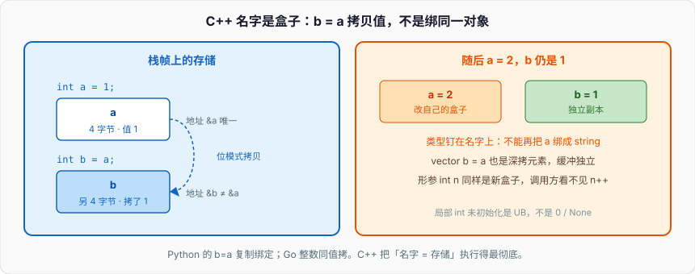

# C++入门

C++ 写 `int a = 1;`，编译器在当前栈帧开 4 字节，把 `1` 的位模式写进去。`a` 就是这块存储。Go 的 `var a int = 1` 同理：名字对应一块固定大小的盒子，类型钉在名字上。Python 写 `a = 1`，做的事情完全不同——解释器在堆上找（或 intern）一个 `PyLongObject`，再把当前命名空间里的名字 `a` 绑到这个对象上。

```cpp
#include <iostream>

int main() {
    int a = 1;
    std::cout << sizeof(a) << "\n";   // 4
    std::cout << &a << "\n";          // 栈上某个地址
}
```

`a` 是装 `1` 的盒子，不是标签。改 `a` 就是改这 4 字节；`int b = a;` 是再开 4 字节、把位模式拷过去（随后改 `a`，`b` 仍是 1）。后面所有「拷贝怎么走、引用绑什么、未初始化读到什么」都从这个模型长出来。



Python 的 `b = a` 复制的是绑定；C++ 的 `b = a` 复制的是值。Go 对内置整数同样是值拷贝。三种语言里，C++ 把「名字 = 存储」执行得最彻底——连类型都不能换绑：

```cpp
int x = 1;
// x = "hello";   // 编译失败，名字 x 的类型在声明处钉死
```

Python 可以 `x = 1` 再 `x = "hello"`，类型跟着对象走。C++ / Go 的类型跟着名字走。后面的初始化、ODR、const、错误处理都落在这个钉子上。

---

## 一、名字对应存储，不是绑定

### 1、赋值语句在干什么

对标量 `int y = x;`，三门语言表面行为碰巧一样。C++ 里它**就是**拷贝——`y` 有自己的 4 字节。Python 里 `y = x` 让两个名字指向同一个 `int` 对象，随后 `x = 1001` 是给 `x` 换绑，`y` 还指着旧的。真正的拷贝从来没发生，只是不可变对象让你看不出来。

对「容器」立刻分叉：

```cpp
#include <vector>
#include <iostream>

int main() {
    std::vector<int> a{1, 2, 3};
    std::vector<int> b = a;     // 拷贝构造：再分配一块缓冲，元素逐个拷
    a.push_back(4);
    std::cout << b.size() << "\n";  // 3，b 是独立副本
}
```

Python 的 `b = a` 共享同一份 list；Go 的 `b := a` 对 slice 拷贝的是 slice 头（底层数组共享），对数组是真拷贝。C++ 的 `std::vector` 拷贝构造默认深拷贝元素（缓冲独立）。不要拿 Python 的名字绑定去读 C++ 的 `=`。

函数参数同一套规则：

```cpp
void bump_int(int n) { n += 1; }                          // 形参是新盒子
void bump_vec(std::vector<int> xs) { xs.push_back(1); }   // 整份 vector 拷贝

int x = 10;
bump_int(x);                    // x 仍是 10
std::vector<int> nums{10};
bump_vec(nums);                 // nums 仍是 {10}，拷贝很贵
```

想让调用方看到修改，传引用（`T&`）或指针（`T*`）。想避免拷贝又不改对象，传 `const T&`。指针与引用篇会把三种签名拆开；这里记住：默认是**按值拷贝存储**，不是绑名字。

### 2、类型钉在名字上

声明 `int n = 1;` 做了三件事：引入名字；把类型定为 `int`（编译期信息，运行时这块存储不知道自己是 int）；在当前作用域分配存储（自动存储期就是栈上）。`n = 2` 改盒子里的位；`n = 3.14` 能编过但静默丢小数；`n = "x"` 非法。

Python 的 `n = 1` 只做第一件，类型在对象头上。Go 的 `var n int = 1` 和 C++ 同一模型，但零值会把盒子清成 `0`；C++ 的「没写初始化」对局部 `int` 是未初始化，读它是未定义行为。

```cpp
int a;              // 局部：未初始化，读 a 是 UB
static int b;       // 静态存储期：零初始化，b == 0
```

「未初始化」不是「零」，也不是 `None`。它是盒子里的随机位（或更糟：编译器按 UB 优化掉你的检查）。后端代码里局部内置类型必须写初始化，这条比风格更硬。

### 3、同一份值，三种寿命

存储期决定盒子活多久。C++ 没有「绑定」，只有这块存储在不在。

| 存储期 | 声明方式 | 寿命 | 对照 |
| --- | --- | --- | --- |
| 自动 | 局部变量、临时量 | 进入作用域分配，离开析构 | Go 局部（逃逸则上堆）；Python 没有栈对象 |
| 静态 | 全局、`static` 局部、命名空间变量 | 程序启动到结束 | Go 包级变量；Python 模块级名字 |
| 动态 | `new` / 分配器 | 你 `delete` 或容器析构为止 | Go `new`/`make` 交给 GC；Python 全是堆 |

```cpp
int g = 1;                  // 静态

int counter() {
    static int n = 0;       // 第一次进函数才初始化，之后一直活着
    return ++n;
}

int main() {
    int x = 2;              // 自动，栈
    int* p = new int{3};    // 动态，堆；必须有人 delete
    delete p;
}
```

`new` 的所有权和 RAII 是后面专篇。入门只需：名字对应的存储有大小、类型、寿命；堆上那块是另一份存储，指针名字只装着地址。

---

## 二、从源文件到可执行：四步和 ODR

`g++ -o app main.cpp` 看起来一步，实际是预处理 / 编译 / 汇编 / 链接。Python 是源文件 → 字节码 → 解释器；Go 也编译到机器码，但包和导出规则挡掉了一大部分「重复定义」。C++ 把编译单元和链接暴露出来，ODR 就是这套模型的合同。

### 1、预处理 / 编译 / 汇编

`#include`、`#define`、`#ifdef` 在预处理展开。`#include "foo.h"` 字面意思是把 `foo.h` 的文本贴进来。每个 `.cpp` 是一个翻译单元。同一个头被十个 `.cpp` include，函数体如果写在头里又没有 `inline`，链接期就会看到十份定义。

```cpp
// g++ -E main.cpp -o main.i     预处理
// g++ -S main.cpp -o main.s     停在汇编
constexpr int kMax = 100;        // 常量用这个，不要 #define MAX 100
```

宏没有作用域、没有类型，只是文本替换。常量用 `constexpr` / `const`，条件编译才用宏。

编译这一步做类型检查、重载决议、模板实例化、优化。「undefined type」「no matching function」是编译期的，还没到链接。编译器看到的是**当前翻译单元**：`foo.cpp` 里调用 `bar()`，只要有声明就能编过；`bar` 的定义在不在，这一步不管。

汇编器把 `.s` 变成 `.o`。每个目标文件带着符号表：本单元定义了哪些函数 / 全局变量，引用了哪些外部符号。`nm main.o` 能看见 `T`（已定义的代码）和 `U`（未定义、等着链接）。

### 2、链接与 ODR

链接器把多个 `.o` 和库拼成可执行文件 / 共享库，解析未定义符号。Python 没有这一步（import 是运行时找模块）；Go 的链接更封闭，包内符号默认不导出。C++ 允许你在两个 `.cpp` 里各写一份 `void foo() {}`，然后在链接期爆炸。

**ODR（One Definition Rule）** 最小集：

1. 非内联函数、全局变量：整个程序有且只有一个定义。
2. class / 模板 / inline 函数：每个翻译单元可以有一份定义，但必须**相同**。
3. 声明可以重复，定义不行。

```cpp
// a.cpp
int count = 0;          // 定义
// b.cpp
int count = 1;          // 再定义一次：链接错误，重复符号
```

正确拆法：

```cpp
// count.h
#pragma once
extern int count;       // 声明：有这么个 int，定义在别处

// count.cpp
int count = 0;          // 唯一定义
```

`inline` 函数和 class 成员函数写在头里，是 ODR 的例外通道：编译器给它们弱符号 / COMDAT，链接器留一份。头文件里写 `static` 函数则是「每个翻译单元一份独立副本」，和 inline 不是一回事。

### 3、头文件卫士

同一翻译单元里头被间接 include 两次，class 定义会出现两次，直接编译失败。

```cpp
#ifndef FOO_H_
#define FOO_H_
struct Foo { int x; };
#endif
// 等价：#pragma once
```

`#pragma once` 按文件身份去重；传统 guard 按宏名，跨文件系统拷贝同一份头时更稳。项目里二选一即可。

头文件只放：**声明、inline / 模板、class 定义、constexpr、typedef / using**。非 inline 的函数体、带初始值的非 const 全局变量，放到 `.cpp`。这是 ODR 的工程化，不是审美。

```cpp
// 错：头里定义非 inline 函数 —— 两个 cpp include 就重复定义
int add(int a, int b) { return a + b; }

// 对：声明在头，定义在 cpp
int add(int a, int b);

// 也对：inline，允许出现在每个翻译单元
inline int add(int a, int b) { return a + b; }
```

---

## 三、基本类型与 sizeof

C++ 的基本类型是有宽度的盒子。`sizeof` 是编译期常量，不含「对象头」。Python 的 `sys.getsizeof(1)` 通常 28 字节，那是 `PyLongObject` 的税。

### 1、整数、浮点、bool

标准只保证相对宽度：`sizeof(char) == 1`，`sizeof(short) <= sizeof(int) <= sizeof(long) <= sizeof(long long)`。不要赌 `long` 是 8 字节——LP64（Linux x86-64）上是，LLP64（Windows）上 `long` 仍是 4。需要固定宽度用 `<cstdint>`：

```cpp
#include <cstdint>
#include <climits>
#include <iostream>

int main() {
    std::cout << sizeof(int) << " " << sizeof(long) << " "
              << sizeof(std::int64_t) << " " << sizeof(void*) << "\n";
    std::cout << INT_MAX << "\n";
}
```

`int` 溢出是未定义行为，不是绕回。C++ 编译器可以假设「有符号永不溢出」然后把你的溢出检查优化掉。需要绕回用无符号：

```cpp
int a = INT_MAX;
// a + 1;                        // UB
unsigned u = 0u;
unsigned v = u - 1u;             // wrap 到 UINT_MAX，有定义
```

Python 的 `int` 永远不会溢出，换成更大的堆对象。代价是没有「寄存器里加一下」那种便宜。协议字段、文件偏移、哈希，C++ 用固定宽度整数。`bool` 通常 1 字节，不是 1 bit。`true` / `false` 转整数是 1 / 0。

`float` 一般是 IEEE 754 binary32，`double` 是 binary64。和 Python 的 `float`（就是 C `double`）、Go 的 `float64` 同一套二进制坑：`0.1 + 0.2 != 0.3`。比较浮点用容差，或把钱和计数改成整数。整数转 `double` 在 2^53 之后丢精度。

### 2、char、指针、size_t、对齐

`char` 是 1 字节，有符号性是实现定义的。原始字节用 `unsigned char` 或 `std::byte`（C++17）。文本在 C++ 里没有 Python `str` 那种 Unicode 码点序列——`std::string` 是字节串，编码是你和调用约定的合同。Go 的 `string` 也是只读字节，`len` 是字节数。网络协议、checksum 按字节算，C++ 和 Go 更近。

```cpp
char c = 'A';
char* p = &c;
std::cout << sizeof(p) << "\n";     // 指针宽度，64 位上 8，和指向什么无关

int arr[4] = {1, 2, 3, 4};
std::cout << sizeof(arr) << "\n";                          // 16
std::cout << sizeof(arr) / sizeof(arr[0]) << "\n";         // 4
```

`sizeof(T*)` 与 `T` 无关（函数指针、成员指针除外）。数组传到函数会退化成指针，`sizeof` 立刻变成指针宽度。指针篇展开；这里只记：`sizeof` 在数组上给的是整块存储，在指针上给的是地址的宽度。

`std::size_t` 是 `sizeof` 的类型，无符号。容器 `.size()` 返回它。和有符号 `int` 混算容易绕到巨大的正数：`size_t n = 0; int i = -1; if (n < i)` 里 `i` 会提升成无符号。循环下标选 `std::size_t` 或 `std::ptrdiff_t`，不要无脑 `int`。

盒子不但有大小，还有对齐。结构体为了对齐会塞 padding：

```cpp
struct A { char c; int n; };
struct B { int n; char c; };
// sizeof(A)、sizeof(B) 常见都是 8，不是 5
```

对象模型篇展开布局。入门只要知道：`sizeof` 不是成员 `sizeof` 之和。

---

## 四、初始化：盒子里第一口值从哪来

C++ 的初始化规则比 Go 的零值、Python 的「先绑再改」都密。同一行 `T x;` 和 `T x{};` 差的是有没有把盒子写成确定值。

### 1、默认初始化 vs 值初始化

不写初始化器是默认初始化。对局部非 class 类型：**什么都不做**，盒子里是垃圾。对 class 类型：调默认构造。对静态存储期：先零初始化。

```cpp
int a;                      // 局部 int：未初始化
struct S { int n; };
S s;                        // 没有用户声明的构造函数：s.n 对局部同样未初始化
static int b;               // 0
```

「有默认构造」和「成员被清零」不是一回事。给成员写类内初始值或写构造函数，才能指望确定值：

```cpp
struct Point {
    int x = 0;
    int y = 0;
};
Point p;                    // p.x == 0，p.y == 0
```

值初始化用 `T()` 或 `T{}`（空列表）。标量变成 `0` / `false` / `nullptr`。没有用户提供构造函数的 class，成员递归值初始化。

```cpp
int a{};                    // 0
int* p{};                   // nullptr
S s{};                      // s.n == 0
```

`new int` 是默认初始化（堆上垃圾）；`new int()` / `new int{}` 是值初始化（0）。这个差别值一次线上事故。

### 2、直接初始化与列表初始化

圆括号 `T x(args)` 是直接初始化。花括号是列表初始化，**禁止窄化**：

```cpp
int n(5);
std::vector<int> v(3, 1);   // 3 个元素，都是 1

int bad{3.14};              // 编译错误：double → int 窄化
int m(3.14);                // 合法，m == 3，静默丢小数
int k = 3.14;               // 合法，同样丢
```

最烦人的解析（most vexing parse）：`Guard g(Timer());` 是函数声明，不是对象。写成 `Guard g{Timer{}};`。新代码优先用 `{}`。

聚合类型（没有私有成员、没有用户提供的构造函数等，规则在对象模型篇）可以直接用列表填成员：`struct Pair { int a; int b; }; Pair p{1, 2};`。

`std::initializer_list` 让 `vector` 吃 `{1, 2, 3}`。和 `vector(size, value)` 冲突时，`{}` 优先走 initializer_list：

```cpp
std::vector<int> a(3, 1);   // {1, 1, 1}
std::vector<int> b{3, 1};   // {3, 1}  —— 不是 3 个 1
```

这不是语法糖，是重载决议。写「n 个值为 v 的元素」用圆括号；写「这就是元素列表」用花括号。

拷贝初始化是 `T x = v;`，看起来像赋值，其实是初始化。赋值是对象活了之后的 `x = v;`。const 对象只能初始化不能赋值：`const int n = 1;` 合法，`n = 2;` 非法。

### 3、auto 与 decltype

`auto` 用初始化器推导名字的类型，推导规则几乎等于模板参数推导。引用和顶层 const 会被丢掉：

```cpp
int x = 1;
const int cx = 2;
int& rx = x;

auto a = x;                 // int
auto b = cx;                // int，顶层 const 丢了
auto c = rx;                // int，引用丢了，又拷了一份
auto& d = rx;               // int&
const auto& e = cx;         // const int&
```

想保留引用，自己写 `auto&` / `const auto&`。`auto` 不是 Python 那种动态类型，推导发生在编译期，之后名字的类型钉死。

`decltype` 给出表达式的声明类型，保留引用和 const：`decltype(x)` 是 `int`，`decltype((x))` 是 `int&`（额外括号让 x 变成左值表达式）。

局部变量用 `auto` 减少重复；接口、成员、返回值把类型写明白。`auto x{1};` 在 C++17 是 `int`，C++11 曾是 `std::initializer_list<int>`——这是坚持 C++17 的原因之一。`auto m = {1};` 仍是 `initializer_list<int>`，注意等号。

---

## 五、控制流

块用 `{}`，缩进是给人看的，编译器只认括号。`if (x)` 的条件必须能转成 `bool`；没有 Python 那种「空 list 为假」——指针非空为真，`vector` 不会在 `if` 里隐式变 bool。

### 1、if / switch

```cpp
int status = 404;
if (status == 200) {
    // ok
} else if (status == 404) {
    // missing
} else {
    // other
}
```

C++17 允许 if 带初始化，寿命限在整条 if-else 上：

```cpp
#include <map>
#include <string>

void lookup(const std::map<std::string, int>& m) {
    if (auto it = m.find("q"); it != m.end()) {
        // 用 it->second
    }
    // it 已经不在
}
```

Go 的 `if v, err := f(); err != nil` 是同一类写法。Python 3.8 的海象 `if (n := f())` 更近，但 Python 的 `n` 会漏到外层；C++17 这个 `it` 不会。条件里写 `=` 能编过（`if (x = 1)`），比较用 `==`。

```cpp
enum class Code { Ok = 200, NotFound = 404, Error = 500 };

int bucket(Code c) {
    switch (c) {
        case Code::Ok:
            return 0;
        case Code::NotFound:
        case Code::Error:       // 故意 fallthrough
            return 1;
        default:
            return -1;
    }
}
```

`case` 必须是整数常量表达式。没有 break 会掉进下一个 case。C++17 用 `[[fallthrough]];` 标明故意穿过。`enum class` 带作用域，不能隐式变 `int`；老 `enum` 会。新代码用 `enum class`。

Python 3.10 的 `match` 是模式匹配；Go 的 `switch` 默认不 fallthrough。C++ 的 switch 默认会。写 `break` 是纪律。

### 2、for / while

`for (int i = 0; i < 10; ++i)` 里 `i` 的作用域就是这个 for，不会泄漏到外面。Python 的 `for i in range(3)` 之后 `i` 还在。Go 1.22 修过「每次迭代新变量」；C++ 的 `int i` 就是一个盒子反复改。`while` / `do-while` 语义和 C 一样。

范围 for 绑定到元素：

```cpp
std::vector<int> xs{1, 2, 3};
for (int x : xs) { }            // 拷贝每个元素
for (int& x : xs) { x += 1; }   // 改原元素
for (const int& x : xs) { }     // 只读，不拷贝
```

对 `vector<std::string>` 写 `for (auto s : xs)` 会拷贝每一根字符串。默认写成 `const auto&`，需要改再 `&`，需要拷贝再按值。这和 Python `for x in xs` 绑名字不是一回事。没有 Python 的 `for-else`。

---

## 六、函数：声明、定义、头文件

### 1、声明是合同，定义是实现

```cpp
int add(int a, int b);          // 声明：可以写多次

int add(int a, int b) {         // 定义：非 inline 只能有一份
    return a + b;
}
```

调用点只需要声明。定义可以在另一个 `.cpp`。链接器负责把调用点的符号和那一份定义焊上。Python 的 `def` 是运行时造函数对象并绑名字，没有声明 / 定义分裂；Go 同一包内不用前向声明，跨包靠导出。

默认参数写在声明处，定义处不要重复：

```cpp
int clamp(int v, int lo = 0, int hi = 100);
int clamp(int v, int lo, int hi) {
    if (v < lo) return lo;
    if (v > hi) return hi;
    return v;
}
```

默认实参在调用点填入，每次调用一份新的。Python 默认参数在 `def` 时求值一次、所有调用共享——那是另一类坑，C++ 没有。

返回局部自动对象的引用 / 指针是悬空，读它是 UB。返回值本身可以是局部 `int`，调用方会拿到拷贝或被 RVO 直接造在调用方的盒子里。C++17 对纯右值的省略构造更硬。有返回类型却从某条路径漏掉 `return`，对非 void 是 UB。

### 2、重载

同一作用域、同名、参数列表不同（类型、个数、const、引用类别），构成重载。返回类型不参与重载决议。决议在编译期完成。Python 没有重载，靠默认参数和 `*args`；Go 没有重载。

```cpp
void f(int);
void f(int*);
f(0);           // 走 int
f(nullptr);     // 走 int*
// f(NULL);     // NULL 常是 0，走 int —— 这就是为什么要用 nullptr
```

### 3、头文件最小集

```cpp
// box.h
#pragma once
namespace demo {
struct Box {
    int n;
    explicit Box(int n);
    int value() const;
};
int add(int a, int b);
}

// box.cpp
#include "box.h"
namespace demo {
Box::Box(int n) : n(n) {}
int Box::value() const { return n; }
int add(int a, int b) { return a + b; }
}

// main.cpp
#include "box.h"
#include <iostream>
int main() {
    demo::Box b{3};
    std::cout << demo::add(b.value(), 1) << "\n";
}
```

`#include "box.h"` 只要保证声明可见。`Box::` 把类外定义嵌回类作用域。`explicit` 挡住 `Box b = 3;` 这种隐式转换，`Box b{3}` 仍合法。构造函数是在造盒子，不是 Python 的 `__init__` 给已有对象填属性。

---

## 七、namespace

全局名字只有一份，两个库都叫 `log` 就会撞。C++ 用命名空间把符号隔开；Go 用包路径；Python 用模块。

```cpp
namespace demo {
int n = 1;
int inc(int x) { return x + 1; }
}

int main() {
    return demo::inc(demo::n);
}
```

可以再次打开同一个 namespace 往里加东西，头文件和 cpp 各自 `namespace demo { ... }` 是在拼同一块。C++17 的嵌套声明 `namespace demo::net { void listen(); }` 等价于两层花括号。

```cpp
using demo::inc;            // 只引入一个名字
using namespace demo;       // 引入整包，头文件里不要写
```

头文件写 `using namespace std;` 会把 `std` 泄进每一个 include 了你的翻译单元。`.cpp` 里可以；更干净的是直接 `std::`。参数依赖查找（ADL）：`std::cout << x` 能找到 `operator<<`，是因为参数的命名空间会参与查找。自己给类型写 `operator<<` 放进类型所在的 namespace，不要塞进 `std`。

```cpp
namespace {
int cache = 0;              // 内部链接，别的翻译单元看不见
void helper() {}
}
```

匿名 namespace 等价于「这个 `.cpp` 私有」。Go 小写名字不导出、Python `_name` 只是约定，C++ 的内部链接是链接器级的看不见。新代码对「只在本 cpp 用的符号」优先匿名 namespace。

---

## 八、const 与 constexpr

### 1、const 钉的是对象

```cpp
const int n = 1;
// n = 2;                   // 非法

int x = 1;
const int* p = &x;          // 不能通过 p 改 x
int* const q = &x;          // q 不能指向别处，能改 x
const int* const r = &x;    // 都不能
```

`const` 在 `*` 左边：指向的对象 const；在 `*` 右边：指针自己 const。从右往左读：`q` 是 const 指针，指向 int。const 是类型的一部分，能参与重载（`void f(int&)` 和 `void f(const int&)` 是两个函数）。

顶层 const：对象自己不能改。底层 const：通过这个指针 / 引用不能改。拷贝会丢掉顶层 const（`auto` 也丢），丢不掉底层 const——否则就能通过新指针改 const 对象。

```cpp
const int n = 1;
auto a = n;                 // int，顶层 const 丢了
const int* p = &n;
auto q = p;                 // const int*，底层 const 还在
```

字符串字面量的类型是 `const char[N]`。应写成 `const char* s = "hi";`。Go 的 `string` 不可变；Python 的 `str` 不可变；C++ 的 `std::string` 可变，字面量不是 `std::string`。

### 2、constexpr：编译期能算的，就别拖到运行

`const int n = 1;` 是运行时常量对象。`constexpr int n = 1;` 要求初始化器是常量表达式，`n` 能用在数组长度、模板参数、`case` 标签上。

```cpp
constexpr int sq(int x) { return x * x; }

constexpr int k = sq(4);        // 16，编译期
int n = 3;
int m = sq(n);                  // 运行时也能调
char buf[k];                    // 合法，k 是常量表达式
```

C++17 的 `constexpr` 函数可以有局部变量、循环。`if constexpr` 在编译期丢掉不走的分支，模板里常用。`const` 表达「运行时别改」；`constexpr` 表达「编译期就定死」。数组大小、hash 种子这类，能 `constexpr` 就不要 `#define`。

### 3、const 作为接口合同

`int len(const std::string& s)` 不拷贝、不修改。`int get() const` 里 `this` 是 `const Counter*`，不能改非 `mutable` 成员，只能调其他 const 成员。调用方拿着 `const Counter&` 时只能调 `get`。这是 C++ 把「只读视图」编进类型系统的方式。Python 没有；Go 靠值拷贝或不导出字段，没有 const 方法。`mutable` 给逻辑 const、物理可改的缓存用，滥用等于拆掉合同。

---

## 九、和 Go / Python 对照：零值、可见性、错误处理

### 1、零值

Go 的每个变量都有零值：`int` 是 0，`string` 是 `""`，指针是 `nil`，结构体成员递归清零。Python 名字在绑上之前根本不存在，读未绑定是 `NameError`。C++ **没有**「凡声明必零值」：

```cpp
int a;                          // 局部：垃圾
int b{};                        // 0
struct User { std::string name; int age; };
User u;                         // name 是空 string（有默认构造），age 未初始化
User v{};                       // name 空，age 0
```

`std::string`、`std::vector` 有默认构造，默认初始化也是空容器。内置类型和没有构造函数的聚合成员不会。后端结构体要么给成员类内初始值，要么一律 `{}` 值初始化，要么写构造函数。不要假设「没写就是 0」。

静态存储期（全局、`static`）会零初始化，所以全局 `int g;` 是 0。把局部变量的习惯套到全局上会「碰巧对」，换到函数里就 UB。以存储期为准，不以「我试过是 0」为准。

### 2、可见性

| | C++ | Go | Python |
| --- | --- | --- | --- |
| 模块 / 包私有 | 匿名 namespace、内部链接、`private` 成员 | 小写名字 | `_name` 约定，并不强制 |
| 跨文件可见 | 头文件声明 + 外部链接 | 大写导出 | 模块 import |
| 类成员 | `public` / `protected` / `private` | 字段大写导出 | 全是 public，最多 `__` 改名 |

```cpp
class Account {
public:
    int id() const { return id_; }
    void set_balance(int v);
private:
    int id_{0};
    int balance_{0};
};
```

访问控制是编译期检查，不是运行时建议。Python 的 `__balance` 只是名字改写；Go 的小写在包外编译失败，包内全可见。C++ 的 `private` 连同一个翻译单元的自由函数都看不见，除非 `friend`。结构体默认 `public`，class 默认 `private`。除此之外 `struct` / `class` 几乎没有区别。

### 3、错误处理

Python 抛异常，不接就往上走。Go 返回 `(value, error)`，不检查能编过，但风格强制查 `err`。C++ 两套并存。

```cpp
int parse_or_throw(const std::string& s) {
    if (s.empty()) throw std::invalid_argument("empty port");
    return 8080;
}

std::optional<int> parse_or_none(const std::string& s) {
    if (s.empty()) return std::nullopt;
    return 8080;
}
```

异常沿栈展开，已构造的自动对象按反序析构——这是 RAII 能成立的前提。中间 `new` 了却没交给对象，`throw` 之后 `delete` 走不到，内存与 RAII 篇从这里切入。

`std::optional` 表示「有或没有」，没有「为什么没有」。需要原因就用 `std::variant`、自己的 `Result`、或异常。不要在「失败」时返回 `0` 或 `-1` 还不写清楚合同。

项目选一条路：不变式破坏用异常；预期中的失败用返回值。每个 API 必须让调用方用类型看出来。Python 几乎全是异常；Go 几乎全是返回值；C++ 把选择权给你，也就把一致性的责任给你。`noexcept` 违反则 `terminate`。析构默认 `noexcept`，析构里不要抛。

---

## 十、入门就会踩的点，和一份能跑的对照

未初始化不是零：`int n; if (n == 0)` 是 UB。Debug 有时把栈填成 `0xCC`，Release 不填，两个构建行为不同就是 UB 的典型样子。写 `int n{}`。

`std::string s = "a";` 是初始化，随后 `s = "b";` 是赋值。`const`、引用、没有默认构造的成员只能走初始化。`int a = 3.9;` 静默截成 3，`int b{3.9};` 拒绝——需要截断就 `static_cast`。`-7 / 2` 是 `-3`（C++11 起向零），Python 的 `//` 向负无穷。Go 的整数 `/` 和 C++ 一致。

```cpp
#define SQUARE(x) x * x
int n = SQUARE(1 + 2);      // 1 + 2 * 1 + 2 == 5，不是 9
```

要宏就充分加括号；更好是 `constexpr` 函数。头文件里不要 `using namespace std;`。`count`、`size`、`move` 会被 ADL 搅在一起。写出 `std::`。默认按 C++17 编。

把「名字是盒子」串成一个文件。`g++ -std=c++17 -O0 -Wall -Wextra -o intro intro.cpp && ./intro`：

```cpp
// intro.cpp — 名字、初始化、sizeof、const。C++17。
#include <iostream>
#include <string>
#include <type_traits>
#include <vector>

int main() {
    int a = 1;
    std::cout << "sizeof(a)=" << sizeof(a) << "\n";

    int x = 1000, y = x;
    x = 1001;
    std::cout << "x=" << x << " y=" << y << " same=" << (&x == &y) << "\n";

    std::vector<int> va{1, 2, 3};
    std::vector<int> vb = va;
    va.push_back(4);
    std::cout << "va=" << va.size() << " vb=" << vb.size()
              << " data_same=" << (va.data() == vb.data()) << "\n";

    int zero{};
    int truncated(3.14);
    std::cout << "int{}=" << zero << " truncated=" << truncated << "\n";
    // int narrow{3.14}; 解开应编译失败

    const int cx = 2;
    int& rx = a;
    auto b1 = cx;
    auto b2 = rx;
    std::cout << "b1 const=" << std::is_const<decltype(b1)>::value
              << " b2 ref=" << std::is_reference<decltype(b2)>::value << "\n";

    auto tick = []() {
        static int n = 0;
        return ++n;
    };
    constexpr int k = 4;
    int buf[k] = {};
    int* p = nullptr;
    std::string s = "中";
    std::cout << tick() << " " << tick()
              << " buf=" << sizeof(buf) / sizeof(buf[0])
              << " -7/2=" << (-7 / 2)
              << " null=" << (p == nullptr)
              << " utf8_bytes=" << s.size() << "\n";
}
```

跑完对照：`sizeof(int)` 是 4；`y = x` 之后改 `x` 不动 `y`；`vector` 拷贝后 `data()` 不同；`int{}` 是 0；`auto` 丢掉 const 和引用；`static` 局部跨调用活着；`-7/2` 是 -3；`std::string("中")` 的 `size()` 是 3 不是 1。全部来自同一件事：名字对应一块有类型、有大小、有寿命的存储。类型在声明处钉死，赋值改盒子里的位，不是换绑。动态语言里「变量」是标签；C++ 里变量是盒子。按盒子想：它在哪、多大、何时有确定值、谁在离开时收摊。虚函数、智能指针、移动语义都是在这套模型上加规则。

下一篇从空 class 的 `sizeof` 为什么不是 0 开始，把成员布局、构造顺序和三 / 五法则钉死。
