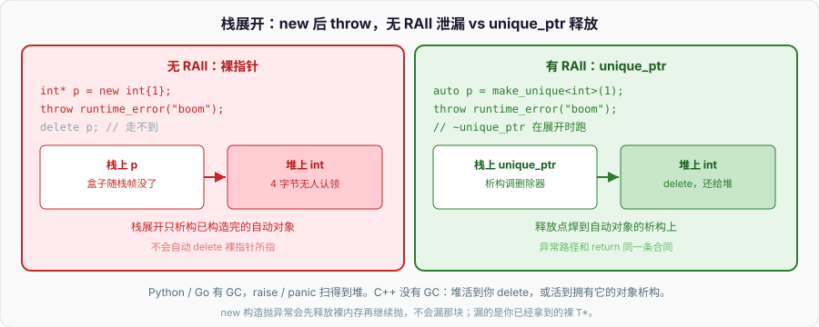

# 内存与RAII

`new` 成功了，下一行构造函数里 `throw`：

```cpp
void leak() {
    int* p = new int{1};
    throw std::runtime_error("boom");
    delete p;                       // 走不到
}
```

栈展开会析构已经构造完的自动对象，**不会**自动 `delete p`。`p` 是装着地址的盒子，盒子自己随栈帧没了，堆上那 4 字节没人认领。入门篇把这条事故留给本篇；对象模型把析构顺序钉死；指针篇把 `T*` 说成「可能空、可能悬」。本篇把三块拼上：存储在哪、`new`/`delete` 和 `malloc`/`free` 差什么、所有权怎么绑到对象寿命上、异常安全三档、野指针 / double free / UAF 从哪来。



Python 全是堆，引用计数 + GC，`raise` 不会把对象弄丢。Go 也是 GC，`panic` 仍然扫得到堆。C++ 没有 GC：堆上那块活到你 `delete`，或活到拥有它的对象析构。智能指针是 RAII 的一种应用，本篇只点到，不展开引用计数和别名。

---

## 一、栈、堆、静态：三块地

### 1、自动存储：栈帧上的盒子

函数一进，局部变量和临时量在当前栈帧分配；一出，按构造反序析构，存储收回。入门篇的自动存储期。对象模型的「后构造先析构」就是栈。

```cpp
void f() {
    int n = 1;                      // 栈
    std::string s = "hi";           // s 这个对象在栈上；缓冲通常在堆上
}                                   // ~s 释放缓冲，n 随帧消失
```

栈上对象的地址随帧走。返回局部的指针 / 引用，指向的是已经回收的栈槽，再用是 UAF。栈大小有限（常见几 MB），巨大数组、深度递归会溢出。大缓冲放 `vector`，不要 `char buf[1 << 20];`。

栈分配几乎是挪栈指针，析构是编译器插的调用。没有系统调用，没有锁。热路径上能放栈就放栈。Go 的局部可能逃逸到堆；C++ 局部对象地址一逃出函数就是你的 bug，编译器不会默默上堆（除非 RVO 把对象直接造在调用方）。

临时量也在自动存储期。`f(T{})` 里那个 `T` 活过整个函数调用（实参寿命），`const T& r = T{};` 活过 `r`。表达式中间的纯右值在完整表达式末尾析构。不要把指向临时量的指针存进容器——表达式一结束，地址就是栈上的垃圾。对象模型篇的寿命延长只对「绑到引用上」成立，指针没有延长。

### 2、静态存储：程序一辈子

全局、`namespace` 变量、`static` 局部、`static` 成员：零初始化 → 常量初始化 → 动态初始化。对象模型篇写过跨翻译单元顺序未指定。寿命到程序结束，析构按构造反序。

```cpp
int g = 1;                          // 数据段，main 之前就在
int counter() {
    static int n = 0;               // 第一次经过这里才完成动态初始化
    return ++n;
}
```

静态对象的地址稳定，可以返回指针。不要在 `exit` / 静态析构阶段再碰已经死掉的另一个静态对象。多线程里函数内静态局部的初始化 C++11 起有锁；别在里面再抢同一把可能反过来等你的锁。

只读字面量、`const` 全局整数，常进只读段。写它们是 UB，表现常常是 SIGSEGV。指针篇的 `char* s = "hi"; s[0] = 'H';` 就是在写只读段。

`thread_local` 是按线程的静态存储期：每个线程一份，线程起来时初始化，线程结束时析构。不要把 `thread_local` 对象的地址交给别的线程还假设它一直活着——那个线程一退，地址就悬。函数内 `static` 是全进程一份，`thread_local` 是每线程一份，别混。

### 3、动态存储：堆，寿命你定

`new T` / `new T[n]` / 分配器 `allocate` 向堆要一块。这块活到对应的 `delete` / `delete[]` / `deallocate`。指针变量本身可以在栈上，所指在堆上——两份存储，两份寿命。

```cpp
int* p = new int{1};                // p 在栈，*p 在堆
delete p;                           // 堆收回；p 的值还在，已经悬
p = nullptr;
```

堆允许跨函数活、允许运行时才知道大小。代价：分配可能失败（抛 `std::bad_alloc` 或返回空，看是否 `nothrow`），有碎片，有锁，比栈慢一个数量级不止。`std::vector` 把堆缓冲藏在对象里，对象走 RAII，你几乎不必手写 `new`。

进程里还有 mmap、线程局部、寄存器（`register` 在 C++17 是保留字、无语义）。工程上先分清三块：栈跟函数，静态跟进程，堆跟你写的释放点。RAII 的意思是：把释放点焊到某个栈上（或静态）对象的析构上，让「跟函数 / 跟进程」的规则替你管堆。

堆上的字节在 `delete` 之后不再是那个对象。指针变量还在，值还是那个地址，这就是悬空。语言不把指针清零。栈上那只装地址的盒子和堆上那块数据，寿命从一开始就不是绑在一起的——除非你用 RAII 把它们焊上。

mmap / brk 是堆的下层。你几乎不直接碰它们；`malloc` / `operator new` 向系统要页，再切成对象大小。页对齐的大块、文件映射，才轮到 `mmap`。那也是资源，同样要 RAII（自己写个 `Mapped` 析构 `munmap`）。本篇的堆一律指 `new` 这条线。

---

## 二、new/delete vs malloc/free

### 1、new 不只是分配

`new T(args)` 大致三步：调用分配函数要原始字节（通常底层仍是类似 malloc 的东西）；在这块上构造 `T`；返回 `T*`。失败：分配失败抛 `std::bad_alloc`（除非 `nothrow`）；构造抛异常则先把原始字节释放再让异常继续，**不会**泄漏那块裸内存。

```cpp
struct Boom {
    Boom() { throw 1; }
};

int main() {
    try {
        Boom* p = new Boom();       // 分配成功，构造抛，内存已释放
    } catch (int) {}
}
```

开头那个泄漏不是 `new` 的构造失败，是 `new` **已经返回**之后，你把指针放进局部变量，再在别的代码里抛——那时对象已经构造成功，语言只负责析构自动对象，不负责追你手里的裸指针。

`delete p`：对非空指针先析构，再调释放函数。`delete nullptr` 合法，什么都不做。`new T[n]` 配 `delete[] p`：按反序析构 n 个元素再释放。`new` 配 `delete[]`、`new[]` 配 `delete`，UB。数组 new 会在块前头记个数（实现细节），用错释放函数会把个数当数据、或漏析构。

```cpp
int* a = new int[3]{};
delete[] a;
// delete a;                        // UB
```

`new int` 默认初始化（垃圾）；`new int()` / `new int{}` 值初始化（0）。入门篇写过。class 类型 `new T` 调默认构造。

定位 new：`new (ptr) T(args)` 在已有字节上构造，**不分配**。配对的是显式析构 `ptr->~T()`，不是 `delete ptr`——`delete` 会再调释放函数，而这块可能来自栈、来自 malloc、来自池。容器、`optional`、任何「先有存储再有对象」的地方都是定位 new。忘记析构：非平凡类型的资源漏。析构后当活对象用：UAF。

```cpp
alignas(T) unsigned char buf[sizeof(T)];
T* p = new (buf) T{};
p->~T();                            // 不是 delete p
```

### 2、malloc 只买字节

`malloc(n)` 返回 `void*`，不对任何对象构造。失败返回 `nullptr`，不抛。`free(p)` 不析构。`malloc(0)` 实现定义，可能空可能非空不可写。对齐至少适合 max_align_t；过对齐类型要用 `aligned_alloc` / 重载 `new`。

```cpp
int* p = static_cast<int*>(std::malloc(sizeof(int)));
if (!p) return;
*p = 1;                             // 开始对象寿命（平凡类型）
std::free(p);

auto* s = static_cast<std::string*>(std::malloc(sizeof(std::string)));
if (!s) return;
new (s) std::string("hi");          // 定位 new：在已有字节上构造
s->~basic_string();                 // 必须手动析构
std::free(s);
```

对非平凡类型，`malloc` 之后必须定位 `new` 才有对象，`free` 之前必须显式析构。漏一步：要么没对象却当对象用，要么析构没跑资源漏。这就是为什么 C++ 代码用 `new`/`delete` 或容器，不要把 `malloc` 当通用对象工厂。

`realloc` 可能搬内存。平凡字节缓冲可以；活着的 C++ 对象被搬走，指针全悬，析构跑在错误地址上。不要 `realloc` 含 `std::string` 的数组。

### 3、混用、nothrow、自定义 new

`new` 来的指针 `free`，`malloc` 来的指针 `delete`，UB。两边的元数据、对齐、调试填充都不保证兼容，即便今天碰巧能跑。

```cpp
int* p = new int{1};
// std::free(p);                    // UB
std::unique_ptr 之类才是正道，见后文点到为止。

int* q = static_cast<int*>(std::malloc(4));
// delete q;                        // UB
std::free(q);
```

`new (std::nothrow) T` 分配失败返回 `nullptr`，仍可能在构造阶段抛。返回值要查空。一般项目选异常，别混。

可以重载 `operator new` / `operator delete`（class 级或全局）。调试分配器、池、对齐都走这里。写了 `new` 必须写匹配的 `delete`，数组版本也要成对。不要在生产全局 `new` 里偷偷打日志到还没构造完的 `iostream`。本篇不展开分配器；记住 `new` 表达式和 `operator new` 不是一回事——前者含构造，后者只要字节。

C 的 `malloc` 对 Python / Go 运行时是内部细节。C++ 把「要字节」和「当对象」拆开，RAII 管的是对象，不是字节。

`operator new(sizeof(T))` 只要字节，返回 `void*`，失败抛。`new T` 表达式在这之后还要构造。调试时在重载的 `operator new` 里打断点，看到的是「要字节」那一层，看不到构造。泄漏报告里的栈常常停在分配函数，真正漏的是「拿到指针之后没进对象」。

---

## 三、RAII：所有权焊在析构上

### 1、资源获取即初始化

RAII：资源在对象构造时拿到，在析构时释放。对象的自动存储期（或静态期）替你决定释放点。栈展开、提前 `return`、`break` 出循环，析构都跑。开头的 `leak()` 错在资源只进了指针，没有进对象。

```cpp
struct Slot {
    int* p;
    explicit Slot(int v) : p(new int{v}) {}
    ~Slot() { delete p; }
    Slot(const Slot&) = delete;
    Slot& operator=(const Slot&) = delete;
};

void ok() {
    Slot s{1};
    throw std::runtime_error("boom");
}                                   // ~Slot 仍跑，delete 发生
```

`Slot` 按对象模型的五法则禁止拷贝——否则两个对象 `delete` 同一块。更好是成员直接用 `std::vector` / `std::string` / 智能指针，零法则，连 `Slot` 都不必写。

文件、锁、socket、mmap 同一模式：

```cpp
struct File {
    std::FILE* fp;
    explicit File(const char* path) : fp(std::fopen(path, "rb")) {
        if (!fp) throw std::runtime_error("open");
    }
    ~File() { if (fp) std::fclose(fp); }
    File(const File&) = delete;
    File& operator=(const File&) = delete;
};
```

构造失败（没打开）不要在析构里 `fclose` 空指针——上面 `fp` 非空才关。构造抛异常时，**已经构造成功的成员**会析构，正在构造的这个类的析构不跑。成员各自 RAII，组合才安全。

锁同一套路。`std::lock_guard<std::mutex>` 构造时 `lock`，析构时 `unlock`。手写 `mu.lock(); ...; mu.unlock();` 中间 `return` / `throw` 就会把锁带走。Go 的 `defer mu.Unlock()` 是函数级；C++ 的 guard 是作用域级，块结束就放，不必等函数返回。

```cpp
void bump(std::mutex& mu, int& n) {
    std::lock_guard<std::mutex> g(mu);
    n += 1;
}                                   // 解锁发生在这里，包括抛异常时
```

### 2、所有权：谁析构，谁释放

一块资源同一时刻只有一个所有者（独占），或有明确的共享计数（共享）。所有者是那个会在析构里释放的对象。指针、引用、观察者不管释放。

```cpp
void use(const std::string& s);     // 不拥有
void sink(std::string s);           // 按值：进来的是一份所有权（拷或移）
std::string make();                 // 返回：所有权交给调用方
```

形参 `T` 拿走一份（拷或移）；`T&` / `const T&` / `T*` 不拿走。指针篇的三种形参，在内存上就是所有权合同。返回 `T` 交所有权；返回 `T&` / `T*` 不交，调用方不得释放，且必须保证对象还活着。

容器拥有元素。`vector` 析构逐个析构元素再释放缓冲。`vector<T*>` 只拥有指针值，不拥有所指——这是最常见的假 RAII。要拥有堆上的 `T`，用 `vector<T>` 或 `vector<std::unique_ptr<T>>`。

所有权在签名里读：

```cpp
std::unique_ptr<T> make();          // 交出去
void eat(std::unique_ptr<T>);       // 吃进来
void view(const T&);                // 看看
void view(T*);                      // 看看，可能空
void borrow(T&);                    // 看看且能改，不拥有
```

`unique_ptr` 按值传就是交所有权（只能移，不能拷）。`unique_ptr<T>&` 能改指针本身（换成别的对象、释放），仍不是把所有权拷走。观察者需要「可能空」才用裸指针；确定有对象用引用。不要 `shared_ptr` 当默认形参——那是在说「我们一起拥有」，大多数 API 并没有这层意思。

### 3、智能指针只点到是 RAII 应用

`std::unique_ptr<T>` 独占一块 `new` 出来的对象，析构 `delete`。可移动、不可拷贝。`std::shared_ptr<T>` 共享所有权，最后一个析构时 `delete`。`std::weak_ptr` 观察、不延长寿命。它们是把开头那个 `int* p = new int` 换成一个栈上对象，让栈展开能跑到 `delete`。

```cpp
void f() {
    auto p = std::make_unique<int>(1);
    throw std::runtime_error("boom");
}                                   // unique_ptr 析构，delete 发生
```

`make_unique` / `make_shared` 把分配和接管焊成一次，避免 `foo(new T, new U)` 里某一个 `new` 成功另一个抛导致泄漏（C++17 对这个求值顺序仍不保证安全，用 make 最省心）。本篇到此为止：智能指针是 RAII，不是新的存储期。引用计数、循环引用、自定义删除器、别名构造，不在这里展开。

没有所有权的观察用裸指针或引用，合同写清楚：不释放、不存过所有者寿命。不要「以防万一」做成 `shared_ptr` 满天飞——那是把生命周期问题藏进计数。

工厂函数返回 `unique_ptr`，调用方按需转 `shared_ptr`（`std::shared_ptr<T> p = make();` 合法）。反过来不能从 `shared_ptr` 无损耗地退回独占——已经共享了。能独占就独占。循环引用（两个 `shared_ptr` 互相指）计数永远到不了 0，这是展开智能指针时才讲的坑；这里只记：共享所有权有成本，默认不要共享。

---

## 四、异常安全三档

### 1、无泄漏、不损坏、要么成功要么没发生

异常安全描述「抛了之后对象和资源处于什么状态」，不是「会不会抛」。三档：

**基本保证**（basic）：抛之后没有资源泄漏，对象仍满足不变量，可以析构、可以赋值，但内容可能已经改了一半。例如往 `vector` 插元素，抛了之后 `size` 可能已经变，但不会 double free。

**强保证**（strong）：抛之后状态和调用前一模一样——操作要么完成要么像没发生。拷贝并交换是典型手法。

**不抛保证**（nothrow / no-fail）：保证不抛。析构、移动、`swap` 应当尽量做到。`noexcept` 标出来，违反则 `terminate`。

没有「异常不安全」这档的合法位置：抛了之后泄漏或对象烂掉，是 bug。开头的 `leak()` 连基本保证都没有。

```cpp
void basic_push(std::vector<int>& v, int x) {
    v.push_back(x);                 // vector 自己提供对元素拷贝的强保证；
}                                   // 这里作为「至少不泄漏」的底线

void strong_replace(std::vector<int>& v, std::vector<int> src) {
    v.swap(src);                    // swap 不抛；src 带旧值出作用域释放
}                                   // 失败发生在构造 src 时，v 未动
```

按值收 `src` 时，失败点在调用方构造实参——目标还没进函数。进了函数再 `swap`，`swap` 对 `vector` 不抛。这是强保证的常见拼法。对象模型里移动赋值先 `new` 再 `delete`，也是为了基本 / 强保证：分配失败则旧缓冲还在。

### 2、拷贝并交换、操作顺序

要强保证：先在边上把新状态造出来（失败则旧对象没碰），再用不抛的 `swap` / 移动把新状态换进来。旧状态到临时对象里，析构释放。

```cpp
class Buffer {
    int* p_{nullptr};
    std::size_t n_{0};
public:
    Buffer() = default;
    explicit Buffer(std::size_t n) : p_(new int[n]{}), n_(n) {}
    ~Buffer() { delete[] p_; }
    Buffer(const Buffer& o) : Buffer(o.n_) {
        std::copy(o.p_, o.p_ + n_, p_);
    }
    Buffer(Buffer&& o) noexcept : p_(o.p_), n_(o.n_) {
        o.p_ = nullptr;
        o.n_ = 0;
    }
    void swap(Buffer& o) noexcept {
        using std::swap;
        swap(p_, o.p_);
        swap(n_, o.n_);
    }
    Buffer& operator=(Buffer o) {   // 按值：拷或移进 o，失败则 *this 不动
        swap(o);
        return *this;
    }
};
```

按值 `operator=` 把拷贝失败关在进函数之前（或进函数后只碰参数）。自赋值天然安全：自己拷一份再换。代价是每次赋值都先造完整副本，强保证用钱买。

操作顺序决定保证级别。先改 `*this` 再分配：分配失败时对象已经烂了，连基本保证都没有。先分配再改：分配失败则旧对象还在，至少基本保证。先造完整新状态再 swap：强保证。先释放再拿新资源：拿失败时手里空了，不变量可能破（文件关掉了却没打开新的）。资源替换的顺序几乎总是「先拿新、再放旧」，或「造好副本再换」。

基本保证更便宜：原地改，失败时允许「已经改了前 k 个」。文档写清楚。容器的 `insert` 对元素类型的要求写在标准里——元素移动 `noexcept` 时 `vector` 扩容走移动，否则走拷贝，就是为了扩容失败时旧缓冲仍完整。对象模型点过 `noexcept` 移动；异常安全是它的理由。

### 3、析构不抛、异常中再抛

栈展开时若析构再抛，两个异常同时在途，`std::terminate`。所以析构默认 `noexcept`，析构里只释放、记日志，不抛。文件 `fclose` 失败也吞掉（或记录），不要让 `~File` 抛。

`catch` 里再操作可能抛的代码，注意当前异常还在。`throw;` 原样继续传。`throw e;` 再造一个，可能切片。构造函数里抛是允许的——对象没活成，析构不跑，已构造成员反序析构。这是「构造失败用异常」和 RAII 配套的原因：不要用「半成品对象 + 错误码」让调用方忘了收摊。

没有异常的路径同样要 RAII。`return` 提前、`goto` 清理（C 风格）在 C++ 里用对象代替。Go 的 `defer` 是函数级 RAII；Python 的 `with` 是块级。C++ 的析构是作用域级，更密，也更依赖你把资源放进对象而不是放进裸指针。

项目选异常还是错误码是入门篇的话题。无论哪条路，资源释放必须走析构。错误码风格下构造失败用工厂返回 `optional` / `expected`，不要留下「打开了一半」的对象。

`noexcept` 是合同。标了却抛，`terminate`，没有 `catch` 的机会。移动、`swap`、析构能 `noexcept` 就标——`vector` 靠这个决定扩容走移动还是拷贝。不要把可能 `new` 的函数标 `noexcept` 来「图快」：`bad_alloc` 会直接杀进程。函数指针 / `std::function` 的类型含不含 `noexcept` 在 C++17 已经进入类型系统，对不上就匹配失败。

---

## 五、野指针、double free、UAF

### 1、野指针：值不是合法地址

未初始化的指针、已经释放仍留着的指针、指向已经结束寿命的对象的指针，解引用都是 UB。习惯上「野指针」偏未初始化，「悬空」偏释放之后，工程上一起消灭。

```cpp
int* p;                             // 局部未初始化，值是垃圾
// *p = 1;                          // UB

int* q = new int{1};
delete q;
// *q = 2;                          // UAF
q = nullptr;                        // 之后 delete q 安全，*q 仍 UB（空）

int* dangle() {
    int n = 1;
    return &n;                      // 栈槽收回
}
```

对策：声明立刻初始化成有效地址或 `nullptr`。释放后置空（仅当这是最后一个副本）。不要返回局部地址。不要存指向 `vector` 元素的指针再 `push_back`——扩容会使指针悬空。`string` 的 `c_str()` 同样，下一次改 `string` 就悬。

```cpp
std::vector<int> v{1, 2, 3};
int* p = &v[0];
v.push_back(4);                     // 可能扩容，p 悬空
const char* cs = std::string{"x"}.c_str();  // 临时 string 已死
```

成员里存 `T*` 指向自己的另一个成员，移动后指针可能仍指着源对象的成员——移动构造必须重绑。能存偏移 / 下标就别存内部指针。

Debug 下未初始化指针常是 `0xCCCCCCCC`，一解引用就炸。Release 可能「能跑」——这是 UB，不是修好。入门篇的未初始化 `int` 同一类。

### 2、double free：两个释放点认同一块

```cpp
int* p = new int{1};
int* q = p;                         // 浅拷，两个人都觉得自己拥有
delete p;
delete q;                           // double free
```

堆元数据被拆两次，下一次分配可能崩在毫无关系的 `new` 上，现场离犯罪点很远。默认拷贝一个攥着 `int*` 的 class，就是这条。对象模型的三法则针对它：要么深拷一份新缓冲，要么禁止拷贝，要么把指针换成 `unique_ptr` 让拷贝编译失败。

`delete p; delete p;` 在 `p` 没置空时也是 double free。置空后第二次 `delete nullptr` 合法。置空救不了 `q` 那个副本。所有权不能靠「记得置空」维持，要靠类型：独占用 `unique_ptr`，观察用裸指针且不 `delete`。

`new[]` / `delete` 混用有时表现为 double free 或漏析构，归类为「释放函数不匹配」。成对写，或不要写，交给 `vector`。

异常路径上的 double free：拷贝赋值先 `delete[] p` 再 `new`，`new` 抛了之后对象里 `p` 已经是释放过的地址，析构再 `delete[]` 一次。对象模型篇的「先造新再放旧」就是挡这个。RAII 成员（`unique_ptr`、`vector`）把顺序藏进它们自己的赋值，你少写一次就少错一次。

### 3、UAF：释放后再碰

use-after-free：`delete` 之后经任何还活着的指针 / 引用读写那块。堆可能已经把字节发给别人，你写的是别人的对象——数据损坏，不一定立刻崩。

```cpp
struct Node { int v; Node* next; };
Node* p = new Node{1, nullptr};
Node* alias = p;
delete p;
alias->v = 2;                       // UAF
```

悬空引用同一回事：`int& r = *p; delete p; r = 3;`。引用不能置空，更难事后标记。所以引用的合同是「绑定期间对象活着」，不要绑堆上即将交出的对象。

迭代器、指针、引用失效：`vector` 扩容、`erase`、`string` 增长。标准为每种容器写了失效规则。循环里 `erase` 必须用返回的下一个迭代器，不能再用旧的。

```cpp
std::vector<int> v{1, 2, 3, 4};
for (auto it = v.begin(); it != v.end(); ) {
    if (*it % 2 == 0) it = v.erase(it);     // erase 返回下一个
    else ++it;
}
```

`std::list` 删除只让被删的迭代器失效，`vector` 删除让其后全部失效。选容器时这是合同的一部分，不只是「快不快」。ASAN 对堆 UAF 很灵，对栈 UAF、迭代器失效也常能抓到；编译加 `-fsanitize=address` 应当成为本地默认，不是出事了才开。

工具：ASAN（`-fsanitize=address`）抓堆 UAF、double free、部分泄漏；未初始化用 MSAN 或 `valgrind`；UBSAN 抓空引用、越界下标。本机复现优先 ASAN，不要只靠「我看代码觉得没问题」。

野指针 / double free / UAF 不是三种无关的 C 题，是所有权没焊上的三种症状：没主人（野）、两个主人（double free）、主人已经死了还在用（UAF）。RAII + 清楚的观察者合同，是同一剂药。

还有一类「看起来像泄漏其实是还活着」：静态容器、全局 cache、单例里的 `new` 从不 `delete`——进程结束操作系统收回，ASAN 仍可能报。要干净就给单例一个析构，或故意泄漏并在注释里写「进程级缓存」。不要把「反正进程要退」当成函数里每次 `new` 都不 `delete` 的理由。

---

## 六、对照、易错点和一份能跑的实验

Python：对象在堆上，名字是引用计数里的一条边，`del` 只是去掉边。Go：逃逸分析 + GC，`defer` 管非内存资源。C++：栈对象跟作用域，堆对象跟 `delete` 或跟某个栈对象的析构。没有第三种「语言替你扫」的默认路径。`new` 返回之后，所有权必须立刻进 RAII 对象。异常安全的底线是析构能跑；强保证再加「失败则旧状态不动」。

对照一张表：

| | 分配 | 释放 | 失败 | 对象寿命 |
| --- | --- | --- | --- | --- |
| 栈 | 进作用域 | 析构 + 收帧 | 不涉及堆失败 | 作用域 |
| `new` / `delete` | 分配 + 构造 | 析构 + 释放 | 抛 / nothrow 空 | 到 `delete` |
| `malloc` / `free` | 只要字节 | 不析构 | 返回空 | 你当它是对象的那段 |
| RAII 对象 | 构造里拿 | 析构里放 | 构造抛则没对象 | 跟对象 |

智能指针只是表里最后一行的一种实现。`unique_ptr` 独占，`shared_ptr` 共享，裸指针观察。本篇不把它们当新语言特性讲——存储期仍是那三块。

易错点：

- `new` 成功、中间 `throw` / `return`，裸 `delete` 走不到。
- `new[]` 配 `delete`，`malloc` 配 `delete`。
- 默认拷贝带指针的类，两个析构抢一块。
- 析构里抛异常。
- 释放后指针副本还在，继续 `*`。
- 返回局部地址。
- `vector<T*>` 当拥有者，只清了指针数组。
- 追求强保证却原地改到一半才 `new` 失败。
- 用 `realloc` 搬活着的 C++ 对象。
- 定位 new 之后 `delete`，或忘记显式析构。
- `lock` / `unlock` 手写配对，中间 `throw`。
- 赋值先 `delete` 再 `new`，`new` 抛了 double free。

把泄漏、RAII、三档保证、三类 bug 串进一个文件。`g++ -std=c++17 -O0 -Wall -Wextra -o raii raii.cpp && ./raii`：

```cpp
// raii.cpp — 栈堆、new vs 泄漏、RAII、拷贝并交换。C++17。
#include <algorithm>
#include <cstdio>
#include <iostream>
#include <memory>
#include <new>
#include <stdexcept>
#include <string>
#include <utility>
#include <vector>

struct Slot {
    int* p;
    explicit Slot(int v) : p(new int{v}) {}
    ~Slot() { delete p; }
    Slot(const Slot&) = delete;
    Slot& operator=(const Slot&) = delete;
    Slot(Slot&& o) noexcept : p(o.p) { o.p = nullptr; }
    Slot& operator=(Slot&& o) noexcept {
        if (this == &o) return *this;
        delete p;
        p = o.p;
        o.p = nullptr;
        return *this;
    }
};

struct Buffer {
    int* p_{nullptr};
    std::size_t n_{0};
    Buffer() = default;
    explicit Buffer(std::size_t n) : p_(new int[n]{}), n_(n) {}
    ~Buffer() { delete[] p_; }
    Buffer(const Buffer& o) : Buffer(o.n_) {
        std::copy(o.p_, o.p_ + n_, p_);
    }
    Buffer(Buffer&& o) noexcept : p_(o.p_), n_(o.n_) {
        o.p_ = nullptr;
        o.n_ = 0;
    }
    void swap(Buffer& o) noexcept {
        using std::swap;
        swap(p_, o.p_);
        swap(n_, o.n_);
    }
    Buffer& operator=(Buffer o) {
        swap(o);
        return *this;
    }
    std::size_t size() const { return n_; }
};

int g_static = 7;

void may_throw(bool boom) {
    Slot s{42};
    if (boom) throw std::runtime_error("boom");
    (void)s;
}

int main() {
    int stack_n = 1;
    int* heap_n = new int{2};
    std::cout << "stack=" << stack_n
              << " heap=" << *heap_n
              << " static=" << g_static << "\n";
    delete heap_n;

    int* z = new int{};                 // 值初始化 0
    int* g = new int;                   // 默认初始化，不打印 *g
    std::cout << "value_init=" << *z << "\n";
    delete z;
    delete g;

    try {
        may_throw(true);
    } catch (const std::runtime_error& e) {
        std::cout << "caught=" << e.what() << " (Slot still released)\n";
    }

    Buffer a{3};
    Buffer b = a;                       // 拷贝，独立缓冲
    a = Buffer{5};                      // 按值赋值，强保证拼法
    std::cout << "a=" << a.size() << " b=" << b.size() << "\n";

    auto p = std::unique_ptr<int>(new int{9});  // RAII 应用；生产用 make_unique
    std::cout << "unique=" << *p << "\n";

    std::vector<int> xs{1, 2, 3};
    xs.push_back(4);                    // 缓冲在堆，所有权在 xs
    std::cout << "vec=" << xs.size() << "\n";
}
```

跑完对照：栈、堆、静态三块都能读到确定值；`new int{}` 是 0；`may_throw(true)` 抛了之后程序仍活着——`Slot` 的析构把 `new` 配上了 `delete`；`Buffer` 拷贝后各有各的长度，赋值换成 5 不影响副本；`unique_ptr` 出作用域即释放。开头那种「`delete` 走不到」的写法，只要指针不进对象，就会在 `throw` 时少一次释放。名字仍是盒子：栈上的盒子跟作用域死，堆上的盒子跟所有者的析构死。RAII 把第二只盒子的钥匙放进第一只盒子里。

编译加上 `-fsanitize=address` 再跑一遍，故意写的泄漏路径会被打出来，RAII 路径应当干净。这不是可选作业——本篇列的三类 bug，ASAN 比 code review 更早发现。

虚函数、模板、STL 容器的失效规则，都建立在这套所有权上。资源进对象，观察者不当所有者，异常路径上析构仍能跑——这三句够把本篇用在后端代码里。

手写 `new` 的检查清单：立刻交给 RAII 对象；`new`/`delete`、`new[]`/`delete[]`、`malloc`/`free` 各自成对，不混；构造失败让成员析构去收已经拿到的资源；赋值先造新再放旧；析构不抛。能交给 `vector` / `string` / `unique_ptr` 的，不要出现在这份清单上——零法则比五法则更安全。后端代码里泄漏、UAF、锁没放，多半不是「忘了写 delete」，是「指针没进对象」。把钥匙放进盒子，盒子出作用域时钥匙一起走。

入门篇钉盒子，对象模型钉盒子内部和特殊成员，指针篇钉三种形参和值类别，本篇钉盒子在哪一块地、谁在离开时收摊。四篇是同一件事的四个切面。

