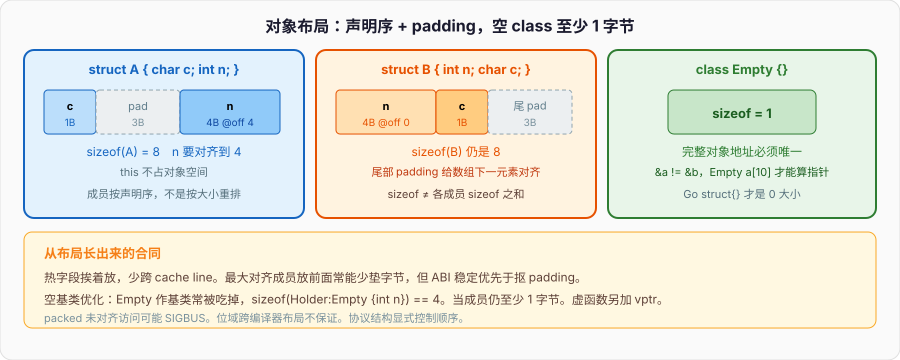

# 对象模型

空 class 写出来：

```cpp
class Empty {};
```

`sizeof(Empty)` 不是 0，常见实现是 1。每个对象必须有独一无二的地址：两个 `Empty` 变量 `&a != &b`。大小若是 0，`Empty a[10]` 里所有元素叠在同一地址，指针算术崩掉。编译器塞 1 字节占位。入门篇说名字对应存储；对象模型把这块存储的内部排法钉死。

Python 的 `class Empty: pass` 实例在堆上，带类型指针、引用计数，`sys.getsizeof` 远大于 1。Go 的 `type Empty struct{}` 才是 0 大小——Go 允许不同变量共享同一地址。C++ 选了「对象有身份」：同一类型的两个完整对象，地址必须不同。后面的成员布局、`this`、空基类优化、标准布局，都从这条身份规则长出来。



---

## 一、成员怎么排，this 从哪来

### 1、声明顺序就是内存顺序

非静态数据成员按**声明顺序**排，中间为了对齐插入 padding。尾部再补齐，让数组里下一个元素也对齐。

```cpp
#include <iostream>

struct A { char c; int n; };
struct B { int n; char c; };

int main() {
    std::cout << sizeof(A) << " " << sizeof(B) << "\n";  // 常见都是 8
    std::cout << offsetof(A, c) << " " << offsetof(A, n) << "\n";  // 0 4
    std::cout << offsetof(B, n) << " " << offsetof(B, c) << "\n";  // 0 4
}
```

`A` 在 `c` 后面垫 3 字节，`n` 落到 4 的倍数。`B` 的 `c` 后面同样垫 3 字节——不是给 `c` 自己，是给「下一个 `B`」。`sizeof` 不是成员 `sizeof` 之和。入门篇点过这一句，这里是完整规则：对齐按成员类型，整体对齐取成员对齐的最大值（实现可更严）。

把热数据、常一起访问的字段挨着放，减少 cache line 跨度。把最大对齐的成员放前面，常常能少垫几个字节，但可读性和 ABI 稳定优先于抠 padding。协议结构体要和 C / 对端二进制一致时，显式控制顺序，必要时 `__attribute__((packed))`——packed 会让未对齐访问变慢，甚至在某些架构上 SIGBUS。默认别 pack。

位域把多个小整数塞进同一个分配单元，声明顺序仍是逻辑顺序，但跨编译器的布局不保证。需要可移植的二进制布局，用 `std::uint8_t` 自己做位移，不要赌位域。

### 2、this 是隐式指针，不占对象空间

非静态成员函数被调用时，编译器多传一个参数：指向当前对象的指针，名字叫 `this`。`s.f(1)` 大致是 `S::f(&s, 1)`。`this` 的类型：非 const 成员里是 `T*`，const 成员里是 `const T*`。它不是成员，不计入 `sizeof`。

```cpp
struct Counter {
    int n = 0;
    void inc() { ++n; }                 // 等价 ++this->n
    int get() const { return n; }       // this 是 const Counter*
    Counter* self() { return this; }
};

int main() {
    Counter c;
    c.inc();                            // this == &c
    const Counter k;
    k.get();                            // 只能调 const 成员
    // k.inc();                         // 非法：inc 的 this 不是 const
}
```

`this` 不能重新赋值（C++ 里它是 prvalue）。成员函数里写 `n` 就是 `this->n`。静态成员函数没有 `this`，所以不能直接碰非静态成员——没有「当前对象」。

Python 的 `self` 是显式第一个参数，运行时绑实例。Go 的方法接收者写成 `func (c *Counter) Inc()`，也是显式。C++ 把接收者藏进 `this`，类型系统用尾 `const` 区分只读。入门篇的 const 接口合同，落点就是 `this` 的类型。

取成员函数指针不是取 `this`：`void (Counter::*pmf)() = &Counter::inc;` 要一个对象才能调用 `(c.*pmf)()`。成员指针的宽度常常不是 `sizeof(void*)`，虚函数还会更宽。本篇只需要：普通数据成员按偏移访问，`this` + 偏移就是成员地址。

### 3、空对象为何不能是 0

回到开头。完整对象（不是基类子对象）大小至少 1，保证地址唯一：

```cpp
Empty a;
Empty b;
static_assert(sizeof(Empty) >= 1);
// &a != &b，始终成立
```

`new Empty[n]` 要能用指针差还原下标。零大小数组在 C++ 里不是标准功能。占位字节没有值的语义，不要读它。有了非静态数据成员之后，这 1 字节占位通常被成员「吃掉」，`sizeof` 按成员和对齐走。

---

## 二、标准布局与空基类优化

### 1、标准布局：能当 C struct 用的那一类

标准布局（standard-layout）是一套布局合同，满足时可以用 `offsetof`，可以和 C 互传，可以 `memcpy` 到另一块同样类型的存储（在对象生命周期规则允许的前提下）。C++17 用 `std::is_standard_layout<T>::value` 查。

常见要求（完整条款在标准 [class.prop]，这里记工程上会踩的）：

- 没有虚函数、没有虚基类。
- 所有非静态数据成员访问控制相同（别一部分 `public` 一部分 `private`）。
- 至多一个类提供非静态数据成员：要么基类没有数据、数据全在派生类，要么反过来。
- 基类不是和第一个非静态成员同一类型（否则地址会撞）。
- 成员本身也是标准布局。

```cpp
#include <type_traits>

struct Point { int x; int y; };                 // 是
struct Bad {
    int x;
private:
    int y;                                      // 访问控制混了，不是
};
struct Poly { virtual void f(); int n; };       // 有虚函数，不是

static_assert(std::is_standard_layout<Point>::value);
static_assert(!std::is_standard_layout<Bad>::value);
static_assert(!std::is_standard_layout<Poly>::value);
```

标准布局加上平凡拷贝（trivially copyable）就是「可以当字节块搬」的类型。协议缓冲区、共享内存、`write(fd, &msg, sizeof(msg))` 依赖这个。一旦加了虚函数、用户提供的拷贝构造、`std::string` 成员，合同失效，不要 `memcpy`。

平凡类型的默认构造在默认初始化时对局部变量仍然**不做零填充**——入门篇的 `S s;` 对无用户构造的 `S`，成员是垃圾。标准布局不等于零值。需要确定值就 `S s{}`。

### 2、空基类优化（EBO）

作为**完整对象**的空 class 至少 1 字节；作为**基类子对象**，常见实现把这 1 字节优化掉，让派生类的第一个成员和基类起始地址重合。这叫空基类优化。

```cpp
struct Empty {};
struct Holder : Empty { int n; };

static_assert(sizeof(Empty) == 1);
static_assert(sizeof(Holder) == sizeof(int));   // 常见成立，EBO 吃掉空基类
```

标准库靠它省空间：`std::vector` 把分配器作为基类（或用压缩对），空分配器不占额外字节。自己写「策略 / 分配器 / 比较器」当模板参数时，用基类或压缩对，不要无脑当成员——当成员的空 class 仍至少 1 字节，再对齐可能变成 4 或 8。

EBO 有限制。同一类型的两个子对象不能共享地址：

```cpp
struct Empty {};
struct Two : Empty, Empty {};   // 非法，不能直接重复继承同一类

struct E1 {};
struct E2 {};
struct Mix : E1, E2 { int n; }; // 两个不同空基类，常见仍 sizeof == 4
```

成员如果是空 class，**没有** EBO（C++20 的 `[[no_unique_address]]` 才给成员开类似口子，本系列按 C++17，当成员就按至少 1 字节算）。

空基类和第一个成员类型相同会破坏「基类与成员地址不同」：

```cpp
struct Empty {};
struct Awkward : Empty {
    Empty e;                    // 合法，但 EBO 往往不能把基类压成 0
};
```

布局是 ABI。加一个虚函数、调换成员顺序、插入 `private`，都可能让 `sizeof` 和对端结构对不上。对外的二进制接口锁死布局，对内的类型按规则排。

### 3、虚函数只点到 vptr

给 class 加一个虚函数，对象里通常多一个隐藏指针——vptr，指向该类的虚表。64 位上这是 8 字节，再加对齐。

```cpp
struct A { int n; };
struct B { virtual void f(); int n; };

// 常见：sizeof(A) == 4，sizeof(B) == 16（8 字节 vptr + 4 字节 n + 4 字节尾对齐）
```

有了 vptr，就不再是标准布局，不能当 C struct 用，`offsetof` 在非标准布局上是条件支持。虚调用、虚析构、纯虚、菱形继承，后面专篇。这里只记：**虚函数改变对象大小和布局**。不需要运行时多态就不要 `virtual`，那 8 字节和间接跳转是税。

Go 的接口动态派发把 itable 放在接口值里，对象本身不加 vptr。Python 全是鸭子 + 类型对象指针。C++ 把派发信息放进对象，所以「加不加 virtual」是布局决策，不是风格。

---

## 三、构造与析构顺序

### 1、构造：基类 → 成员声明序 → 函数体

创建一个完整对象时，顺序固定：

1. 构造虚基类（由最派生类负责，深度优先、声明序）。没有虚继承就跳过。
2. 构造直接基类，按基类声明顺序，与初始化列表里写的顺序无关。
3. 构造非静态成员，按**成员声明顺序**，同样与初始化列表顺序无关。
4. 执行构造函数体。

```cpp
#include <iostream>

struct Base {
    Base() { std::cout << "Base\n"; }
    ~Base() { std::cout << "~Base\n"; }
};

struct Member {
    Member() { std::cout << "Member\n"; }
    ~Member() { std::cout << "~Member\n"; }
};

struct D : Base {
    Member m;
    D() { std::cout << "D\n"; }
    ~D() { std::cout << "~D\n"; }
};

int main() {
    D d;
}
// 输出：
// Base
// Member
// D
// ~D
// ~Member
// ~Base
```

先基类后成员：成员构造函数里可以安全用已经活着的基类子对象。先声明的成员先构造：后面的成员初始化器可以引用前面的成员，反过来在对象尚未开始构造时读前面——如果前面还没轮到，那是未初始化读。

数组按从小到大的下标构造；`new T[n]` 同样。聚合初始化按声明顺序给成员填值，没写到的走空初始化。

### 2、析构：严格反序

析构函数体先执行，然后成员按声明的**逆序**析构，然后基类逆序析构。和构造对称。栈上多个自动对象，后构造的先析构（后进先出）。

这个反序是 RAII 能嵌套的原因：内层锁、文件、缓冲先释放，外层再收。内存与 RAII 篇会把所有权钉在析构上；这里只要顺序本身。

构造中途抛异常：已构造完的成员和基类按反序析构，**没构造到的不管**，函数体不会跑。这不是「部分对象泄漏」，是语言保证。你要保证的是：每个已经构造完的子对象，自己的析构能把资源吐干净。

```cpp
struct Boom {
    Boom() { throw 1; }
};

struct Wrap {
    Member ok;          // 先构造成功
    Boom boom;          // 这里抛，ok 会被析构
};
```

`ok` 的析构会跑，`Wrap` 自己的析构不会——对象没构造成功，没有「这个 Wrap」。

### 3、委托、继承、数组、临时量

C++11 起可以委托构造：`D() : D(0) {}`。目标构造按上面的完整顺序跑一遍，回来后执行当前函数体。不要双向委托，会递归。委托时**不能同时初始化成员**——成员已经在被委托的那个构造里初始化过了。

继承构造 `using Base::Base;` 把基类构造函数拉进派生类，派生类自己的成员按类内初始值或默认初始化，不会自动去调基类那个签名之外的逻辑。成员有不变量，写自己的构造，不要只 using。

临时量的寿命：纯右值在完整表达式末尾析构。`const T& r = T{};` 会把临时量寿命延长到引用的寿命。`T&& rr = T{};` 同样延长。这不是引用本身「拥有」堆，只是编译器把临时量的销毁点推迟。返回局部自动对象的引用仍是悬空——那个对象在 `return` 时已经死了，没有延长。

虚析构：基类指针 `delete` 派生对象，基类析构必须 `virtual`，否则只调基类析构，派生成员漏析构，UB。本篇不展开虚表，只记这条删除合同。没有多态删除，就不要无故给析构加 `virtual`——又是一个 vptr。

---

## 四、拷贝、移动与三 / 五法则

### 1、编译器默认生成什么

用户一个特殊成员都不写时，编译器按需生成：默认构造、析构、拷贝构造、拷贝赋值；C++11 起还有移动构造、移动赋值。成员逐个拷 / 移。对 `int` 就是拷位；对 `std::string` 就是调它自己的拷贝 / 移动。

一旦你声明了其中某些，生成规则收紧：

- 用户声明了拷贝构造或拷贝赋值，移动操作**不再默认生成**（想要就 `= default`）。
- 用户声明了移动构造或移动赋值，拷贝操作被定义为删除（除非你显式写拷贝）。
- 用户声明了析构，移动不再默认生成；拷贝仍生成，但被视为过时倾向。

```cpp
struct Rule {
    std::string s;
    // 什么都不写：拷贝深拷字符串，移动偷缓冲，析构放缓冲
};

struct Once {
    std::string s;
    Once(const Once&) = default;     // 声明了拷贝 → 移动不会默认生成
};
```

`= default` 是「按成员默认做」；`= delete` 是「禁止」。要禁止拷贝的资源句柄，把拷贝构造和拷贝赋值 `= delete`，按需保留移动。

### 2、拷贝构造与拷贝赋值

拷贝构造 `T(const T&)` 在用一个已有对象**初始化**另一个时调用：`T a = b;`、`T a(b);`、按值传参、按值返回（未省略时）。拷贝赋值 `T& operator=(const T&)` 在两个都活着的对象之间赋值：`a = b;`。

```cpp
struct Buffer {
    int* p;
    std::size_t n;
    Buffer(std::size_t n) : p(new int[n]{}), n(n) {}
    ~Buffer() { delete[] p; }

    Buffer(const Buffer& o) : p(new int[o.n]), n(o.n) {
        std::copy(o.p, o.p + n, p);
    }
    Buffer& operator=(const Buffer& o) {
        if (this == &o) return *this;           // 自赋值
        int* q = new int[o.n];                  // 先分配，失败则原对象不变
        std::copy(o.p, o.p + o.n, q);
        delete[] p;
        p = q;
        n = o.n;
        return *this;
    }
};
```

默认逐成员拷贝对「手里攥着裸指针」是浅拷：两个对象 `delete[]` 同一块，double free。这就是三法则的来源——你写了析构释放资源，拷贝必须深拷或禁止拷贝，赋值必须对得上。自赋值 `a = a;` 先 `delete[] p` 再读 `o.p` 就是 UAF。先造新资源再释放旧的，异常时旧对象还在。

按值传 `Buffer` 会拷贝构造。大对象用 `const Buffer&`。指针与引用篇拆三种形参；这里记住拷贝构造的钱是实打实的分配 + 逐字节/逐元素。

### 3、移动构造与移动赋值

移动把资源**所有权转走**，源对象留下合法可析构的空状态。动机是：按值返回大 `vector` 时不必再分配一块去拷元素。指针与引用篇从值类别讲 `std::move`；对象模型这边看特殊成员。

```cpp
Buffer(Buffer&& o) noexcept : p(o.p), n(o.n) {
    o.p = nullptr;
    o.n = 0;
}
Buffer& operator=(Buffer&& o) noexcept {
    if (this == &o) return *this;
    delete[] p;
    p = o.p;
    n = o.n;
    o.p = nullptr;
    o.n = 0;
    return *this;
}
```

源对象之后只保证：可以赋值、可以析构。不要假设移动后 `o.n` 仍是旧长度。`noexcept` 很重要：`std::vector` 扩容时，若元素移动是 `noexcept`，就移动；否则退回拷贝，保证抛异常时旧缓冲仍完整。移动赋值里先 `delete[] p` 再偷，自移动要挡。更稳的是 swap，或先把源的指针掏空再释放自己。

C++17 对纯右值有强制省略拷贝 / 移动（prvalue 直接在目标存储上构造）。`T f() { return T{1}; } T x = f();` 可以一次构造，不调移动。`std::move` 不会「更快」，它只是把左值转成右值引用，去匹配移动重载。

### 4、三法则、五法则、零法则

**三法则**：需要析构、拷贝构造、拷贝赋值中的一个，另外两个也要一起考虑。典型触发点是裸 `new`、文件描述符、锁。

**五法则**：C++11 加上移动构造、移动赋值。写了五个中的一个，其余四个都要显式：实现、`= default` 或 `= delete`。

**零法则**：不要自己管资源。成员用 `std::string`、`std::vector`、智能指针、`std::unique_ptr` 这类 RAII 类型，特殊成员全部默认生成。自己写五件套是最后手段。

```cpp
struct File {                         // 零法则
    std::string path;
    std::vector<char> data;
};

struct Handle {                       // 五法则，禁止拷贝，允许移动
    int fd = -1;
    Handle() = default;
    explicit Handle(int fd) : fd(fd) {}
    ~Handle() { if (fd >= 0) /* close(fd) */; }
    Handle(const Handle&) = delete;
    Handle& operator=(const Handle&) = delete;
    Handle(Handle&& o) noexcept : fd(o.fd) { o.fd = -1; }
    Handle& operator=(Handle&& o) noexcept {
        if (this == &o) return *this;
        if (fd >= 0) { /* close(fd) */ }
        fd = o.fd;
        o.fd = -1;
        return *this;
    }
};
```

析构默认 `noexcept`。析构里抛异常，栈展开再碰上异常会 `terminate`。释放失败记日志，不要抛。入门篇写过这条，对象模型把它焊在特殊成员上。

Python 的 `__init__` / `__del__` 不管拷贝——赋值是换绑。Go 没有析构，没有拷贝构造，结构体赋值是浅拷字段，切片头共享底层数组。C++ 把「这个对象被复制时资源怎么办」编进类型，所以有五件套。能零法则就零法则。

---

## 五、初始化列表

### 1、列表决定用哪个构造，顺序仍是声明序

冒号后面是成员初始化列表，在函数体之前跑。成员按**声明顺序**初始化，不是按你在列表里写的顺序。写反了，编译器通常警告，运行时是先声明的那个先活。

```cpp
struct Pair {
    int a;
    int b;
    Pair(int x) : b(x), a(b) {}     // 仍先初始化 a，此时 b 还没开始 → a 读未初始化的 b
};
```

正确：要么按声明序写列表，要么让后面的依赖前面已经声明的成员。跨成员依赖尽量少，能在函数体里算的，先把每个成员用参数或类内初始值钉死。

没出现在列表里的成员：有类内初始值就用它，否则默认初始化。局部 `int` 成员默认初始化是垃圾——又是入门篇那条。

```cpp
struct S {
    int n = 1;                      // 类内初始值
    int m;
    S() : m(2) {}                   // n 用 1，m 用 2
    explicit S(int n) : n(n), m(0) {}  // 列表覆盖类内初始值
};
```

### 2、必须走列表的三类成员

const 成员、引用成员、没有默认构造的成员，不能在函数体里「先默认再赋值」。它们必须在初始化列表（或类内初始值）里完成初始化。

```cpp
struct NeedList {
    const int id;
    int& ref;
    std::unique_ptr<int> p;         // 有移动，没有拷贝；这里只说明「没有默认」时也必须
    NeedList(int id, int& r)
        : id(id), ref(r), p(std::make_unique<int>(0)) {}
};
```

函数体里的 `id = 1;` 是赋值。`const int` 不能赋值。引用不能空着等赋值。这和「初始化 vs 赋值」是同一条缝：入门篇对 `const int n = 1;` 说过，成员上更硬。

初始化列表里对成员写 `n(n)`，右边的 `n` 是构造函数参数，左边是成员——合法且常见。对基类写 `Base(args)`，调的是基类那个构造，不是成员。

### 3、委托、explicit、聚合

委托构造把活交给另一个构造，当前构造的列表里只能出现被委托的构造，不能夹带成员。类内初始值在「没被列表覆盖」时生效，委托走的那个构造会处理成员。

`explicit` 挡住单参数构造变成隐式转换：

```cpp
struct Box {
    int n;
    explicit Box(int n) : n(n) {}
};

void take(Box);
// take(3);                         // 非法
take(Box{3});                       // 合法
Box b = 3;                          // 非法（拷贝初始化，要隐式转换）
Box c{3};                           // 合法（直接列表初始化）
```

聚合（C++17）：没有用户提供的构造函数、没有私有 / 保护非静态数据、没有虚函数 / 虚基类，可以 `S s{1, 2};` 按声明序填。一旦你写了 `S(int)`，聚合口子关掉，必须走构造函数。想保留聚合就不要写构造，用类内初始值给默认。

`this` 在初始化列表里已经指向正在构造的对象，可以取地址交给成员，但不要在列表里调虚函数——派生类部分还没构造，虚调用会落到基类实现或纯虚崩溃。函数体里调虚函数同样落在**当前正在构造的类**，不是最终派生类。构造 / 析构期间当对象就是当前这个类。

---

## 六、static 成员

### 1、不属于对象，不进 sizeof

静态数据成员是「这个 class 一份」，不是「每个对象一份」。它不占对象布局，`sizeof` 不算它。访问不需要对象：`T::count`。有对象也能 `t.count`，语义仍是那一份。

```cpp
struct Account {
    static int total;               // 声明
    int id = 0;
};

int Account::total = 0;             // 定义，只能一份

int main() {
    Account a, b;
    Account::total = 2;
    // sizeof(Account) 不含 total，常见等于 sizeof(int)
}
```

静态成员函数没有 `this`，不能访问非静态成员，不能是 const（没有对象可 const）。可以访问静态成员、可以调其他静态函数。当命名空间函数用，只是名字在 class 作用域里，有访问私有的权限。

Python 的类变量活在类对象上，实例赋值会在实例字典里遮住它。Go 没有 class 级字段，包级变量是另一回事。C++ 的 static 成员是带访问控制和 class 作用域的全局变量。

### 2、定义位置与 C++17 inline static

非 inline 的静态数据成员：头里声明，某一个 `.cpp` 里定义。头里直接 `int Account::total = 0;` 会被每个 include 的翻译单元定义一次，违反 ODR。这和入门篇全局变量同一条规则。

C++17 允许 `inline static` 在类内定义：

```cpp
struct Account {
    inline static int total = 0;    // 头文件里可以，链接器合并成一份
    static constexpr int kMax = 100;  // C++17 起 constexpr 静态成员隐式 inline
};
```

`static constexpr` 整型在 C++17 之前常常还要类外再写一行定义（取地址时）。C++17 起当 inline 变量处理。新代码静态成员优先 `inline static` / `static constexpr`，少在 cpp 里漏定义。

静态成员可以是不完整类型的指针 / 引用，也可以是本类型的指针——单例指针那种。不能是本类型的非静态成员（大小无限递归）。静态 `std::string` 的构造发生在动态初始化阶段，注意下一小节。

### 3、静态初始化顺序

静态存储期的对象：先零初始化，再常量初始化，再动态初始化。同一翻译单元里，命名空间作用域的动态初始化按定义顺序。**跨翻译单元的动态初始化顺序未指定**。这就是 static initialization order fiasco：

```cpp
// a.cpp
std::string g_name = "svc";

// b.cpp
std::string g_hello = g_name + " started";  // g_name 可能还没构造
```

对策：改成函数内静态局部。C++11 起函数内静态局部的初始化是线程安全的，第一次经过那行才构造：

```cpp
const std::string& name() {
    static const std::string s = "svc";
    return s;
}
```

对象模型里它仍是静态存储期，寿命到程序结束。析构顺序：动态初始化过的静态对象，按构造的反序析构。函数内静态在第一次构造后参与这个序列。析构阶段再去用已经死掉的另一个静态对象，是另一类 fiasco。静态对象的析构里不要碰别的全局。

静态成员的构造 / 析构同样走这套。它不是「第一个对象创建时才活」，命名空间作用域的静态成员在 `main` 之前就可能已经构造完。不要在静态初始化里调还依赖别的全局的东西。

---

## 七、对照、易错点和一份能跑的布局实验

Go 的结构体内存也按对齐排，没有 this、没有成员函数藏 vptr（方法不进对象）。Python 实例是 `__dict__` 或 slots，没有「成员偏移写死」这回事。C++ 对象是一块连续存储：开头可能是 vptr，然后基类子对象，然后成员，中间 padding。空完整对象至少 1 字节；空基类常常 0 额外字节。`this` 是这块存储的地址。

构造按基类、成员声明序、函数体；析构反过来。拷贝是再造一块并复制资源；移动是偷资源并把源掏空。三 / 五法则针对「你自己管的资源」；能交给成员管理就零法则。初始化列表不是语法糖，是 const / 引用 / 无默认构造成员的唯一入口。static 成员是类的全局，不进 sizeof，定义遵守 ODR。

易错点压缩：

- 列表顺序当初始化顺序——不是，声明序才是。
- 写了析构忘了拷贝，默认浅拷然后 double free。
- 基类指针删除派生对象，基类析构非虚 → UB。
- 构造函数里调虚函数，期望落到派生类——不会。
- `sizeof` 当有效载荷，忘了 padding 和 vptr。
- 两个翻译单元的全局互相依赖构造。
- 空 class 当成员指望不占空间——C++17 下至少 1 字节。

把布局、顺序、特殊成员串进一个文件。`g++ -std=c++17 -O0 -Wall -Wextra -o objmodel objmodel.cpp && ./objmodel`：

```cpp
// objmodel.cpp — 空 class、布局、构造顺序、五法则、static。C++17。
#include <algorithm>
#include <cstddef>
#include <iostream>
#include <string>
#include <type_traits>
#include <utility>

struct Empty {};

struct Naive {
    char c;
    int n;
};

struct Base {
    Base() { std::cout << " Base"; }
    ~Base() { std::cout << " ~Base"; }
};

struct Member {
    Member() { std::cout << " Member"; }
    ~Member() { std::cout << "~Member"; }
};

struct Derived : Base {
    Member m;
    Derived() { std::cout << " Derived"; }
    ~Derived() { std::cout << " ~Derived"; }
};

struct Holder : Empty {
    int n = 0;
};

struct Buffer {
    int* p;
    std::size_t n;
    explicit Buffer(std::size_t n) : p(new int[n]{}), n(n) {}
    ~Buffer() { delete[] p; }
    Buffer(const Buffer& o) : p(new int[o.n]), n(o.n) {
        std::copy(o.p, o.p + n, p);
    }
    Buffer& operator=(const Buffer& o) {
        if (this == &o) return *this;
        int* q = new int[o.n];
        std::copy(o.p, o.p + o.n, q);
        delete[] p;
        p = q;
        n = o.n;
        return *this;
    }
    Buffer(Buffer&& o) noexcept : p(o.p), n(o.n) {
        o.p = nullptr;
        o.n = 0;
    }
    Buffer& operator=(Buffer&& o) noexcept {
        if (this == &o) return *this;
        delete[] p;
        p = o.p;
        n = o.n;
        o.p = nullptr;
        o.n = 0;
        return *this;
    }
};

struct Account {
    inline static int total = 0;
    int id = 0;
    Account() { ++total; }
    ~Account() { --total; }
};

int main() {
    std::cout << "sizeof(Empty)=" << sizeof(Empty)
              << " sizeof(Naive)=" << sizeof(Naive)
              << " off_n=" << offsetof(Naive, n) << "\n";
    std::cout << "stdlayout Naive="
              << std::is_standard_layout<Naive>::value
              << " Empty=" << std::is_standard_layout<Empty>::value
              << " sizeof(Holder)=" << sizeof(Holder) << "\n";

    std::cout << "ctor";
    {
        Derived d;
        std::cout << " | dtor";
    }
    std::cout << "\n";

    Buffer a{3};
    a.p[0] = 7;
    Buffer b = a;                       // 拷贝
    Buffer c = std::move(a);            // 移动，a.p 已掏空
    std::cout << "copy=" << b.p[0]
              << " moved=" << c.p[0]
              << " src_null=" << (a.p == nullptr) << "\n";

    Account x, y;
    std::cout << "sizeof(Account)=" << sizeof(Account)
              << " total=" << Account::total << "\n";
}
```

跑完对照：`sizeof(Empty)` 是 1 不是 0；`Naive` 因 padding 是 8，`n` 的偏移是 4；`Holder` 靠 EBO 常常等于 `sizeof(int)`；构造打印 `Base Member Derived`，析构反过来；拷贝后改源不影响副本，移动后源指针是 `nullptr`；`sizeof(Account)` 不含 `total`，两个对象活着时 `total == 2`。全部来自同一件事：对象是一块有身份的存储，成员按声明序排在里面，`this` 指向这块的起始，构造按固定顺序把子对象逐个点燃，析构按反序熄灭。特殊成员决定这块存储被复制时资源跟不跟；static 成员根本不在这块存储里。

下一篇从 `T` / `T&` / `T*` 三种形参开始，把指针、引用、值类别和四种 cast 钉死。
