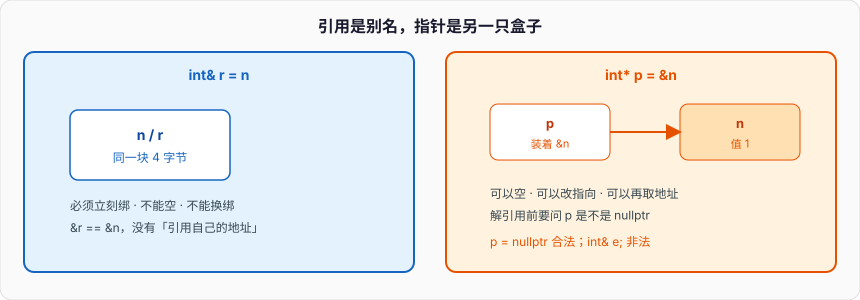

# 指针引用与值类别

函数要「用一个 `T`」，形参有三种常见写法：

```cpp
void by_value(T x);          // 新盒子，拷进来
void by_ref(T& x);           // 绑调用方那块存储
void by_ptr(T* x);           // 盒子里装着地址
```

`by_value` 调完，调用方的对象原样。`by_ref` 里改 `x` 就是改调用方。`by_ptr` 多一档：`x` 可以是空，解引用前要问。入门篇说默认按值拷贝存储；对象模型说拷贝构造会真的再造一块。本篇把三种形参拆开：指针和引用差在哪，`const` 写在哪一侧，左值 / 右值 / 将亡值怎么驱动移动，四种 cast 各拦什么，数组传到函数为什么变成指针。

Python 的参数全是名字绑定，没有 `T&`。Go 的参数按值拷贝，指针是 `*T`，没有引用类型。C++ 把「这块存储」和「指向这块存储的名字」分成两套语法。智能指针是 RAII 对指针的包装，内存篇点一下即可；本篇不展开。



---

## 一、指针 vs 引用

### 1、引用是别名，指针是对象

```cpp
int n = 1;
int& r = n;                 // r 就是 n，必须立刻绑
int* p = &n;                // p 是另一块存储，里面写着 n 的地址

r = 2;                      // n == 2
*p = 3;                     // n == 3
p = nullptr;                // p 可以空，可以再指向别处
// r = 什么都不会「换绑」，赋值写进 n
```

引用必须初始化，不能空（不存在「空引用」这种合法状态），不能重新绑定。之后对 `r` 的操作全是对 `n` 的操作。指针是独立对象：可以空、可以改指向、可以再取地址（`int**`）。`sizeof(r)` 等于 `sizeof(int)`，`sizeof(p)` 是指针宽度。

实现上引用常常就是指针，但语言不给你这个指针去空、去算术。`int&` 没有「未绑定」状态，所以函数形参 `T&` 的合同是：进来的就是一个活对象。`T*` 的合同是：可能是空，可能指向数组，可能指向已经死掉的对象——后两种要调用方保证。

```cpp
void bump(int& x) { x += 1; }
void bump_p(int* x) {
    if (x) *x += 1;         // 指针要先问空
}

int n = 1;
bump(n);                    // 必须传左值
bump_p(&n);
bump_p(nullptr);            // 合法，函数自己挡
// bump(1);                 // 非法：非 const 左值引用绑不上右值
```

可选、延迟绑定、要算术、要和 C API 互传，用指针。必须存在、当作另一个名字，用引用。成员、局部变量里尽量少留裸指针——寿命一错就是悬空。形参优先引用，需要空再用指针。

`&r` 等于 `&n`：取引用的地址就是对象的地址，没有「引用自己的地址」。`int*& rp = p;` 是指针的引用，合法——`rp` 是指针这个盒子的别名，能改指向。不存在「引用的指针」这种类型：引用不是对象，没有自己的地址可被指针指向。`int&&` 是右值引用，仍是别名，不是指针。

```cpp
int n = 1;
int* p = &n;
int*& rp = p;               // 指针的引用
rp = nullptr;               // p 也变成空
int** pp = &p;              // 指针的指针，pp 是另一只盒子
```

`nullptr` 的类型是 `std::nullptr_t`，能转成任意指针，不能转成整数（除了 bool）。`NULL` 在 C++ 里常是 `0`，重载时走 `int` 那个版本——入门篇写过。新代码指针空值只用 `nullptr`。

### 2、三种形参的代价和合同

| 形参 | 调用方看到的修改 | 空 | 拷贝 | 典型用途 |
| --- | --- | --- | --- | --- |
| `T` | 否 | 无此问题 | 拷贝 / 移动进形参 | 小对象、要占有一份 |
| `T&` | 是 | 不能空 | 不拷 | 要改调用方 |
| `const T&` | 否 | 不能空 | 不拷 | 只读大对象 |
| `T*` | 是（经 `*`） | 可以空 | 只拷地址 | 可选、数组、C API |
| `const T*` | 否 | 可以空 | 只拷地址 | 可选只读 |

```cpp
void scale(std::vector<int> xs);            // 整份拷贝，调用方不动
void scale_ref(std::vector<int>& xs);       // 改调用方
void scale_view(const std::vector<int>& xs); // 只读，不拷
void scale_opt(std::vector<int>* xs);       // nullptr 表示「没有」
```

小标量（`int`、指针、`std::size_t`）按值便宜，别 `const int&`。大对象、有堆缓冲的类型，只读走 `const T&`，要占有走按值再移动，要改走 `T&`。Go 的 slice 头按值拷仍共享底层数组；C++ 的 `vector` 按值是深拷。不要拿 Go 的切片直觉填 `vector` 形参。

返回引用 / 指针时，指向的对象必须比返回值活得长。返回局部自动对象的 `T&` / `T*` 是悬空，读是 UB。返回 `T` 可以，C++17 对纯右值还有省略构造。返回 `const T&` 指向形参 `const T&` 绑定的临时量，函数一结束临时量死——同样悬空。

```cpp
const std::string& bad(const std::string& s) { return s; }
const std::string& r = bad(std::string{"tmp"});  // s 绑的临时量在 bad 返回后死，r 悬空
```

链式调用里 `f().g()` 若 `f` 返回 `T`，`g` 在完整表达式内用那个临时量，合法。若 `g` 把 `this` 存下来跨表达式再用，悬空。按值返回小对象；返回大对象也按值，让移动 / 省略构造干活，不要为了「省一次拷」返回局部引用。

### 3、引用折叠、指针算术、void*

引用的引用在手写时非法（`int& &`），模板里会折叠：`T&` 再叠 `&` 还是 `T&`，`T&&` 叠 `&` 变成 `T&`。这是转发引用能「保持值类别」的原因，后面移动那节用到。指针没有折叠，`int**` 就是指针的指针。

指针算术按所指类型的 `sizeof` 走：`p + 1` 跳一个 `T`，不是一字节。`void*` 不能算术、不能解引用，只当「地址」传。转回原来的类型再碰数据。数组和指针在算术上像，但数组名不是指针对象——没有自己那块装地址的盒子，不能 `arr++`。

```cpp
int a[3] = {1, 2, 3};
int* p = a;                 // 退化：数组名转成指向首元素的指针
p = p + 1;                  // 指向 2
// a = a + 1;               // 非法
```

多级指针是「盒子里装着另一只盒子的地址」。引用不是盒子，所以没有「引用的数组」这种常见写法，有的是「数组的引用」：`int (&ra)[3] = a;`，`sizeof(ra)` 仍是整数组。这个差别到数组退化那节再钉一次。

`void*` 从任意对象指针隐式转换而来，转回去必须 `static_cast` 成**原来的类型**。函数指针和 `void*` 之间的转换不是标准保证（POSIX 上常见，语言没说）。对象指针和函数指针不要混。C API 用 `void*` 传上下文时，转回的类型必须和当初转进去的一致，含 cv 限定。

```cpp
int n = 1;
void* vp = &n;
int* p = static_cast<int*>(vp);     // 对
// double* d = static_cast<double*>(vp);  // 编得过，解引用是 UB
```

指针算术只在同一数组（含尾后一格）上有定义。`p + n` 不得超出尾后，`p - q` 两个指针必须同源。跨对象比大小、减地址，是 UB——堆上两块独立 `new` 谁大谁小，语言不保证。`std::less<T*>` 给全序，供 `map` 当键用，那是实现提供的总序，不是你自己写 `<`。

---

## 二、const 写在哪

### 1、从右往左读

`const` 修饰紧挨着的左边；写在类型最左边时等价于修饰那个类型。指针出现后，位置决定钉的是指针还是所指对象：

```cpp
int x = 1, y = 2;
const int* p = &x;          // 不能经 p 改 x，p 可以改指向
int const* p2 = &x;         // 同上
int* const q = &x;          // q 不能改指向，能改 x
const int* const r = &x;    // 都不能

p = &y;                     // 合法
// *p = 3;                  // 非法
*q = 3;                     // 合法
// q = &y;                  // 非法
```

从右往左：`q` 是 const 指针，指向 int；`p` 是指针，指向 const int。入门篇写过顶层 / 底层。顶层 const 是对象自己不能改（`q` 的 const、`const int n`）。底层 const 是通过这个指针 / 引用不能改所指（`p` 的 const）。拷贝丢掉顶层，丢不掉底层。

引用本身不能换绑，所以 `int& const` 没有意义（有的编译器当普通 `int&`）。`const int&` 是底层 const：通过这个引用不能改，可以绑 const 对象，也可以绑非 const 对象（只读视图），还可以绑右值——临时量寿命延长到引用寿命。

```cpp
const int& a = x;           // 只读看 x
const int& b = 1;           // 绑临时量，合法
// int& c = 1;              // 非法
```

### 2、形参上的 const 合同

`void f(const T&)`：不拷贝、不修改。`void f(const T*)`：可能空，不修改。`void f(T)` 里给形参加顶层 `const`（`void f(const int n)`）只约束函数体，对调用方没区别，重载也不区分——顶层 const 在函数类型里会被丢掉。

```cpp
void f(int);
void f(const int);          // 重定义，不是重载

void g(int&);
void g(const int&);         // 两个函数，底层 const 参与重载
```

成员函数尾 `const` 改的是 `this`：`int get() const` 里 `this` 是 `const T*`。对象模型篇说过。`const` 对象只能调 const 成员。`mutable` 成员在 const 函数里仍可改，给缓存用，不是给偷懒用。

`const T*` 不能隐式转成 `T*`，否则就能经新指针改 const 对象。反过来 `T*` 可以转成 `const T*`。去掉底层 const 必须 `const_cast`，而且只有原对象本来就不是 const 时，改它才有定义。

### 3、字符串字面量、指针与数组

字面量 `"hi"` 的类型是 `const char[3]`（含 `'\0'`）。写成 `char* s = "hi";` 在 C++ 里非法（曾作为废弃特性允许）。应 `const char* s = "hi";`。经这个指针改字面量是 UB——字面量可能在只读段。

```cpp
const char* s = "hi";
char buf[] = "hi";          // 数组，拷了字面量，buf 可改
// s[0] = 'H';              // UB
buf[0] = 'H';               // 合法
```

`std::string` 可变，和字面量不是一种东西。`const std::string&` 形参避免拷贝；需要拥有一份再按值。Go 的 `string` 不可变；Python 的 `str` 不可变。C++ 的 const 是类型上的钉子，不是对象种类。

C++17 的 `std::string_view` 是「指针 + 长度」的只读视图，不拥有缓冲。形参用它比 `const std::string&` 更能接字面量和子串，但调用期间底层字符必须活着——不要把 `string_view` 绑到临时 `string` 上再存下来。它不是智能指针，是 const 视图合同的另一种写法。

```cpp
void show(std::string_view s);      // 不拥有
std::string_view v = std::string{"tmp"};  // 临时量死，v 悬空
```

`const` 不深。`const std::vector<int*>` 不能改 vector，能改所指的 `int`。要连元素所指也只读，用 `const T*` 当元素类型，或根本不要裸指针。const 钉的是这一层盒子，下一层盒子另说。

---

## 三、左值、右值、将亡值

### 1、值类别不是「能不能取地址」那么简单

C++11 把表达式分成：

- **glvalue**（广义左值）：有身份，指一块存储。再分成 **lvalue**（左值）和 **xvalue**（将亡值）。
- **prvalue**（纯右值）：初始化用的值，典型是字面量、算术结果、返回的非引用 `T`。
- **rvalue** = xvalue + prvalue。

左值：有名字的变量、解引用、返回左值引用的调用、字符串字面量。纯右值：`1`、`1+2`、`T{}`、按值返回的临时量。将亡值：`std::move(x)` 的结果、返回 `T&&` 的调用、成员将亡值上的成员访问。

```cpp
int n = 1;
n = 2;                      // n 是左值，可以放在 = 左边
// 1 = 2;                   // 1 是纯右值
int* p = &n;                // 左值能取地址
// &1;                      // 非法

int f();
int& g();
int&& h();

f();                        // 纯右值
g();                        // 左值
h();                        // 将亡值
std::move(n);               // 将亡值，n 还在，只是被标成「可以偷」
```

「能取地址」对左值成立，对将亡值不成立（`&std::move(n)` 非法）。将亡值仍然有身份——它指着某块即将被掏空的存储。纯右值在 C++17 里甚至可以还没有存储，直到它被用来初始化某个对象（强制省略构造）。

`T&` 只绑左值。`const T&` 绑左值，也绑右值（延长临时量寿命）。`T&&` 只绑右值。这三条决定重载怎么选移动还是拷贝。

几个一眼能判的：

```cpp
int n = 1;
++n;                        // 左值，还是 n 那块
n++;                        // 纯右值，旧值的副本
n = 2;                      // 赋值表达式是左值，值是赋完后的 n
int arr[2] = {};
arr[0];                     // 左值
int* p = arr;
*p;                         // 左值
std::string{"x"};           // 纯右值
std::string s = "x";
s + "y";                    // 纯右值（operator+ 返回 T）
```

左值转右值会发生「读出来」：用 `int` 初始化另一个 `int` 时，读 n 的值。`std::move` 不做这个读，只改引用类别。把将亡值绑到 `const T&` 上，移动重载选不中——`const T&` 也能绑右值，但走的是拷贝。不要给移动构造写成 `T(const T&&)` 还指望能偷：`const` 挡了改源。

临时量寿命：作为完整表达式里的纯右值，表达式结束时析构。绑到 `const T&` 或 `T&&` 的局部引用上，延长到该引用的寿命。绑到**函数形参** `const T&` 上，只活过这次调用。成员初始化 `const T& r = T{};` 只延长到构造函数结束，不是对象一辈子——成员引用悬空是常见坑。

### 2、移动的动机

拷贝大 `vector` 要分配新缓冲、逐元素拷。如果源马上要死（函数返回的临时量、`std::move` 标过的变量），再拷一份是浪费。移动构造把缓冲指针偷走，源置空。对象模型篇写过五法则；这边看语言怎么把「可以偷」标出来。

```cpp
std::vector<int> make() {
    std::vector<int> v(1000);
    return v;               // 通常 NRVO / 按右值走移动，C++17 纯右值更省
}

std::vector<int> a = make();            // 不必拷 1000 个 int
std::vector<int> b = std::move(a);      // a 合法但空（或未指定内容）
```

`std::move(a)` **不移动**。它是 `static_cast<T&&>(a)`，把左值转成将亡值，让重载选中移动构造 / 移动赋值。真的搬资源发生在那个构造 / 赋值里。源对象之后只保证可析构、可赋值。

按值形参 `void sink(std::vector<int> v)` 从左值调用会拷，从右值调用会移。想强制走移动，调用方写 `sink(std::move(a))`。只读不占有，继续 `const T&`。

移动的工程动机就这一条：所有权转手时不要再分配。返回 `vector`、把局部 `unique_ptr` 交给容器、函数用完某个缓冲就交给下游，都是转手。容器扩容时把旧元素搬到新缓冲，也是转手——所以元素的移动最好 `noexcept`，对象模型篇写过。

```cpp
struct Widget {
    std::string name;
    std::vector<int> data;
};

Widget make_widget() {
    Widget w;
    w.name = "w";
    w.data.resize(1000);
    return w;                       // 成员逐个移或 NRVO，不要 std::move(w) 挡 NRVO
}
```

`return std::move(w);` 常阻止 NRVO：编译器看到的是「把左值转成右值再构造」，不再把 `w` 和返回槽当成同一块。局部对象直接 `return w;`。对成员、对函数形参（已经不可能是返回槽）才 `std::move`。

没有移动构造的类型，右值仍走拷贝。只声明了拷贝、没声明移动的类，移动被抑制（对象模型的生成规则）。旧代码加了析构却忘了移动，`vector` 扩容只能拷——又慢又可能抛。五法则把移动写上，或零法则交给成员。

### 3、转发引用 vs 右值引用

`T&&` 在两种语境下意思不同。

普通函数 `void f(std::vector<int>&& v)`：`v` 是右值引用，只能绑右值。函数体里 `v` 这个**名字是左值**——有名字。再交给别的函数要继续当右值，得 `std::move(v)`。

模板 `template<class T> void f(T&& x)`：`T&&` 是转发引用（原称万能引用）。传入左值，`T` 推导成 `U&`，折叠成 `U&`；传入右值，`T` 推导成 `U`，保持 `U&&`。`std::forward<T>(x)` 按推导结果再转回原来的值类别。

```cpp
template<class T>
void wrapper(T&& x) {
    sink(std::forward<T>(x));       // 左值仍拷，右值才移
}
```

`auto&&` 同样是转发引用。`const auto&&` 不是——多了 const，变成普通右值引用。不要对左值乱 `std::move`：后面还要用那个对象，里面的缓冲已经空了。不要对转发引用写 `std::move`，那会把左值也强制成右值。该 `forward` 就 `forward`，该 `move` 就 `move`。

C++17 起 `if constexpr`、结构化绑定里也会碰到 `auto&&`。规则不变：有推导、写 `T&&` / `auto&&`，按转发想；类型写死的 `vector<int>&&`，按右值引用想。

```cpp
template<class T>
void twice_forward_wrong(T&& x) {
    sink(x);                        // x 是左值，总是拷
    sink(std::move(x));             // 左值也被偷
    sink(std::forward<T>(x));       // 对
}
```

范围 for：`for (auto&& e : xs)` 按元素的值类别绑定，元素是 `int` 就当 `int`，是 `bool` 向量代理就绑上代理。`for (auto e : xs)` 一律拷贝。容器元素大，默认 `const auto&`；要转手再 `auto&&` 配 `forward`。不要无脑 `auto&&` 再 `move` 进另一个容器——那会掏空源容器。

---

## 四、四种 cast

C 的 `(T)x` 什么都干：去 const、改类型、改解释。出错时找不到。C++ 拆成四个，各管一档，grep 得到。

### 1、static_cast

相关类型之间的显式转换：算术、`void*` 往回、向上 / 向下指针（非虚基、编译期已知）、`enum class` 和整数、`std::move` 那种引用类别转换。

```cpp
double d = 3.7;
int n = static_cast<int>(d);            // 3，截断，比 int n{3.7} 的禁止窄化显式

void* vp = &n;
int* p = static_cast<int*>(vp);         // 必须转回原来的类型

enum class Color { Red = 1 };
int k = static_cast<int>(Color::Red);
Color c = static_cast<Color>(1);
```

向下转 `Base*` → `Derived*` 时，`static_cast` **不检查**运行时类型。基类指针实际指着别的派生类，转完再碰派生成员是 UB。有虚函数、需要检查，用 `dynamic_cast`。没有继承关系，`static_cast` 拒绝指针互转——那是 `reinterpret_cast` 的活。

`static_cast` 不能去掉 `const`。`(int*)pconst` 在 C 里可以，C++ 里请走 `const_cast`。入门篇的窄化：需要截断就 `static_cast`，不要静默赋值。

向上转 `Derived*` → `Base*` 隐式就能做，`static_cast` 只是写明白。虚基类的指针转换要调调整偏移，必须 `static_cast` / `dynamic_cast`，C 风格转换对虚基可能做错事。空指针向上向下转仍是空。

`enum class` 不隐式转整数，进出都要 `static_cast`。这是它存在的原因之一：不会在重载里偷偷变成 `int`。算术转换里，`static_cast<std::uint32_t>(-1)` 是有定义的绕回；有符号溢出仍是 UB，cast 救不了 `int` 加法溢出。

### 2、const_cast

只改 const / volatile。其它转换它不做。

```cpp
void legacy(char* s);
void call(const char* s) {
    legacy(const_cast<char*>(s));       // 合同：legacy 不能真写 s
}

const int n = 1;
int* p = const_cast<int*>(&n);
// *p = 2;                              // UB：n 本来就是 const
```

原对象不是 const，经 `const T*` 再 `const_cast` 回去再改，有定义。原对象是 const，改它是 UB，即便编译器让你写出来。API 只接受非 const 指针、而你确定对方只读时，才用 `const_cast`。新代码两边都标 const，少靠它。

### 3、reinterpret_cast

把位模式当另一种类型解释：指针互转、指针和整数互转。几乎不做值转换。结果高度依赖实现，用错就是 UB。

```cpp
int n = 0x01020304;
auto p = reinterpret_cast<unsigned char*>(&n);  // 按字节看对象，允许
std::uint32_t bits = 0x3f800000;
// float f = reinterpret_cast<float>(bits);     // 非法，不是指针
float f = *reinterpret_cast<float*>(&bits);    // 严格别名：可能 UB
```

允许的典型用途：和 C API 互传 `void*` / `intptr_t`；把对象当 `unsigned char` 数组看（对象表示）。不同类型指针互相 `reinterpret_cast` 再解引用，踩严格别名：编译器假设 `int*` 和 `float*` 不指向同一块，优化会把你的读写拆没。要改解释，用 `std::memcpy` 到另一块，或 C++20 的 `std::bit_cast`（本系列 C++17，用 `memcpy`）。

`reinterpret_cast` 不能去 const（可以顺带转类型，但仍要先处理 const）。能 `static_cast` 就不要它。能 `memcpy` 就不要指针互转解引用。

### 4、dynamic_cast

运行时检查的多态转换。源类型必须有虚函数（多态类型）。指针失败返回 `nullptr`，引用失败抛 `std::bad_cast`。

```cpp
struct B { virtual ~B() {} };
struct D : B { int n = 1; };
struct E : B {};

B* pb = new D{};
D* pd = dynamic_cast<D*>(pb);           // 成功
E* pe = dynamic_cast<E*>(pb);           // nullptr
B& rb = *pb;
try {
    E& re = dynamic_cast<E&>(rb);       // 抛
    (void)re;
} catch (const std::bad_cast&) {}
delete pb;
```

没有虚函数，`dynamic_cast` 编译失败或只能向上转。代价是 RTTI：虚表旁多一份类型信息。热路径、已由设计保证类型，用 `static_cast`。跨模块、插件、真的不知道实际类型，用 `dynamic_cast`。失败要处理空 / 异常，不要解引用没查的结果。

四种之外还有函数风格 `int(x)` 和 C 风格 `(int)x`。新代码禁止 C 风格——它可能是 static、reinterp、const 里的某一种，读代码看不出来。需要转换时写出是哪一个。

怎么选：相关类型、算术、`void*` 往回 → `static_cast`。只去 const → `const_cast`。多态向下且要检查 → `dynamic_cast`。位模式重解释、和整数互转指针 → `reinterpret_cast`，并假设你已经读过别名规则。一条转换需要两档时拆开写：先 `const_cast` 再 `static_cast`，不要指望一个 C 风格括号做完。

`dynamic_cast<void*>(pb)` 给的是最派生对象的起始地址，有虚函数时有定义。调试、序列化偶尔用。热路径不要靠 RTTI 做类型开关，虚函数或 `std::variant` 更干净。

---

## 五、数组退化

### 1、传到函数就变成指针

数组不是指针。`int a[4]` 是 16 字节连续存储。写成函数形参 `void f(int a[4])` 或 `void f(int a[])`，语言立刻把它调整成 `void f(int* a)`。`sizeof(a)` 在函数里是指针宽度，不是 16。长度信息丢了。

```cpp
void f(int a[4]) {
    std::cout << sizeof(a) << "\n";     // 8（64 位），不是 16
}

int a[4] = {1, 2, 3, 4};
f(a);                                   // a 退化成 &a[0]
std::cout << sizeof(a) << "\n";         // 16
```

这是 C 留下的规则。Go 的数组按值拷贝整块，切片自带长度。Python 的 list 是对象，`len` 在对象上。C++ 的 C 数组传到函数必须**另外传长度**，或不用 C 数组。

指针算术、下标 `a[i]` 就是 `*(a + i)`。没有边界检查。`a[4]` 对长度为 4 的数组是 UB。栈上读过去可能「碰巧」是下一个局部变量，Release 下被优化成空气。

模板同样退化，除非把形参写成数组引用：

```cpp
template<class T>
void decay(T a) {
    // 传入 int[4] 时 T 是 int*，不是 int[4]
}

template<class T, std::size_t N>
void keep(T (&a)[N]) {
    static_assert(N == 4);
}
```

`auto p = a;` 对数组是指针，`auto& ra = a;` 才是数组引用。`decltype(a)` 是数组类型，`decltype(+a)` 因为一元 `+` 先做提升 / 退化，变成指针。`std::begin(a)` / `std::end(a)` 对数组给出首尾指针，对 `vector` 给出迭代器——这是 C++ 把「连续一段」抽象出来的最小接口。

### 2、保住长度：引用、std::array、span 思想

形参写成数组的引用，退化不发生：

```cpp
void g(int (&a)[4]) {
    std::cout << sizeof(a) << "\n";     // 16
}

template<std::size_t N>
void h(int (&a)[N]) {
    // N 推导出来，sizeof(a) == N * sizeof(int)
}
```

`int (*)[4]` 是「指向数组的指针」，同样不退化成 `int*`。需要和 C API 互传时才用。新代码用 `std::array<int, 4>`：它是对象，按值拷贝整块，`.size()` 在，能赋、能还。`std::vector` 是堆上动态数组，长度运行时才有。

只读一段连续 `T`，C++17 没有 `std::span`（C++20）。自己传 `const T*` + `std::size_t`，或传 `const std::vector<T>&` / `const std::array<T, N>&`。不要只传裸指针还假设对方知道长度。

二维数组 `int m[2][3]` 传给 `void f(int m[2][3])` 调整成 `void f(int (*m)[3])`：指向「长度为 3 的数组」的指针。第一维丢掉，第二维必须写对，否则按行跳的步长错。更干净：`std::array<std::array<int, 3>, 2>`，或一块 `vector` 自己算下标。

### 3、字符串、new[]、指针差

`char s[] = "hi";` 是数组，`sizeof` 含 `'\0'`。`const char* s = "hi";` 是指针。`strlen` 看到的是到 `'\0'` 为止，不含 `'\0'`。不要用 `sizeof` 当字符串长度——对指针它给出的是指针宽度。

`new int[n]` 返回 `int*`，长度只在实现内部给 `delete[]` 用。你拿不到这个长度。必须自己记 `n`。`delete p` 对 `new[]` 来的指针是 UB（析构没按数组走，释放器也可能不匹配）。内存篇展开；这里记：数组的长度要么在类型里（`std::array`、引用绑定的 C 数组），要么在你手里的那个 `size_t` 里，**不在指针里**。

两个指针相减，必须指向同一数组（含尾后一格）。结果类型是 `std::ptrdiff_t`。不相关对象的地址相减是 UB。比较大小同样：只保证同一数组内的顺序。堆上两块独立 `new` 的地址比大小，没有你以为的「谁在前」。

`char buf[8]; memcpy(buf, &n, sizeof(n));` 把对象表示拷进字节数组，这是允许的。从字节数组 `memcpy` 回平凡类型也允许。用 `int*` 去读 `char buf` 里「看起来像 int 的字节」踩别名和对齐。数组退化成 `char*` 之后，长度只在你手里的 `sizeof buf`——但 `sizeof` 必须作用在**还没退化的数组名**上。一写成指针，长度就没了。这是 C API 永远带着 `len` 参数的原因。

---

## 六、对照、易错点和一份能跑的实验

Python：名字是绑定，`b = a` 对可变对象共享；没有引用类型；没有指针算术。Go：一切按值，指针显式 `*`，切片自带长度，没有 `T&`，没有将亡值，没有 `std::move`。C++：`T` 是盒子，`T&` 是盒子的另一个名字，`T*` 是装着地址的盒子。值类别决定能不能绑哪种引用，从而决定走拷贝还是移动。数组在函数边界退化成指针，长度必须另走。

易错点：

- `T*` 当 `T&` 用，不查空就 `*`。
- 返回局部的引用 / 指针。
- `char* s = "hi"` 再写 `s[0]`。
- `std::move` 之后继续用源对象的缓冲。
- 转发引用写成 `std::move`，左值被偷。
- C 风格转换一次去掉 const 并改类型。
- `void f(int a[10])` 里用 `sizeof(a)` 当元素数。
- `static_cast` 向下转没虚函数的基类指针，实际类型不对。
- `reinterpret_cast` 之后按另一类型解引用，踩别名。

把三种形参、const 位置、值类别、cast、退化串进一个文件。`g++ -std=c++17 -O0 -Wall -Wextra -o valcat valcat.cpp && ./valcat`：

```cpp
// valcat.cpp — 形参、const、值类别、cast、数组退化。C++17。
#include <iostream>
#include <string>
#include <type_traits>
#include <utility>
#include <vector>

void by_value(std::string s) { s += "!"; }
void by_ref(std::string& s) { s += "!"; }
void by_cref(const std::string& s) { (void)s.size(); }
void by_ptr(std::string* s) { if (s) *s += "?"; }

void take_rref(std::vector<int>&& v) {
    std::cout << " rref_size=" << v.size();
}

template<class T>
void wrap(T&& x) {
    take_rref(std::forward<T>(x));
}

void arr_decay(int a[4]) {
    std::cout << " decay_sz=" << sizeof(a);
}

void arr_ref(int (&a)[4]) {
    std::cout << " ref_sz=" << sizeof(a);
}

int main() {
    std::string s = "x";
    by_value(s);
    std::cout << "after_value=" << s;
    by_ref(s);
    std::cout << " after_ref=" << s;
    by_ptr(&s);
    std::cout << " after_ptr=" << s << "\n";

    int n = 1;
    const int* p = &n;
    // *p = 2;
    int* q = const_cast<int*>(p);
    *q = 2;                                 // n 本来不是 const
    std::cout << "n=" << n
              << " p_top_const=" << std::is_const<decltype(p)>::value
              << " pointee_const=1\n";

    std::vector<int> a{1, 2, 3};
    std::vector<int> b = std::move(a);
    std::cout << "moved_to=" << b.size()
              << " src=" << a.size() << "\n";

    std::vector<int> tmp{4, 5};
    std::cout << "wrap";
    wrap(std::move(tmp));
    std::cout << "\n";

    double d = 3.7;
    int k = static_cast<int>(d);
    void* vp = &k;
    int* ip = static_cast<int*>(vp);
    std::cout << "cast=" << k << " back=" << *ip << "\n";

    int arr[4] = {1, 2, 3, 4};
    std::cout << "arr_sz=" << sizeof(arr);
    arr_decay(arr);
    arr_ref(arr);
    std::cout << "\n";
}
```

跑完对照：按值改的是副本，`s` 仍是 `"x"`；按引用和指针能改到 `"x!?"`；`const int*` 挡写入，`const_cast` 回去后因为原对象非 const 能改；`std::move` 后源 `size()` 是 0；`sizeof` 在数组上是 16、退化后是指针宽度、数组引用上仍是 16；`static_cast` 截断 `3.7` 为 3。全部来自三种形参的差：`T` 造新盒子，`T&` 当别名，`T*` 装地址。const 钉盒子或钉指针；值类别决定别名能不能绑、资源能不能偷；数组在函数边界丢掉长度，除非你用引用把数组类型保住。

下一篇从 `new` 之后 `throw`、`delete` 走不到开始，把栈 / 堆 / 静态、所有权和异常安全钉死。
