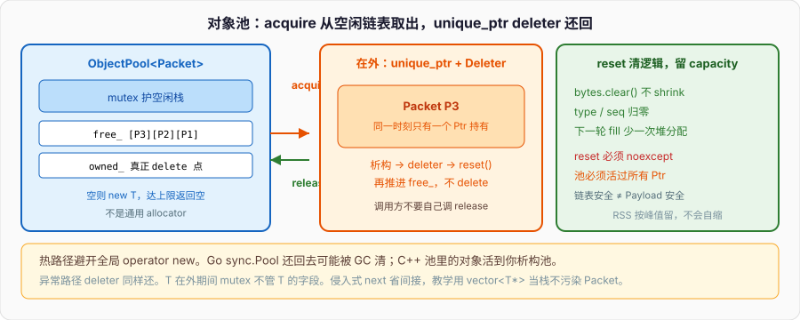

# 线程安全对象池

协议解析热路径上，每个包都 `new Packet`：

```cpp
void on_bytes(const uint8_t* p, std::size_t n) {
    auto pkt = new Packet;
    pkt->fill(p, n);
    dispatch(pkt);                      // 下游某条路径会 delete
}
```

`Packet` 构造并不重：几个整数、一个 `vector<uint8_t>`。重的是 **`operator new` 这条全局分配路径**——多线程一起挤，分配器内部有锁、有缓存、有 size-class。下游再 `delete`，下一次还要再 `new`。对象活了几十微秒，分配器却成了热点。内存篇把 `new` 钉成「向堆要原始字节再构造」；本篇把同一类对象的「要 / 还」从全局堆上拆下来，焊进一只池。



Python 的对象本来就在堆上，分配器是运行时的，你几乎不写池。Go 有 `sync.Pool`：还回去的对象可能被 GC 清掉，合同是「尽量复用」，不是「还回去的一定还在」。C++ 没有 GC 来兜，池里的对象活到你析构池。本篇做一个能跑的 `ObjectPool<T>`：`acquire` 拿出，`unique_ptr` 自定义删除器还回去；mutex 护空闲链表；异常路径也还；和每次 `new` 对着打。它**不是**通用 allocator。

---

## 一、目标与非目标

### 1、要解决什么

同一类型 `T` 被高频构造 / 析构。`T` 自己可能带着可复用的缓冲（`vector` 的 capacity、解析树的节点槽）。池做三件事：

- 第一次：`new T`，放进池的所有权表。
- 之后：从空闲链表弹出一只已经活着的 `T`，调用方用完还回来，**不析构、不 `delete`**。
- `T::reset()` 清逻辑状态，保留 capacity。下一次 `fill` 少一次堆分配。

并发下，空闲链表的推 / 弹要有 happens-before。本篇用一把 mutex。无锁池是另一篇文章：ABA、hazard pointer、内存序，并发篇的东西，这里不混进来。

```cpp
struct Packet {
    std::vector<uint8_t> bytes;
    uint32_t type = 0;
    uint64_t seq  = 0;

    void fill(const uint8_t* p, std::size_t n, uint32_t t, uint64_t s) {
        bytes.assign(p, p + n);         // capacity 够就不分配
        type = t;
        seq  = s;
    }
    void reset() noexcept {
        bytes.clear();                  // 不 shrink，capacity 留给下一轮
        type = 0;
        seq  = 0;
    }
};
```

`reset` 清的是协议字段，不是把 `vector` 的堆缓冲还给 OS。池的收益一大半在这里：对象外壳复用，内部缓冲也复用。

### 2、明确不是什么

- **不是 `malloc` 替代品。** 不按字节、不对齐任意 size、不合并空闲块、没有 size-class。只出 `T*`。
- **不是 STL allocator。** 不能塞进 `vector<T, PoolAlloc>`。`Packet::bytes` 里的字节仍然走全局 `operator new`。池管的是 `Packet` 这个对象，不是它内部每一块堆。
- **不是 GC。** 还回去的对象一直占着堆，直到 `~ObjectPool`。峰值有 N 只在外 + M 只空闲，RSS 按峰值留，不会自己缩。
- **不是线程安全的 `T`。** 池保证「同一只 `T` 同一时刻只被一个 `unique_ptr` 持有」。`T` 的字段怎么读写，还是 `T` 自己的事。智能指针篇那句「计数安全不是对象安全」，这里换成「链表安全不是 Payload 安全」。
- **不是跨类型池。** `ObjectPool<Packet>` 和 `ObjectPool<AstNode>` 是两个池。要通用字节池，去看 jemalloc / tcmalloc，那是分配器，不是本篇。

把「对象池」说成「我写了个内存分配器」，面试里下一句就会被追 size-class 和碎片。本篇到对象这一层停。

### 3、目录结构

教学项目按能粘贴来排。头文件自包含，C++17，不依赖第三方。

```
object_pool/
  include/object_pool.h      # 模板池：空闲链表 + mutex + Deleter
  include/packet.h           # 被池化的类型，带 reset
  tests/test_pool.cpp        # 并发 acquire、异常归还、容量上限
  src/bench.cpp              # 和每次 new 对着打
  CMakeLists.txt
```

```cmake
# CMakeLists.txt
cmake_minimum_required(VERSION 3.10)
project(object_pool LANGUAGES CXX)
set(CMAKE_CXX_STANDARD 17)
set(CMAKE_CXX_STANDARD_REQUIRED ON)
add_executable(test_pool tests/test_pool.cpp)
target_include_directories(test_pool PRIVATE include)
find_package(Threads REQUIRED)
target_link_libraries(test_pool PRIVATE Threads::Threads)

add_executable(bench src/bench.cpp)
target_include_directories(bench PRIVATE include)
target_link_libraries(bench PRIVATE Threads::Threads)
```

单文件编译也行：

```
g++ -std=c++17 -O2 -pthread -Iinclude tests/test_pool.cpp -o test_pool
g++ -std=c++17 -O2 -pthread -Iinclude src/bench.cpp -o bench
```

加 TSan 查链表 race：`-fsanitize=thread -O1 -g`。加 ASAN 查还池之后误用：`-fsanitize=address`。两套 sanitizer不要混在同一次编译。

---

## 二、对象生命周期

### 1、acquire / release 合同

池里每只 `T` 有且只有三个状态：

| 状态 | 谁持有 | 空闲链表上？ |
| --- | --- | --- |
| 空闲 | 池 | 是 |
| 在外 | 调用方的 `unique_ptr` | 否 |
| 销毁 | 无人，`~T` 已跑 | 否（池析构时） |

`acquire`：空闲链表非空就弹出；空且未达上限就 `new T` 再交出；达上限就返回空指针（或阻塞，本篇选返回空，合同简单，调用方自己决定重试还是走普通 `new`）。

`release`：调用 `p->reset()`，推进空闲链表。不 `delete`。

调用方**不要**自己调 `release`。下一节用删除器把 `release` 焊进 `unique_ptr` 的析构。对外只暴露 `acquire`。

```cpp
// 合同，写在头文件注释里，比写在 wiki 里有用
// acquire() 返回的 Ptr 析构时还池。池必须活过所有未析构的 Ptr。
// 同一只 T 不会同时出现在两个 Ptr 里。
// T 在外期间，池的 mutex 不管 T 的字段。
```

### 2、对象进池之前必须 reset

还回来的 `Packet` 可能还留着上一轮的 `bytes`、`type`。下一轮调用方如果只改了部分字段，就会把旧 payload 发出去。`release` 里强制 `reset()`，合同从「调用方记得清」变成「池保证清」。

`reset` 必须 `noexcept`。删除器在 `unique_ptr` 析构里跑，析构里抛就是 `std::terminate`。内存篇：析构不抛。`clear()` 不抛；如果你的 `T::reset` 要关 socket、要打日志，那些失败只能吞掉或记到统计里，不能丢异常。

```cpp
void release(T* p) noexcept {
    if (!p) return;
    p->reset();                         // 必须 noexcept
    std::lock_guard<std::mutex> g(mu_);
    if (shutting_down_) {               // 池先死：只能真删
        delete p;
        return;
    }
    free_.push_back(p);
}
```

`shutting_down_` 是退路，不是推荐用法。推荐用法：所有 `Ptr` 先析构，再析构池。下面线程安全边界会钉这条。

### 3、池死了还握着句柄

`ObjectPool` 在栈上、`Ptr` 被存进全局 / 另一条线程的队列，池的栈帧先没了，删除器里的 `ObjectPool*` 就是悬空。这是 UAF，不是「还池失败」。

三条防法，本篇用第一条，后两条点明：

1. **合同：池活过所有 Ptr。** 池放在 `main` / 服务对象里，句柄只在请求栈上转。文档 + 注释。教学项目够用。
2. **`shared_ptr<Impl>`。** 删除器持有一份控制块，池外观析构后 Impl 还活，最后一只句柄还完再 `delete` 所有 `T`。多一次原子计数，热路径有价。
3. **泄漏给进程。** 删除器发现池已死就 `delete p`（上面 `shutting_down_`），但「池对象已经析构、指针还在用」仍然是 UAF——flag 本身也在已死对象里。所以 3 救不了 1 的违反，只能救「池还在析构过程中、mutex 还活着」这一小段。

本篇代码走 1 + 析构时 `assert(free_.size() == owned_.size())`：还有对象在外就立刻炸，比静默 UAF 好。

---

## 三、空闲链表 + mutex

### 1、用 vector 当栈，不必侵入 T

空闲链表可以是 `T` 里嵌一个 `T* next`（侵入式），也可以是旁边一只 `vector<T*>`。侵入式省一次间接、不靠额外堆，但 `T` 被污染，`Packet` 不该知道自己在池里。教学项目用 `vector<T*>` 当栈：`push_back` / `pop_back`，LIFO，cache 友好——刚还回来的对象还热。

```cpp
std::mutex mu_;
std::vector<std::unique_ptr<T>> owned_; // 所有权：析构池时统一 delete
std::vector<T*> free_;                  // 空闲栈，元素是 owned_ 里的裸指针
std::size_t cap_;                       // 0 表示不设上限
bool shutting_down_ = false;
```

`owned_` 用 `unique_ptr<T>`，池析构时默认删除器真的 `delete`。空闲栈只借地址，不拥有。同一只 `T` 要么在 `free_` 里，要么在某个 `Ptr` 里，不会两边都在——这是不变量，测试要查。

侵入式版本把 `next` 放进 `T`，还池时 `p->next = head_; head_ = p;`。少一次 `vector` 可能发生的扩容。`free_` 自己会扩，但这是按指针扩，频率远低于 `acquire`。先正确，再抠这条。

### 2、锁护住的只有链表

```cpp
T* pop_free() {
    std::lock_guard<std::mutex> g(mu_);
    if (free_.empty()) return nullptr;
    T* p = free_.back();
    free_.pop_back();
    return p;
}

void push_free(T* p) {
    std::lock_guard<std::mutex> g(mu_);
    free_.push_back(p);
}
```

临界区：改 `free_`（以及下面要写的 `owned_` / 计数）。**不含** `T` 的构造、`fill`、`dispatch`。对象在外期间，调用方对 `T` 的读写不拿这把锁。锁粒度错了，池比每次 `new` 还慢——全局分配器好歹有 per-thread cache，你这把大锁把所有线程串在 `acquire` / 还池上。

扩容（`new T`）放锁外还是锁内：

- 锁内 `new`：简单，不会超 `cap_`。分配慢，持锁久，别的线程全堵。
- 锁外 `new`：先锁外分配，再锁内决定要不要留下。可能超发一只，要再 `delete` 或允许短暂超过 cap。

本篇 cap 不大时锁内分配，逻辑短。cap 很大、`T` 构造重，改成锁外。测试里用轻量 `Packet`，锁内即可。

```cpp
T* make_one() {                         // 在锁内调用，见 acquire
    if (cap_ && owned_.size() >= cap_) return nullptr;
    owned_.push_back(std::make_unique<T>());
    return owned_.back().get();
}
```

`make_unique` 失败抛 `bad_alloc`，`lock_guard` 在栈展开时放锁。这是 RAII，不要手写 `lock()` / `unlock()`。

### 3、上限 vs 无限 new

`cap_ == 0`：空闲没有就一直 `new`，池退化成「带复用的无限堆」，RSS 跟峰值走，还回去的不给 OS。适合「并发度有上限、峰值可接受」。

`cap_ > 0`：满了 `acquire` 返回空。调用方：

```cpp
auto p = pool.acquire();
if (!p) p.reset(new Packet);            // 回退到堆；删除器见下一节
```

回退路径的 `Packet` **不属于池**。删除器必须能区分：属于池的还池，不属于的 `delete`。用 `Deleter` 里的 `pool` 指针是否为空来分。

阻塞式（满了等还）要条件变量，并发篇的 `cv.wait` + 谓词。对象池一旦阻塞，调用方的延迟模型就变了，死锁面也来了（持有一只对象的线程再去 acquire 另一只，cap=1 直接卡死）。教学项目不阻塞，把选择权留给调用方。

---

## 四、unique_ptr + 自定义 deleter

### 1、deleter 还池，不 delete

智能指针篇：删除器是 `unique_ptr` 类型的一部分。无状态空 class 走 EBO，`sizeof` 仍是一个指针。这里删除器**有状态**——要知道还到哪只池——`sizeof(Ptr)` 是两个指针宽。接受。不要为了宽度改成全局单例池。

```cpp
template <typename T>
class ObjectPool {
public:
    struct Deleter {
        ObjectPool* pool = nullptr;
        void operator()(T* p) const noexcept {
            if (!p) return;
            if (pool) pool->release(p);
            else delete p;              // 回退路径：不属于池
        }
    };
    using Ptr = std::unique_ptr<T, Deleter>;

    explicit ObjectPool(std::size_t cap = 0) : cap_(cap) {}
    ObjectPool(const ObjectPool&) = delete;
    ObjectPool& operator=(const ObjectPool&) = delete;
    // 移动：教学项目禁止。Ptr 里握着 this，一移全悬
    ObjectPool(ObjectPool&&) = delete;
    ObjectPool& operator=(ObjectPool&&) = delete;

    ~ObjectPool() {
        std::lock_guard<std::mutex> g(mu_);
        shutting_down_ = true;
        // 在外的对象还没还：owned_ 里 unique_ptr 析构会 delete
        // 但 Deleter 稍后还会 release，UAF。合同禁止走到这里。
        assert(free_.size() == owned_.size());
        free_.clear();
        owned_.clear();                 // 真正 ~T + delete
    }

    Ptr acquire() {
        T* raw = nullptr;
        {
            std::lock_guard<std::mutex> g(mu_);
            if (!free_.empty()) {
                raw = free_.back();
                free_.pop_back();
            } else {
                raw = make_one();       // 可能空：达 cap
            }
        }
        if (!raw) return Ptr{nullptr, Deleter{nullptr}};
        return Ptr{raw, Deleter{this}};
    }

    std::size_t idle() const {
        std::lock_guard<std::mutex> g(mu_);
        return free_.size();
    }
    std::size_t live() const {
        std::lock_guard<std::mutex> g(mu_);
        return owned_.size();
    }

private:
    T* make_one() {                     // 调用方已持锁
        if (cap_ && owned_.size() >= cap_) return nullptr;
        owned_.push_back(std::make_unique<T>());
        return owned_.back().get();
    }

    void release(T* p) noexcept {
        p->reset();
        std::lock_guard<std::mutex> g(mu_);
        if (shutting_down_) {
            // 见上：正常合同走不到。防御性，且此时 owned_ 可能正在清
            return;
        }
        free_.push_back(p);
    }

    friend struct Deleter;

    mutable std::mutex mu_;
    std::vector<std::unique_ptr<T>> owned_;
    std::vector<T*> free_;
    std::size_t cap_;
    bool shutting_down_ = false;
};
```

`acquire` 返回的 `Ptr` 类型是 `unique_ptr<T, ObjectPool<T>::Deleter>`，和 `unique_ptr<T>` **不是同一类型**。函数形参不要写 `unique_ptr<T>` 去收它。要观察：`T&` / `T*`。要转手：`Ptr` 按值，调用方 `std::move`。

```cpp
void send(ObjectPool<Packet>::Ptr pkt); // 所有权进来，函数结束还池
void view(const Packet& pkt);           // 只看，不还
```

### 2、异常路径自动归还

内存篇开头那个泄漏：`new` 成功，下一行 `throw`，`delete` 走不到。`Ptr` 是栈上自动对象，栈展开调 `~unique_ptr`，删除器还池。这是本篇用 `unique_ptr` 而不是裸 `T*` + 手动 `release` 的原因。

```cpp
void handle(ObjectPool<Packet>& pool, const uint8_t* p, std::size_t n) {
    auto pkt = pool.acquire();
    if (!pkt) throw std::runtime_error("pool exhausted");
    pkt->fill(p, n, /*type=*/1, /*seq=*/0);
    if (pkt->bytes.empty()) throw std::runtime_error("bad packet");
    dispatch(*pkt);                     // 就算这里 throw，pkt 仍还池
}                                       // ~Ptr → Deleter → release
```

手动 `T* p = pool.pop(); ... pool.push(p);` 在两个 `throw` 点都会把对象丢在在外状态：既不在 `free_`，也不会被 `~ObjectPool` 以外的路径 `delete`——对象还在 `owned_` 里，算泄漏到「池的在外集合」，`idle()` 永远少一只，cap 被一只死句柄占满。RAII 把这条堵死。

### 3、不要 release 裸指针自己 delete

`Ptr::release()` 交出裸指针并置空，删除器不再跑。之后你必须自己 `delete` 或交回池。对接 C API 才需要。对象池场景里调用 `release()` 几乎一定是 bug：对象既不还池，也不 `delete`，`owned_` 里那只 `unique_ptr` 会在池析构时再 `delete` 一次——如果你已经 `delete` 了，double free；如果没 `delete`，对象在外漂到池死。

```cpp
auto pkt = pool.acquire();
Packet* raw = pkt.release();            // 池不再经删除器收回
delete raw;                             // 和 owned_ 里那只 unique_ptr 重复释放：UB
```

禁止。要提前还池：`pkt.reset();`（删除器跑）或让 `pkt` 出作用域。

`Ptr` 可以移进容器、移进另一条线程。移动之后源为空，不会双重还池。不要拷——`unique_ptr` 拷贝已删，这是类型系统在帮你。

---

## 五、线程安全边界

### 1、池的结构安全 ≠ 对象内容安全

mutex 同步的是 `free_` / `owned_` / `cap_` / `shutting_down_`。happens-before：线程 A `release` 解锁 happens-before 线程 B `acquire` 同一只对象的加锁成功。所以 B 看见 A 的 `reset()` 效果，不会拿到一只半改的 `Packet`。

对象在外之后，字段是普通内存。两个线程各持**不同**的 `Ptr`，改各自的 `Packet`，没有 data race。两个线程持**同一只**——合同不允许，`unique_ptr` 也拷不走。把裸 `Packet*` 从 `get()` 交给另一条线程，还继续用原来的 `Ptr`，那是你破坏合同，池不管。

```cpp
void bad(ObjectPool<Packet>& pool) {
    auto p = pool.acquire();
    std::thread t([raw = p.get()] { raw->type = 1; }); // 和下面并发写
    p->type = 2;                        // data race，UB
    t.join();
}
```

`get()` 是观察，寿命不超过 `Ptr`。要跨线程转手：`std::move(p)` 进那个线程，或把 `Ptr` 放进带锁的队列。并发篇：每个共享普通对象要能指出保护者。在外的 `Packet` 的保护者是「独占它的那只 `Ptr` 所在的线程」，不是池的 mutex。

### 2、idle / live 是快照

`idle()` 加锁读 `free_.size()`，返回后数字已经过时。不要写 `if (pool.idle() > 0) auto p = pool.acquire();` 当互斥——中间别的线程可以抢空。`acquire` 自己是原子的（相对池结构），空就空，调用方看 `Ptr` 是否为空。

统计用 `atomic<std::uint64_t>` 记 acquire 次数、回退次数，可以 `relaxed`：只关心数量，不发布其它数据。并发篇：计数用 relaxed，发布用 release/acquire。不要把 `idle()` 当负载开关去启停线程，那是在用过期快照做控制面。

### 3、析构与还在外的句柄

`~ObjectPool` 里 `assert(free_.size() == owned_.size())`。失败 = 有 `Ptr` 还活着。assert 关掉的构建里，`owned_.clear()` 会 `delete` 还在外的对象，那些 `Ptr` 随后还池 → UAF。所以 assert 不是可选：生产构建改成打日志并 `abort`，或改成 `shared_ptr<Impl>` 让寿命跟最后一只句柄走。

池禁止移动：`Ptr` 的 `Deleter::pool` 是 `this`。把池从 `a` 移到 `b`，`a` 的地址上的对象没了，旧句柄全悬。要移动，删除器得握 `shared_ptr<Impl>`，`this` 换成控制块。本篇为了代码能一眼看完，直接删掉移动。五法则：定义了析构，拷贝 / 移动必须表态——这里四条 `= delete`。

`mutable mutex`：`idle()` / `live()` 是 `const`，但要加锁。锁不是对象的逻辑状态，是同步状态。`const` 保证的是「不改 Packet 合同」，不是「不改 mutex 内部」。

---

## 六、和每次 new 对比

### 1、分配路径差在哪

每次 `new Packet`：

1. `operator new(sizeof(Packet))` → 分配器（可能锁、可能走 size-class、可能 brk/mmap）。
2. `Packet` 构造：`vector` 空，三个标量零初始化。
3. `fill`：`vector::assign`，第一次必分配 payload 缓冲。
4. `delete`：`~Packet` 释放 payload，再 `operator delete`。

池命中空闲：

1. 加锁，弹一只指针，解锁。
2. 对象已经构造过，`vector` 往往还留着 capacity。
3. `fill`：`assign` 长度不超过 capacity 则不分配。
4. 还池：`reset`（`clear`，不释放 payload），加锁，压栈。

未命中（池里没有空闲）：退回路径 1，再多一次「登记进 `owned_`」。冷启动前 N 次和每次 `new` 一样贵，之后才摊还。

### 2、什么时候池更快，什么时候更慢

更快：

- `T` 内部缓冲能留 capacity（本篇 `Packet::bytes`）。
- 并发度中等，一把 mutex 的临界区只有几次指针操作，短过分配器。
- 分配 / 释放频率高，对象大小中等偏大（几百字节到几 KB 外壳）。

更慢或没差：

- `T` 是 `int`。池的锁 + `unique_ptr` 两只指针，比 `new int` 还重。这种不要池。
- 并发度极高，所有线程打同一把锁。全局分配器有 tcache，你没有。这时要 per-thread 缓存（线程本地空闲栈，溢出再归还中心池），复杂度上去，本篇不写。
- `reset` 若 `shrink_to_fit`，capacity 没了，池白做。
- 对象几乎不复用：来一次活到进程结束，池无意义。

```cpp
// 错误：还池时把收益交回去
void reset() {
    bytes.shrink_to_fit();              // 下一轮 fill 再分配，池没了
}
```

### 3、不是通用 allocator

对照表，写进设计文档，免得下一个人拿它去接 `vector`：

| | 本池 | 通用 allocator |
| --- | --- | --- |
| 单位 | 一只 `T` | 任意字节 + 对齐 |
| 释放后 | 留在池，不给 OS | 可能还 size-class / mmap |
| 碎片 | 无（固定类型） | 要处理 |
| 接口 | `acquire` → `Ptr` | `allocate` / `deallocate` |
| 对象寿命 | `~T` 在池析构时 | 每次 `deallocate` 前 `~T` |
| 内部堆 | `T` 自己的 `new` 仍走全局 | 可替换整条链 |

`Packet` 的 `vector` 仍然打全局堆。payload 才是大头、且长度变化剧烈时，池化外壳不够，要让 `vector` 用 arena，或自己管一块缓冲。那是 allocator 议题，本篇停在 `T`。

不要重载全局 `operator new` 把所有分配塞进这只池——size 不对、类型不对、静态对象析构顺序会咬你。对象池是调用方显式 `acquire`，不是语言级替换。

---

## 七、测试

### 1、并发 acquire

N 个线程，各 acquire – 写 – 还，循环 M 次。不变量：

- 同时在外的数量 ≤ `live()`。
- `live() == owned_.size()`，且 `live() <= cap_`（cap>0 时）。
- 结束时 `idle() == live()`：全部还清。
- 每个 `Packet::seq` 写成 `thread_id << 32 | i`，读回一致——证明没有两线程同时持同一只。

```cpp
#include "object_pool.h"
#include "packet.h"
#include <atomic>
#include <cassert>
#include <thread>
#include <vector>

void test_concurrent() {
    constexpr int kThreads = 8;
    constexpr int kIters   = 10000;
    ObjectPool<Packet> pool(64);        // cap 小于 8*瞬时需求，会回退空
    std::atomic<int> got{0};
    std::atomic<int> miss{0};

    auto w = [&](int tid) {
        for (int i = 0; i < kIters; ++i) {
            auto p = pool.acquire();
            if (!p) {                   // cap 耗尽：本测试允许 miss
                ++miss;
                continue;
            }
            p->seq = (static_cast<uint64_t>(tid) << 32) | static_cast<uint32_t>(i);
            p->type = static_cast<uint32_t>(tid);
            p->bytes.assign(16, static_cast<uint8_t>(tid));
            assert(p->seq >> 32 == static_cast<uint64_t>(tid));
            ++got;
        }                               // ~p 还池
    };

    std::vector<std::thread> ts;
    for (int t = 0; t < kThreads; ++t) ts.emplace_back(w, t);
    for (auto& t : ts) t.join();

    assert(pool.idle() == pool.live());
    assert(pool.live() <= 64);
    assert(got > 0);
    (void)miss;
}
```

`join` 之后主线程读 `idle()` / `live()` 定义良好：`join` 是同步点，并发篇写过。TSan 应沉默。把 mutex 拿掉再跑 TSan，应点名 `free_`。

cap 故意小于线程数瞬时持有量，才会打到 `acquire` 返回空。若测试里每人同时只持一只，8 线程 cap=64 可能从不 miss——那是在测快乐路径。要打满：线程里嵌套持有多只，或把 cap 改成 4。

### 2、异常路径对象仍归还

```cpp
void test_exception_returns() {
    ObjectPool<Packet> pool(8);
    auto one = pool.acquire();
    one.reset();                        // 先还，让 live==1，idle==1
    assert(pool.idle() == pool.live());

    try {
        auto p = pool.acquire();
        assert(pool.idle() == 0);
        p->fill(nullptr, 0, 7, 1);
        throw std::runtime_error("boom");
    } catch (const std::runtime_error&) {}

    assert(pool.idle() == pool.live()); // 抛了也还回来
    assert(pool.live() == 1);
}
```

对照：把 `Ptr` 换成裸指针、`throw` 前不手写 `release`，`idle()` 会一直是 0，对象卡在在外。这就是本篇不提供公开 `release(T*)` 的原因——能手写就能忘。

析构不抛：给 `Packet::reset` 塞一个 `throw`，还池时 `~Ptr` 直接 `terminate`。测试里可以用 `set_terminate` 抓住，但正确做法是 `reset` 标 `noexcept`，编译器在 `throw` 处帮你炸在开发期。

### 3、对照：关掉池，每次 new

`bench.cpp` 同一份 `fill` 工作量，一边池，一边 `make_unique<Packet>`。

```cpp
#include "object_pool.h"
#include "packet.h"
#include <chrono>
#include <cstdint>
#include <iostream>
#include <memory>
#include <thread>
#include <vector>

using Clock = std::chrono::steady_clock;

template <typename F>
std::int64_t ms(F f) {
    auto a = Clock::now();
    f();
    auto b = Clock::now();
    return std::chrono::duration_cast<std::chrono::milliseconds>(b - a).count();
}

int main() {
    constexpr int kThreads = 4;
    constexpr int kIters   = 200000;
    const std::vector<uint8_t> payload(256, 0xab);

    auto pooled = ms([&] {
        ObjectPool<Packet> pool(128);
        auto w = [&] {
            for (int i = 0; i < kIters; ++i) {
                auto p = pool.acquire();
                if (!p) continue;
                p->fill(payload.data(), payload.size(), 1, i);
            }
        };
        std::vector<std::thread> ts;
        for (int i = 0; i < kThreads; ++i) ts.emplace_back(w);
        for (auto& t : ts) t.join();
    });

    auto fresh = ms([&] {
        auto w = [&] {
            for (int i = 0; i < kIters; ++i) {
                auto p = std::make_unique<Packet>();
                p->fill(payload.data(), payload.size(), 1, i);
            }
        };
        std::vector<std::thread> ts;
        for (int i = 0; i < kThreads; ++i) ts.emplace_back(w);
        for (auto& t : ts) t.join();
    });

    std::cout << "pooled_ms=" << pooled << " fresh_ms=" << fresh << "\n";
}
```

`-O2` 下池路径应当明显短：`vector` 的 256 字节缓冲被 `clear` 留下，`fresh` 每次 `~Packet` 都还掉。若把 payload 改成 0 长度，差距会收窄——外壳那点 `new` 在现代分配器 tcache 上并不惨，池的锁反而可见。用这个数字决定要不要上池，不要凭「对象池」三个字。

---

## 八、可粘贴的其余文件

### 1、packet.h

```cpp
#pragma once

#include <cstdint>
#include <vector>

struct Packet {
    std::vector<uint8_t> bytes;
    uint32_t type = 0;
    uint64_t seq  = 0;

    void fill(const uint8_t* p, std::size_t n, uint32_t t, uint64_t s) {
        if (n) bytes.assign(p, p + n);
        else   bytes.clear();
        type = t;
        seq  = s;
    }
    void reset() noexcept {
        bytes.clear();
        type = 0;
        seq  = 0;
    }
};
```

`object_pool.h` 即第四节那份完整模板，粘到 `include/object_pool.h`，加 `#pragma once` 和：

```cpp
#include <cassert>
#include <memory>
#include <mutex>
#include <vector>
```

`T` 必须：默认可构造、`reset()` 为 `public` 且 `noexcept`。不想给 `Packet` 加 `reset`，就在 `Deleter` 里对 `T` 做 `*p = T{}`——那会释放再分配内部缓冲，池的主要收益没了。要复用就写 `reset`。

### 2、test_pool.cpp 的 main

把第七节两个测试补上 cap 耗尽和「禁止双重持有」的 sanity，串进 `main`：

```cpp
#include "object_pool.h"
#include "packet.h"
#include <atomic>
#include <cassert>
#include <iostream>
#include <stdexcept>
#include <thread>
#include <vector>

void test_concurrent();                 // 见上
void test_exception_returns();          // 见上

void test_cap_and_fallback() {
    ObjectPool<Packet> pool(2);
    auto a = pool.acquire();
    auto b = pool.acquire();
    auto c = pool.acquire();
    assert(a && b);
    assert(!c);                         // cap=2
    assert(pool.live() == 2);
    a.reset();
    auto d = pool.acquire();
    assert(d);                          // 还一只，又能拿
}

int main() {
    test_cap_and_fallback();
    test_exception_returns();
    test_concurrent();
    std::cout << "ok\n";
}
```

跑：`./test_pool` 打印 `ok`。再 `g++ -std=c++17 -fsanitize=thread -O1 -g -pthread -Iinclude tests/test_pool.cpp -o test_pool_tsan && ./test_pool_tsan`。正确路径干净。

### 3、从热路径接到这里

服务里池是成员，请求栈上拿 `Ptr`：

```cpp
class Parser {
    ObjectPool<Packet> pool_{256};
public:
    void on_bytes(const uint8_t* p, std::size_t n) {
        auto pkt = pool_.acquire();
        if (!pkt) {                     // 回退：短暂突发超过 cap
            pkt = ObjectPool<Packet>::Ptr{new Packet, {nullptr}};
        }
        pkt->fill(p, n, 0, 0);
        dispatch(std::move(pkt));       // 下游结束还池；回退路径 delete
    }
};
```

回退路径 `Deleter{nullptr}` 走 `delete`，不进 `owned_`。突发过去之后，池里那 256 只继续转。不要在回退路径再发明第二只池。

`dispatch` 若异步（扔进任务队列），`Ptr` 必须 `move` 进任务，Parser 的请求函数不能在队列未消费时析构池。池放在和队列同寿命的服务对象上，服务停：先停入队，再 `join` 工作线程，再析构池——那时 `idle() == live()`。顺序反了，assert 会抓到。

---

检查清单：`T` 有 `noexcept reset`，清逻辑、留 capacity；`acquire` 只返回 `unique_ptr` + 还池删除器；mutex 只罩空闲栈和所有权表，不罩 `T` 在外的字段；池活过所有 `Ptr`，禁止移动池；cap 满返回空，不阻塞；不是 allocator，内部 `vector` 仍走全局堆。内存篇把钥匙放进盒子；本篇把盒子还回仓库而不是拆掉，仓库的门锁不管盒子里的字。每次 `new` 对上数字再决定留不留这只池，别把「我写了对象池」当成性能结论。
