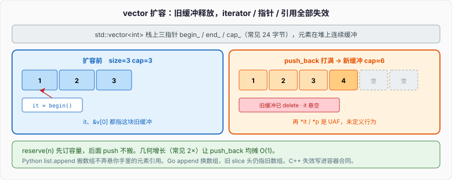

# STL与vector

循环里 `push_back`，手里还握着上一轮的迭代器或指向元素的指针：



```cpp
#include <vector>

int main() {
    std::vector<int> v{1, 2, 3};
    auto it = v.begin();                // 指向 1
    int* p = &v[0];
    for (int i = 0; i < 100; ++i) {
        v.push_back(i);                 // 某一次扩容：旧缓冲释放
    }
    // *it、*p 已经悬空；再读是 UAF，未定义行为
}
```

`vector` 是一块连续缓冲。满了就申请更大的、搬元素、释放旧的。搬完之后，指向旧缓冲的迭代器、指针、引用全部失效。不是「过期还能碰一下」，是对象已经析构、字节已经还给堆。内存篇的 UAF，容器版。Python 的 `list.append` 也可能搬底层数组，但名字绑的是 list 对象，元素是堆上的对象引用，你手里的元素引用不跟着数组走——你不会因为 append 把已经取出的元素弄悬。Go 的 `append` 可能换底层数组，旧 slice 头仍指着旧数组（或共享、或已不再被任何人用）。C++ 把「连续 + 扩容」的失效写进容器合同，不遵守就是 UB。

本篇从这条事故往下：三指针布局、扩容倍数、`reserve` 为什么是合同、失效规则全表、以及 `deque` / `list` / `map` / `unordered_map` 各自拿什么换什么。入门篇只演示过 `vector` 拷贝是深拷；这里把容器当内存模型讲。

---

## 一、vector 就是三只指针

### 1、对象在栈上，元素在堆上

`std::vector<T>` 自己通常三个指针（或指针 + 两个 size）：`begin_`、`end_`、`cap_`。64 位上 `sizeof(vector<int>)` 常见 24。元素不在这 24 字节里。

```cpp
#include <iostream>
#include <vector>

int main() {
    std::vector<int> v;
    std::cout << sizeof(v) << "\n";     // 与 v.size() 无关，常见 24
    v.resize(1000);
    std::cout << sizeof(v) << "\n";     // 还是 24；1000 个 int 在堆上
}
```

`size()` 是 `end_ - begin_`。`capacity()` 是 `cap_ - begin_`。`empty()` 是 `begin_ == end_`，不是看 capacity。`data()` 返回 `begin_`，C API 要连续缓冲时用它，空 vector 的 `data()` 是否为 nullptr 实现可不同，C++17 保证空时也可以给一个非空但别解引用的指针——可移植代码空 vector 不要解引用 `data()`。

`v[i]` 是 `*(begin_ + i)`，不检查边界。`at(i)` 越界抛 `std::out_of_range`。热路径用 `[]`，边界来自外部输入用 `at` 或自己查 `size`。Python 的 `lst[i]` 越界抛 `IndexError`；Go 的 `s[i]` 越界 panic。C++ 的 `[]` 越界是 UB，不是抛。

下标类型是 `size_type`（无符号）。`for (int i = v.size() - 1; i >= 0; --i)` 在空 vector 上 `size() - 1` 下溢成巨大的正数。反向遍历用 `size_t` 小心，或用反向迭代器。

### 2、连续：下标 O(1)，搬迁是税

元素按 `T` 的数组排，中间没有 per-element 堆头。遍历是顺序访存，cache 友好。`push_back` 均摊 O(1)，单次可能 O(n)（搬所有元素）。`insert` 在中间是 O(n)：后面的元素要挪。`erase` 同理。

`T` 必须能搬到新缓冲。C++17 下 `vector` 扩容优先走移动，移动抛则还可能走拷贝（具体看 traits）。移动最好 `noexcept`：否则 `vector` 不敢用移动来提供异常安全，只能拷。对象模型篇写过这条，容器是它的主战场。

```cpp
struct Heavy {
    std::string s;
    Heavy() = default;
    Heavy(const Heavy&) = default;
    Heavy(Heavy&& o) noexcept : s(std::move(o.s)) {}
    Heavy& operator=(const Heavy&) = default;
    Heavy& operator=(Heavy&& o) noexcept {
        s = std::move(o.s);
        return *this;
    }
};

std::vector<Heavy> v;
v.reserve(100);                         // 先订容量，后面 push 不搬
```

没有 `noexcept` 移动的类型，扩容可能拷 N 份。大 `string` / 又写了析构忘了移动的类，热路径上会看见分配器在跳。

### 3、小对象、bool 特化、vector<T*>

`vector<char>`、`vector<int>` 紧凑。`vector<std::string>` 每个 string 自己可能再堆上一块（SSO 短字符串除外）。`vector<vector<int>>` 是「指针数组 + 多块缓冲」，不是二维连续。要一块矩阵，用单 `vector` + 自己算下标，或专门的矩阵类型。

`vector<bool>` 不是 `vector`。它是位压缩代理，`operator[]` 返回的不是 `bool&`，取地址、交给 `auto&` 都会疼。需要真正的 `bool` 序列用 `vector<char>` 或 `deque<bool>`。这是历史包袱，不是特性。

`vector<T*>` 拥有的是指针值，不拥有 `T`。内存篇说过假 RAII。拥有堆上多态对象：`vector<unique_ptr<T>>`。只观察：指针可以，寿命合同写清。

---

## 二、扩容：倍数、reserve、shrink

### 1、几何增长

缓冲满时，新容量通常是旧的 2 倍（libstdc++ 常见 2，MSVC 曾 1.5）。几何增长让 `push_back` 均摊 O(1)：N 次 push 的搬迁总量是 O(N)，不是 O(N²)。算术增长（每次 +10）会把均摊打成 O(N)。

```cpp
std::vector<int> v;
std::size_t last = 0;
for (int i = 0; i < 100; ++i) {
    v.push_back(i);
    if (v.capacity() != last) {
        std::cout << "size=" << v.size()
                  << " cap=" << v.capacity() << "\n";
        last = v.capacity();
    }
}
```

自己跑一遍看你的标准库。不要依赖具体倍数写逻辑；依赖「均摊 O(1)」和「满了会搬」。

`push_back` 的强异常保证：`T` 的拷贝 / 移动若抛，`vector` 应回到调用前的状态（容量可能变，这点历史上有过争论，元素序列应不变）。`emplace_back` 直接在尾部构造，参数转发进去，少一次临时量。能 `emplace` 就 `emplace`，尤其元素构造很贵时。

`insert` 在中间：先保证容量（可能扩），再把尾部挪开，再构造新元素。失败路径要能把挪开的挪回来。所以 `T` 的移动 / 拷贝抛异常时，中间插入的安全档比 `push_back` 更脆，有的操作只给基本保证。

### 2、reserve 是合同，不是提示

`reserve(n)` 保证 `capacity() >= n`。之后只要 `size()` 不超过这个容量，`push_back` / `emplace_back` **不得使迭代器、指针、引用失效**。循环前能估到上限，先 `reserve`。这是消灭开头那类 bug 的正招，也是性能正招：少次分配、少次搬迁。

```cpp
std::vector<int> v;
v.reserve(100);
auto it = v.begin();                    // 空 vector 的 begin 仍有效（可等于 end）
for (int i = 0; i < 100; ++i) {
    v.push_back(i);                     // 不扩容，已有元素的指针不失效
}
// 注意：push_back 仍会使 end() 之前那个「尾后」迭代器失效——尾后每次 size 变都要重取
```

`resize(n)` 改的是 size：变大则在尾部值初始化（或填副本），变小则析构多余元素，**容量不一定缩小**。`resize` 变大超过 capacity 会扩容，已有元素可能搬。`resize` 变小不搬，只析构尾巴，前面的指针仍有效。

`clear()` 析构全部元素，size 变 0，容量通常保留。随后 `push_back` 不一定分配。要还给堆：`shrink_to_fit()`，这是**请求**，不保证。或 `vector<T>().swap(v)` / C++11 起 `v = vector<T>{}` 视实现可能释放。真正要释放，swap 空 vector 是老写法，仍然有效。

```cpp
v.clear();                              // 容量还在
v.shrink_to_fit();                      // 请求释放；可能仍留着
std::vector<int>().swap(v);             // 常见实现下容量变 0
```

### 3、不要在循环里反复扩、也不要过度 reserve

每次 `push_back` 前 `reserve(v.size()+1)` 等于把几何增长打成每次分配，O(N²)。估不准宁可让它自己翻倍。估得过大，内存峰值难看，但正确性还在。服务器上「每个请求 reserve 一百万」会把 RSS 打满——`reserve` 是合同也是账单。

`capacity()` 没有标准化的缩小路径，除了 `shrink_to_fit` 和换一个新 vector。不要自己 `new` 一块当 vector 用还手写扩容——`vector` 就是这件事的标准答案。

已知长度：`vector<T> v(n)` 构造 n 个值初始化的 T；`vector<T> v(n, x)` n 份 x 的拷贝；`v.assign(n, x)` 同类。随后用下标填，不要 `push_back` n 次还忘了 reserve——直接定 size 更干净，前提是 T 能值初始化且你马上会覆盖。

`emplace` vs `push`：`push_back(T{})` 先造临时再移进；`emplace_back()` 在尾部直接构造。对不可拷、临时量贵的类型差得明显。`insert(it, args...)` 有拷贝版本和 `emplace` 版本。`vector<unique_ptr<T>>` 只能 `push_back(std::move(p))` 或 `emplace_back(...)`，不能拷一份 `unique_ptr` 进去。

`data()`、`&v[0]`、空容器：C++11 起 `data()` 空时可以是 nullptr 也可以是非空不可解引用指针。`&v[0]` 在空 vector 上是 UB（`v[0]` 越界）。写 C API 时：

```cpp
void c_api(int* p, std::size_t n);

c_api(v.data(), v.size());              // n==0 时 p 可能空，C API 必须接受
if (!v.empty()) c_api(&v[0], v.size()); // 另一种写法，空则根本不调
```

`swap` 是 O(1)：三个指针对调，迭代器、指针、引用仍指向原来的元素，只是这些元素现在属于另一个 vector。这和扩容相反。`v.swap(u)` 之后，原先指向 `v[0]` 的指针现在指向「在 `u` 里的那个元素」，地址没变。失效规则表经常漏 `swap`：它不失效指向元素的句柄，但「属于哪个容器」换了。

`assign`、`operator=` 从别的 vector / 初始化列表：视容量可能重分配，按插入同类处理，假设可能全废。自赋值 `v = v` 必须安全，标准库会做对。

---

## 三、失效规则：哪一次操作废掉哪一类句柄

### 1、vector / string / deque 的连续（或半连续）

指向元素的迭代器、指针、引用，在「这个元素被挪走或析构」时失效。`vector`：

- `push_back` / `emplace_back` / `insert` / `resize` 变大：若引起扩容，**全部**失效；若未扩容，指向插入点之前的仍有效，插入点及之后的失效（被挪了），尾后失效。
- `erase`：被删的、以及其后的全部失效；之前的仍有效。返回值是指向被删者之后那个元素的新迭代器，必须用返回值，不要 `++` 已失效的。
- `clear` / 析构：全部失效。
- `reserve` 引起扩容：全部失效。`reserve` 不扩（已有足够容量）：不失效。
- `shrink_to_fit` 可能重分配：按扩容同样处理，假设会失效。

```cpp
std::vector<int> v{0, 1, 2, 3, 4};
for (auto it = v.begin(); it != v.end(); ) {
    if (*it % 2 == 0) it = v.erase(it); // 必须接返回值
    else ++it;
}
```

`erase` 返回下一个。`it = v.erase(it)` 是唯一合法写法。`v.erase(it++)` 在 vector 上是 UB：`it++` 的旧值已经失效，后置自增还要用旧迭代器。list 上后置自增碰巧能用，因为只失效被删那个——不要靠这个，一律接返回值。

循环里对当前 `vector` `push_back`：即使 `reserve` 过，**范围 for** 用的是 `begin`/`end` 的副本，`end` 在 size 变时逻辑上过期。范围 for 扩容器是未定义（至少是错误）。要边遍历边 push，用下标：

```cpp
for (std::size_t i = 0; i < v.size(); ++i) {
    if (need_more(v[i])) v.push_back(derive(v[i]));
}
```

下标在未扩容时稳；扩容后元素搬了，下标仍是下标，只要你没握指针。`reserve` 足够则连搬都没有。这是循环里增长的标准写法。

`insert(it, first, last)` 从另一段输入插进来：若输入迭代器指向**同一个 vector** 的元素，而插入引起扩容或元素挪动，源迭代器失效，标准把这类「插入范围来自自身」定得很窄，可移植代码不要 `v.insert(v.end(), v.begin(), v.end())` 指望翻倍——未指定或 UB。要拼接自己，先拷到临时再插，或 `v.insert(v.end(), tmp.begin(), tmp.end())`。

`erase(first, last)` 删区间，返回 `last` 之后那个元素的迭代器。区间里每个元素析构，其后的元素前移。指向其后的句柄失效，指向其前的（未引起别的重分配，erase 不缩容）仍有效。

`pop_back()` 析构最后一个，不重分配，不失效其它元素的指针。`pop_front` 不是 vector 的成员——头删 O(n)，要用自己 `erase(begin())` 或换 deque。误把 vector 当队列从头删，是 O(n²) 的经典写法。

---

### 2、deque：两端，块状

`deque` 分块，块指针表再指到固定大小的块。头尾 `push`/`pop` 均摊 O(1)，不搬所有元素。下标仍 O(1)（算块 + 块内偏移），常数比 vector 大。中间 `insert`/`erase` 仍 O(n)。

失效：

- 两端 `push`/`pop`：指向**其他元素**的引用 / 指针仍有效；迭代器是否失效，`push` 两端会使**迭代器**失效（引用常仍有效——这是 deque 的细规则，写代码时迭代器当会失效处理更安全，或查你用的标准：C++11 起 `push_front`/`push_back` 使所有迭代器失效，引用和指针仍有效）。
- 中间 `insert`/`erase`：全部失效。

deque 适合「两端进出、偶尔下标」。不要当 vector 用——局部性差一截。也不要当 list 用——中间删仍贵。

### 3、list / forward_list：只失效被删的

`list` 双向链表，节点各自堆分配。`insert` / `erase` 不搬其他元素：只有被擦除的迭代器失效，其他一律有效。`splice` 整段 O(1) 挪到另一个 list（同分配器）。没有随机下标，`size` 在 C++11 起 O(1)。

```cpp
std::list<int> ls{1, 2, 3, 4};
for (auto it = ls.begin(); it != ls.end(); ) {
    if (*it == 2) it = ls.erase(it);
    else ++it;
}
```

节点分配器开销、指针追逐对 cache 不友好。除非你真的需要稳定迭代器、O(1) splice，否则不要用 list。算法题里「链表」是节点题，不是 `std::list` 题；工程里 `list` 出现的频率应当很低。

`forward_list` 单向，没有 `size()`，`before_begin()`，更省一个指针。更窄的场景。

### 4、关联容器：键序或哈希

`map` / `set`：结点树（通常红黑树）。迭代器只在该结点被 erase 时失效。`insert` 不使已有迭代器失效。`erase(it)` 返回下一个（C++11），同样接返回值。下标 `map[k]`：**不存在则插入**默认值，这是读路径上的坑。只查用 `find` / `count` / C++20 `contains`，C++17 用 `find != end`。

```cpp
std::map<std::string, int> m;
m["a"] = 1;
auto it = m.find("b");
if (it != m.end()) use(it->second);
// int x = m["b"];                      // 插入 b -> 0，不是只读
```

`unordered_map` / `unordered_set`：哈希桶。`insert` 可能 rehash，rehash 使**所有迭代器失效**，引用 / 指针到元素在标准里仍有效（结点没搬，搬的是桶里的指针）。`erase` 只失效被删的迭代器。`reserve(n)` / `rehash` 控制桶数，避免查找路径上 rehash。负载因子默认 max_load_factor 1.0。

哈希表对 `Key` 要 `hash` 和 `==`。自定义类型必须两个都给，且相等的键哈希必须相等。指针当 key 是比地址，不是比对象。`string` 当 key 每次查找都要算哈希；热路径上可以 Intern 成 ID。

`map` 有序、下界、范围查询 O(log n)。`unordered_map` 均摊 O(1)，最坏 O(n)（被哈希碰撞打满一个桶）。需要最坏 O(log n) 或有序遍历用 `map`。需要均摊 O(1) 且键无序用 `unordered_map`。不要默认「哈希一定更快」——小 n、字符串键、差的哈希，树可能更快。

`multimap` / `multiset` / `unordered_multimap`：重复键。`equal_range` 取等值区间。`erase(key)` 删全部相等键，返回个数；`erase(it)` 删一个。

C++17 结点句柄：`extract` 把结点从容器摘下来不析构，改 key 再 `insert` 回去——用来改 `map` 的 key 而不 reinsert。点到即可：需要改 key 时再查。

---

## 四、选型：连续、稳定、有序、哈希

### 1、一张表

| 容器 | 布局 | 随机访问 | 中间插入删除 | 迭代器失效 | 默认场景 |
| --- | --- | --- | --- | --- | --- |
| `vector` | 一块连续 | O(1) | O(n) | 扩容全废，erase 其后废 | 默认 |
| `deque` | 分块 | O(1) 较慢 | 两端 O(1)，中间 O(n) | 两端 push 迭代器废、引用常在 | 两端队列 |
| `list` | 结点 | 无 | O(1) 已知迭代器 | 只废被删 | splice / 稳定句柄 |
| `map` | 树结点 | 无（按键 O(log n)） | O(log n) | 只废被删 | 有序键、下界 |
| `unordered_map` | 哈希桶 + 结点 | 无（按键均摊 O(1)） | 均摊 O(1) | rehash 废迭代器 | 无序字典 |
| `array` | 对象内连续 | O(1) | 无动态 | 对象活着就有效 | 编译期长度 |
| `string` | 类似 vector\<char\> + SSO | O(1) | O(n) | 同 vector | 文本 |

默认 `vector`。这不是风格，是局部性、分配次数、实现质量的交集。需要稳定指针再考虑结点容器。需要键查询再考虑 map / unordered_map。`vector` + 排序 + `lower_bound` 常常比反复 `map` 插入更快——先填后查，一次 sort。

### 2、vector 当 map 用

```cpp
std::vector<std::pair<int, int>> v;
// 填完
std::sort(v.begin(), v.end());          // 按 first
auto it = std::lower_bound(v.begin(), v.end(), key,
    [](const auto& e, int k) { return e.first < k; });
```

只读查询、键是整数或可排序、数据一次性进来：这个组合打赢 `map`。动态频繁按键插删，才轮到树 / 哈希。Python 的 `dict` 有序（3.7+ 插入序）且哈希；Go 的 `map` 无序哈希。C++ 把「有序树」和「无序哈希」拆开，没有一个叫 `dict` 的默认。选错的代价是每次操作多几个指针追逐，或每次查询 log n。

`vector<char>` 当动态缓冲，比 `string` 语义更「字节」。二进制协议不要用 `string` 当字节袋——`string` 的 SSO、`c_str()` 结尾 0，都能让你多想一步。字节用 `vector<std::uint8_t>`。

### 3、deque 不是更快的 vector

两端 `push` 才是 deque 的点。中间当数组用，cache 比 vector 差：跨块、二次间接。`queue` / `stack` 适配器默认底层是 `deque` / `deque`（`stack` 默认 deque）。`stack` 改成 `vector` 往往更好。`queue` 要两端，deque 合适；单端且要连续，自己用 `vector` 当下标环。

`priority_queue` 默认 `vector` + heap，合理。自定义 `priority_queue` 的比较器，注意是 less 则 top 是最大。

---

## 五、算法、迭代器类别、和容器的接缝

### 1、迭代器不是指针，有时是

`vector` 的迭代器在不少实现里就是 `T*`，你可以 `it + n`。`map` 的迭代器是树结点指针包装，只有 `++` / `--`，没有 `it + n`。算法用迭代器类别分发：Input / Forward / Bidirectional / RandomAccess。`std::sort` 要随机访问，所以 `list` 不能 `std::sort`，要用 `ls.sort()` 成员（归并）。

```cpp
std::vector<int> v{3, 1, 2};
std::sort(v.begin(), v.end());          // 随机访问

std::list<int> ls{3, 1, 2};
ls.sort();                              // 成员
// std::sort(ls.begin(), ls.end());     // 编译失败
```

`std::advance` / `next` / `prev` / `distance` 按类别走 O(1) 或 O(n)。不要自己 `for` 数 n 步还假设是指针。

失效规则是迭代器合同的一部分。算法内部会拷贝迭代器、会写元素，但不会在你的容器上 `push_back`——除非你传的是 `back_inserter`。`std::copy` 到 `v.begin()` 要求目标已有足够元素；要插入用 `back_inserter(v)`，那就会 `push_back`，也就可能扩容。

### 2、remove-erase 惯用法

```cpp
v.erase(std::remove_if(v.begin(), v.end(), pred), v.end());
```

`remove_if` 不删容量，只把要留的搬到前面，返回新逻辑末尾。真正析构尾巴是 `erase`。只 `remove_if` 不 `erase`，size 不变，尾巴是搬过去的垃圾（或未指定）。Python 的 `lst[:] = [x for x in lst if ...]` 一次换绑定；C++ 要两步。`list` 有 `remove_if` 成员，直接删结点。

`unique` 同样只压缩相邻重复，随后 `erase`。先 `sort` 再 `unique` 再 `erase` 去重。`unordered_set` 去重是另一条路，要丢序、要哈希。

### 3、分配器、多态、pmr（点到）

`vector<T, Alloc>` 的第二参数是分配器。默认 `std::allocator<T>` 走全局 `operator new`。不写第二参数即可。需要池、arena、统计，再换分配器。C++17 `std::pmr::vector<T>` 用 `memory_resource*`，同一类型可换底层资源。点到：容器的堆不是死的，但默认路径不要碰 Alloc。

`vector<Base>` 装派生对象会切片。多态用 `vector<unique_ptr<Base>>`。对象模型篇的切片，容器是重灾区。

`pmr` 的陷阱：`pmr::vector<T>` 和 `vector<T>` 不是同一类型，不能无开销互转。`memory_resource*` 必须活过所有用它分配的容器——arena 先死、vector 后析构就是 UAF。资源的寿命盖住容器，和 mutex 盖住线程同一条。默认 `vector` 走全局堆，简单、可预测。池化是测出来的优化，不是先写的架构。

异常安全：`push_back` 对 copyable / nothrow-movable 的 `T` 有强保证——抛了则容器回到调用前。`emplace_back` 在已有容量时直接在尾部构造，若构造抛，size 不变（强保证）；若先扩容再构造失败，元素应已从新缓冲回滚或根本还没提交。`insert` 中间位置更难：要挪开尾巴，构造失败得挪回来，`T` 的移动若抛，可能只剩基本保证（容器有效，内容未指定）。这是「元素移动尽量 `noexcept`」在容器上的具体账单，不只是扩容快不快。

`vector<T>::iterator` 在 debug 库里常常不是裸指针：MSVC 调试迭代器带容器指针，能在失效后解引用时断言。Release 又可能退回 `T*`。不要对迭代器做 `reinterpret_cast`，不要假定 `sizeof(iterator) == sizeof(void*)`。算法只通过迭代器接口走路，这是可移植性的底线。

`std::empty` / `std::data` / `std::size` C++17 自由函数，对 C 数组、`vector`、`string`、`array` 同一套。模板里用它们，比 `.size()` 更能接数组。`std::begin` / `std::end` 同理。范围 for 内部就是 `begin` / `end`，ADL 会找到成员或自由函数。

`capacity` 与 `size` 的比：频繁 `push_back` 的缓冲，容量在 size 的 1～2 倍之间是几何增长的正常态，不是泄漏。泄漏是 size 降回去、capacity 钉在历史峰值还被一个长寿对象握着。短命的请求对象析构时整份还给堆，不必 shrink。长寿的成员 `vector` 吃过一次尖峰，就要考虑还。ASAN 的 leak 检测看的是没还的堆，capacity 留着不算 leak——RSS 涨才是运维视角的 leak。两种仪表都要会读。

`insert` 的返回值是指向**新插入元素**的迭代器（单元素插入），不是下一个。和 `erase` 返回下一个相反。接错返回值再 `++` 会跳过或越界。区间插入返回指向第一个新元素的迭代器。C API 风格的 `void insert` 不存在于 `vector`——有返回值就用。

`emplace` 的坑：`v.emplace_back({1, 2})` 对 `vector<pair<int,int>>` 常常推不出 `initializer_list`，要 `v.push_back({1, 2})` 或 `v.emplace_back(1, 2)`。`emplace` 是把实参原样转发给元素构造，不是「更聪明的 push」。花括号列表不是构造函数实参包。看不懂就 `push_back(T{...})`，能移就移。

并发：`vector` 不是线程安全的。两个线程无同步 `push_back` 是 data race，和开头 `x++` 同类，UB。只读共享、在发布之后不再改 size / capacity，可以多线程读元素——发布协议见并发篇。一边读一边 `push_back`，即使「我确定不会扩容」，size 的普通读写仍是 race。容器级并发用锁，或换并发容器库。标准 `vector` 的合同是单线程，或你自己提供 happens-before。

---

## 六、string、SSO、以及「连续」的亲戚

### 1、string 不是 vector\<char\>，但失效像

`std::string` 连续、几何增长、`push_back` / `append` 可能重分配，迭代器 / 指针 / 引用 / `string_view` 全部失效。短字符串实现常 SSO（small string optimization）：小缓冲开在对象内部，没有堆。`sizeof(string)` 常见 24 或 32。SSO 阈值常见 15 或 22 个 `char`（还要 `\0`）。超过才上堆。

```cpp
std::string a = "short";                // 可能无堆
std::string b = "a long string that spills";  // 堆
const char* p = a.c_str();
a.push_back('!');                       // 可能仍 SSO，p 可能仍有效；不要赌
```

`c_str()` / `data()` C++17 起 `data()` 非 const 可写。始终以 `\0` 结尾，`c_str()` 可给 C API。`string_view` **不**保证 `\0`。从 `string` 取出的指针，`append` 之后当悬处理。SSO 让「小字符串没堆」成为实现细节，逻辑上仍按「可能重分配」写。

`operator+` 造新 string，循环里 `s = s + x` 每次分配，用 `+=` / `append`。已知总长度先 `reserve`。这和 `vector` 同一合同。

`string` 的 `operator[]` 不检查；`at` 抛。`s[s.size()]` C++11 起允许读那个 `\0`，写它是 UB。`substr` 拷新串。`find` 失败返回 `npos`，不是 `-1` 再拿去下标——`npos` 是巨大的 `size_t`，拿去 `s[pos]` 是越界 UB。`compare` / `==` 按字典序。二进制数据不要用 `string` 当袋：`char` 的符号、`c_str` 的额外 0、SSO，都会让协议代码多想。`vector<uint8_t>` 没有这几条隐含约定。

`append(s, pos, n)`、`replace`、`insert` 都可能重分配。`erase` 字符不缩容。`shrink_to_fit` 同样只是请求。短字符串 SSO 时 `shrink_to_fit` 常常什么都不做——本来就没堆。

---

### 2、array、valarray、bitset

`std::array<T, N>` 是对象内连续，`sizeof` 约 `N * sizeof(T)`，没有堆，拷贝就是 N 个 T。迭代器永不因「扩容」失效——它不能扩。长度编译期。栈上巨大 `array` 会爆栈，大缓冲仍 `vector`。和 C 数组互操作：`a.data()`，不会退化成指针传丢长度。指针篇的退化，`array` 是解药之一。

`bitset<N>` 位压缩，N 编译期。`vector<bool>` 是运行时长度的错误答案；`bitset` 是编译期长度的正当答案。`valarray` 数值阵列，几乎不要在通用代码里用，生态薄。

### 3、queue / stack / priority_queue 是适配器

它们不是独立容器，是在 `deque` / `vector` 上套接口。`stack<T>` 默认 `deque<T>`，改成 `stack<T, vector<T>>` 往往更干净。适配器不提供迭代器——不能误打误撞遍历。要遍历就不要用适配器，直接用底层容器。`priority_queue` 的 `top` 是最高优先，`push`/`pop` O(log n)，底层 `vector` + heap。自定义比较器类型是 `priority_queue` 的一部分，lambda 要先 `decltype` 或写成函数对象 class。

`std::set` / `multiset` 和 `map` 同一棵树，只是不存 mapped value。元素即键，`const`，改元素等于改键，禁止。需要「有序且要改非键字段」用 `map` 或 `set` + `mutable` 成员（比较器不能看 mutable 那部分，否则树坏）。`unordered_set` 同理。

小整数键、密集 ID：`vector<T>` 按下标当字典，空槽用 `optional<T>` 或专门的空值。`map<int, T>` 在 ID 从 0 连续到 N 时是在用树模拟数组。选型表的「默认 vector」包含这一条。稀疏 ID、要删除中间键、键不可当开下标，才上哈希或树。

`unordered_map` 的 `rehash(n)` / `reserve(n)` 在已知最终元素数时先订桶，避免查找路径上 rehash 把迭代器废掉。迭代器稳定性：C++17 哈希表是结点式，元素引用在 insert 导致 rehash 后仍有效，**迭代器**仍废。代码里握着 `it` 边插边用，按会废处理。握着 `&map[k]` 当元素地址，rehash 后仍指向那个结点——这是和 `vector` 不同的点。不要把这条推广到「哈希表什么都不废」。

`equal_range` 在 `multimap` 上给出同键区间，区间在没 erase 这些结点时有效。`lower_bound` / `upper_bound` 是树的专长，哈希表没有有序边界（`unordered_multimap` 的 `equal_range` 只是同键桶内范围，无全序）。需要「>= k 的第一个」用 `map`，不要对哈希表排序键。

---

## 七、对照 Python list、Go slice

### 1、list 是指针数组，vector 是值数组

Python `list` 底层是 `PyObject*` 的连续数组，扩容同样几何增长。元素对象在堆上，list 槽里是指针。`a = lst[0]; lst.append(x)` 之后 `a` 仍指着那个对象——你握的是对象，不是槽。C++ `vector<int>` 的元素就是 int 本身，扩容把 int 搬到新地址。`vector<string>` 搬的是 string 对象（SSO 或指针偷走），不是 Python 那种「永远再间接一次」。

所以 Python 里「取出元素再 append」安全；C++ 里「取出指针 / 引用 / 迭代器再 push_back」不安全。Go 的 `s := a[0]; a = append(a, x)`：`s` 若是 int 是拷贝；若 `a` 是 `[]T`、`s := a[0:1]`，append 可能换数组，旧 slice 仍指旧数组——Go 的坑在「两个 slice 共享还是不共享」，C++ 的坑在「句柄还指不指得上」。

Python `list` 可以异构：`[1, "a", None]`。C++ `vector<T>` 元素类型钉死。要异构：`vector<variant<...>>` 闭集，或 `vector<unique_ptr<Base>>` 开集。不要 `vector<void*>` 当异构袋——类型和所有权都丢了。Go 的 `[]any`（以前 `[]interface{}`）类似擦除，每个元素一个接口值；C++ 没有默认的那个袋。

`list.sort` 在 Python 是 Timsort，稳定。C++ `std::sort` 不保证稳定，`std::stable_sort` 才稳，要额外内存。`list.reverse` 对应 `std::reverse`。不要假设 `sort` 稳，比较器相等的元素相对位置会换。

---

### 2、Go slice 头 vs vector 三指针

Go slice 是 `{ptr, len, cap}`，值拷贝这个头，底层数组共享。`b := a; append` 到 cap 内，`a` 能看见；超出 cap 换数组，`a` 看不见。C++ `vector` 拷贝是深拷整份元素；要共享用 `shared_ptr<vector<T>>` 或干脆别共享、传引用。不要把 Go 的 slice 赋值直觉用在 `vector b = a` 上——入门篇写过，这里钉在扩容上：C++ 没有「共享底层数组的 vector 赋值」。

`string_view` / C++17 没有标准 `span`（C++20 才有），观察连续缓冲用指针 + 长度或自己写 span。观察者同样在 `vector` 扩容后悬空。`string_view` 指着 `string` 或字面量，`string` 扩容 / 析构后 view 悬。和迭代器同一类合同。

Go 里 `s = s[:0]` 保留 cap，对应 `v.clear()` 保留 capacity。`s = nil` 丢掉底层数组，对应 `vector<T>().swap(v)`。Go 没有 `shrink_to_fit` 这种请求接口，GC 扫不到的数组靠你不再引用。C++ 必须显式还堆，否则 RSS 钉在历史峰值——服务端循环里 `clear` 不 `shrink` 是常见的「内存只涨不跌」。该不该 shrink：热路径保留容量避免再分配；请求结束、对象要活很久且这次特别大，再还。

`append` 的第一个返回值必须接：`a = append(a, x)`。C++ `push_back` 是成员，改的就是这个对象，没有「忘了接返回值」这一种 slice 事故，换成「忘了失效」。两种语言的连续缓冲，坑的形状不同，根都是「底层数组可能换」。

---

### 3、字典

Python `dict` 是哈希 + 插入序。Go `map` 是哈希，遍历顺序每次可能不同。C++ `map` 是树（键序），`unordered_map` 是哈希（桶序，rehash 会变）。要从 Python 过来：默认别用 `map` 当 dict，多数场景 `unordered_map` 更接近；要有序遍历再 `map` 或 `vector` + sort。`map[k]` 插入默认值这点，Python 的 `d[k]` 没有键是 `KeyError`，Go 的 `m[k]` 没有键是零值且不插入——三门语言三个行为，C++ 的 `operator[]` 最「有副作用」。

`unordered_map` 的桶里是链表或开寻址（实现定义，C++17 标准只要求结点容器的引用稳定性：元素指针在 rehash 后仍有效）。不要依赖遍历顺序。不要依赖 `max_load_factor` 的默认值在所有库上一样。自定义 `Key` 必须 `==` 与 `hash` 一致：`a == b` 则 `hash(a) == hash(b)`。不相等的键哈希碰撞只影响性能；相等的键哈希不同是正确性 bug，查找会丢。

`map` 的键是 `const`：`it->first` 不能改。改键等于换结点，C++17 `extract` 再改再插。`[]` 对 `map<K, unique_ptr<V>>` 在缺失时尝试插入默认 `unique_ptr`（空），然后你再赋值——合法。对不可默认构造的 `V`，`[]` 编译失败，用 `try_emplace` / `insert_or_assign`（C++17）。`try_emplace` 只在键不存在时构造映射值，避免先造一个临时再扔掉。热路径插入用它，不要 `m[k] = V{...}` 那种必须 `V` 可默认构造 + 可赋值的路径。

```cpp
std::map<int, std::string> m;
m.try_emplace(1, 10, 'a');              // 只在没有 1 时构造 string(10, 'a')
m.insert_or_assign(1, "b");             // 有则赋，无则插
```

Python `d.setdefault` / `d[k] = v` 混在一起；C++ 把「只在缺失时造」和「有则覆盖」拆开。从 Python 过来会把 `[]` 当 lookup，这是容器篇最贵的一处误读。

---

## 八、对照、易错点和一份能跑的实验

失效压缩：

- `vector` 扩容：迭代器、指针、引用全废。
- `vector` 中间 insert / erase：其后废，其前（未扩容时）还在。
- `deque` 两端 push：迭代器废，引用常在；中间操作全废。
- `list` / `map` / `set`：只废被删结点。
- `unordered_*`：rehash 废迭代器，引用常在；erase 废被删。

易错点：

- 循环 `push_back` 还握着 `begin` / `&v[0]` / 范围 for。
- `erase` 不接返回值。
- `for (int i = v.size()-1; ...)` 空容器下溢。
- `map[k]` 当查找。
- `vector<bool>` 当真正的序列。
- `vector<Base>` 装派生，切片。
- `vector<T*>` 当拥有者。
- 每次 push 前 `reserve(size()+1)`。
- 依赖 capacity 的具体倍数。
- `remove_if` 不 `erase`。
- 对 `list` 调 `std::sort`。
- `string_view` 指临时 `string`。
- 哈希表自定义类型只写了 `==` 没写 `hash`，或两者不一致。
- 边遍历 `unordered_map` 边 insert 导致 rehash，迭代器废。
- `s = s + x` 循环里反复分配。
- 依赖 SSO「短字符串指针永远有效」。
- `stack` / `queue` 上找迭代器。
- `pmr::vector` 的 resource 先于容器死。
- `try_emplace` 该用却用 `[]` 逼 `V` 默认构造。
- `hash` 和 `==` 不一致。
- 巨大 `std::array` 放栈上。
- `priority_queue` 当可遍历容器。
- 对 `string` 取 `c_str()` 再 `append`。
- `vector<string>` 当二维字节缓冲，却假设连续。
- `erase(remove_if)` 的 pred 里再改容器。

`g++ -std=c++17 -O0 -Wall -Wextra -o vec vec.cpp && ./vec`：

```cpp
// vec.cpp — 布局、reserve、失效、选型对照。C++17。
#include <algorithm>
#include <iostream>
#include <map>
#include <string>
#include <unordered_map>
#include <vector>

int main() {
    std::vector<int> v;
    std::cout << "sizeof=" << sizeof(v)
              << " size=" << v.size()
              << " cap=" << v.capacity() << "\n";

    v.reserve(8);
    const int* p = v.data();            // 空时不要解引用；只存地址做比较
    for (int i = 0; i < 8; ++i) v.push_back(i);
    std::cout << "after8 cap=" << v.capacity()
              << " data_moved=" << (v.data() != p && p != nullptr) << "\n";
    // reserve(8) 后 8 次 push 不应换缓冲；p 可能是 nullptr（空 data）

    v.push_back(8);                     // 可能扩容
    std::cout << "after9 cap=" << v.capacity() << "\n";

    auto it = v.begin();
    it = v.erase(it);                   // 接返回值
    std::cout << "front=" << *it << " size=" << v.size() << "\n";

    v.erase(std::remove_if(v.begin(), v.end(),
                           [](int x) { return x % 2 == 0; }),
            v.end());
    std::cout << "odd=";
    for (int x : v) std::cout << x << " ";
    std::cout << "\n";

    std::map<std::string, int> m;
    m["a"] = 1;
    if (m.find("b") == m.end()) std::cout << "no b\n";
    std::cout << "map_size_before_index=" << m.size() << "\n";
    (void)m["b"];                       // 插入
    std::cout << "map_size_after_index=" << m.size() << "\n";

    std::unordered_map<int, int> u;
    u.reserve(16);
    for (int i = 0; i < 10; ++i) u[i] = i * i;
    std::cout << "umap=" << u.size() << " bucket=" << u.bucket_count() << "\n";

    std::vector<int> a{1, 2, 3};
    std::vector<int> b;
    b.swap(a);
    std::cout << "swap a=" << a.size() << " b=" << b.size() << "\n";

    std::string s = "short";
    s.reserve(64);
    const char* cs = s.c_str();
    s.append("!");                      // 容量足够，SSO 或堆缓冲都可能不搬
    std::cout << "str=" << s << " c_str_same=" << (cs == s.c_str()) << "\n";

    std::map<int, std::string> im;
    im.try_emplace(1, 3, 'x');
    im.insert_or_assign(1, "y");
    std::cout << "try=" << im[1] << " size=" << im.size() << "\n";
}
```

跑完对照：`sizeof` 与元素个数无关；`reserve(8)` 后八次 `push_back` 容量不变；第九次可能翻倍；`erase` 接返回值后还能解引用；`remove_if` + `erase` 留下奇数；`m["b"]` 把 size 从 1 变 2；`swap` 交换 size；`try_emplace` 不存在才造、`insert_or_assign` 覆盖成 `"y"`。把开头那段「循环 push 还用旧迭代器」加上 ASAN 再跑，应能打到堆 UAF。

`swap` 之后原先指向 `a` 元素的指针仍指向那块缓冲，只是缓冲现在属于 `b`——失效表里「swap 不废元素句柄」可以在实验里把 `const int* p = &a[0]; a.swap(b);` 再读 `*p` 验证，地址没变。`string` 在 `reserve` 足够时 `append` 常常不换 `c_str()`，不够时必换；不要把这次输出的 `c_str_same` 写进协议。

检查清单：默认 `vector`；循环增长先 `reserve` 或用下标；句柄的寿命写进注释或干脆不存；`erase` 接返回值；查找 `map` 用 `find`；字节用 `vector<uint8_t>`；多态用 `vector<unique_ptr<Base>>`。Python list / Go slice 的「取出后还能 append」在 C++ 的连续容器上不成立——连续是性能，失效是账单。热路径上 `clear` 保留 capacity 是特性；进程级缓存还历史峰值，才 `shrink_to_fit` 或 swap 空容器。容器选型先问：要不要连续、句柄要不要稳、键要不要有序。三个问题的答案把 `vector` / `deque` / `list` / `map` / `unordered_map` 切开，剩下的是适配器和 `string` 这类连续亲戚。

开头那次循环 `push_back` 还握着 `it` / `&v[0]`，是连续容器的原罪演示：性能来自「元素在一块」，正确性账单是「这块会换」。`reserve` 把账单延后到你声明的上限之外；下标循环根本不握句柄；结点容器把账单改成「只废被删的」，另付一份指针追逐。没有免费的连续。Python list 把元素再间接一次，Go slice 把换数组的事实写进 `append` 的返回值，C++ 把换数组藏进成员函数、用失效规则收税。三门语言同一块连续缓冲，税单开在不同窗口。写 C++ 的窗口在迭代器、指针、引用、`string_view` 上——握了就按会废写，不握才自由。

`vector` 是默认容器，不是唯一容器。连续、reserve、失效、选型，四件事能讲清，其它 STL 容器只是在这张合同上换布局。默认写 `vector`，句柄要稳再离开连续，键要查再上树或哈希。这和「先 `new` 再想所有权」一样，是把税单提前摊开。

循环里 `push_back` 之前问三句：容量够不够、手里有没有指向元素的句柄、`end()` 是不是还拿着旧的。三句都过，连续才安全。不够就 `reserve` 或改下标；有句柄就别扩；旧 `end` 丢掉重取。入门篇把 `vector` 当深拷贝的例子；本篇把它当一块会搬家的堆缓冲。搬家是特性，失效是合同，选型是付哪一种税。

`push_back` 之前容量不够会换缓冲；换了，旧迭代器就是野指针。这句话够把本篇钉在 UAF 上，其余容器是同一句话的变体：谁搬家、搬多少、哪些句柄跟着死。默认 `vector`，换容器时把这句重问一遍。

Python 的名字握的是元素对象，Go 的 slice 头握的是数组窗口，C++ 的迭代器握的是元素地址。三种握法，只有 C++ 在扩容后把地址作废当 UB。写循环先 `reserve`，或改成下标——下标不是地址，缓冲换了下标还在。

连续是性能。失效是账单。默认付这笔账，比先选 `list` 再问为什么慢要便宜。

句柄、下标、结点，三条路，选一条走完。
