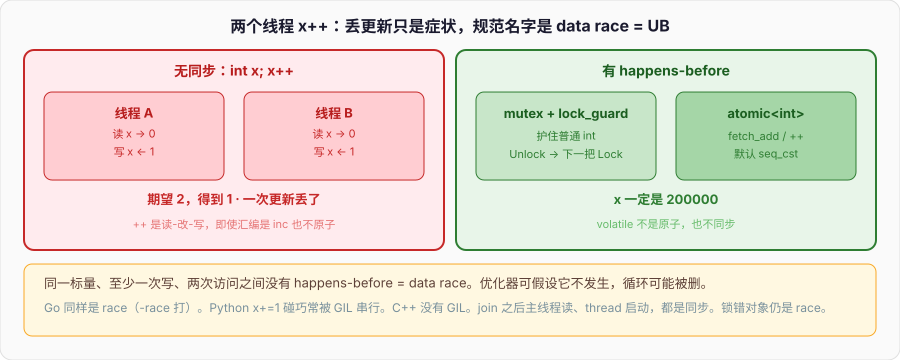

# 并发与内存序

两个线程对同一个 `int x` 做 `x++`：



```cpp
#include <thread>

int x = 0;

void bump() {
    for (int i = 0; i < 100000; ++i) ++x;
}

int main() {
    std::thread a(bump), b(bump);
    a.join();
    b.join();
    // x 不是 200000；更糟：这是 data race，整个程序未定义
}
```

`++x` 不是一条指令语义上的一回事：读、加、写。两个线程交错，两次读到同一个值，两次写回同一个 `值+1`，一次更新丢了。有的 CPU 上 `inc [x]` 看起来像一条，C++ 仍然不认它是原子的——编译器可以拆，硬件可以撕，另一个核的缓存可以看不到。丢更新只是「你运气好时看见的症状」。规范的名字是 **data race：未定义行为**。不是「结果可能偏小」，是优化器可以假设它不发生，从而把你的循环整段删掉、把相邻无关的读写重排进灾难里。

Go 的 `x++` 在两个 goroutine 里同样是 race，`go test -race` 会打；语言没有把 race 定义成 UB 那么狠，但正确性照样没了。Python 的 `x += 1` 在两个 `threading.Thread` 里，GIL 让字节码之间串行，这个特定操作碰巧常能「看起来对」，换 `x += y` 或 C 扩展一释放 GIL 照样丢。C++ 没有 GIL，没有绿色线程通道当默认同步。本篇从 `x++` 往下：线程寿命、mutex 怎么焊进 RAII、条件变量为什么必须带谓词、`atomic` 保的是哪一层、`memory_order` 至少四档各同步什么。

---

## 一、丢更新、撕读写、data race 是 UB

### 1、什么算 data race

同一块内存，两个线程冲突地访问（至少一次是写），并且这两次访问之间**没有 happens-before**，就是 data race。冲突：同一标量对象，不是「同一个 cache line」——false sharing 是性能，不是 UB。两个线程各写自己的 `int`，即使它们挤在同一行缓存，仍是定义良好（只是慢）。两个线程写同一个 `int`，没有锁、没有 atomic、没有其它同步，就是 UB。

```cpp
int x = 0;
int y = 0;

void f() { x = 1; }                     // 若另一线程无同步地读 x：UB
void g() { y = 1; }                     // 另一线程写自己的 y：没问题
```

`x = 1` 和另一线程的 `int t = x` 无同步：UB。不要说「只是读，顶多读到旧值」——无同步的读对正在写的普通对象，规范直接放行优化器。可能读到半写入（撕）、可能读到从未出现过的值、可能编译器把后面的代码按「这段不会和写并发」来动。

位域、`vector` 的相邻 `bool`（`vector<bool>` 更不是 bool）、同一字节里的两个位，可能被实现成整字节读写，两个线程各写相邻位也可能 race。按对象来想：一个标量对象一把锁或一个 atomic。

### 2、++ 为什么不是原子

```cpp
++x;                                    // 等价于 x = x + 1，两次访问
x += 1;                                 // 同
x = x + 1;                              // 同
```

即使编译成 `inc`，C++ 的抽象机仍是读-改-写。要原子增量：`std::atomic<int> x; x.fetch_add(1);` 或 `++x` 若 `x` 是 `atomic<int>`（默认 seq_cst）。`volatile int x; ++x;` **不是**原子，也不同步——`volatile` 阻止的是「对这个对象的访问被优化掉」，不阻止重排过其它非 volatile、不阻止撕、不提供跨线程 happens-before。嵌入式 MMIO 用 `volatile`；线程间共享状态不要。

64 位机器上 `int64_t` 普通读写在对齐时常常一条指令，规范仍然允许撕，仍然没有 happens-before。不要拿「我看了反汇编是一条 mov」当同步。

### 3、症状和 UB 的距离

丢掉几次更新，是 data race 最温和的脸。ASAN / TSan（`-fsanitize=thread`）能抓很多。TSan 抓不到的不等于没有：时间窗口窄、优化后代码变形。正确性靠同步，不靠复现。

有同步就不是 data race：同一把 mutex 护住的读写、atomic 上的操作、线程 `join` 之后主线程读（join 同步）、从 `thread` 构造到子线程启动（启动同步）。「我加了锁」仍可能锁错对象、锁的范围没罩住所有访问。每个共享的普通对象，都要能指出它的保护者。

---

## 二、thread：寿命合同比 spawn 重要

### 1、构造即启动，析构不能是 joinable

```cpp
#include <thread>
#include <iostream>

void work(int n) { std::cout << n << "\n"; }

int main() {
    std::thread t(work, 42);            // 可能已经在跑，甚至在构造返回前
    t.join();                           // 等结束；之后 t 不再 joinable
}
```

`std::thread t(f, args...)` 把 `f` 和参数**按值**衰减拷进内部存储，然后启动。要传引用：`std::ref(x)` / `std::cref(x)`。漏掉 `ref`，子线程改的是拷贝，主线程看不见；更糟，若参数是指向主线程栈上临时量的引用，临时量在完整表达式末尾死，子线程悬空。

```cpp
void add(int& n) { n += 1; }

int n = 0;
std::thread t(add, n);                  // 错：传的是拷贝，add 的引用绑在内部拷贝上
std::thread u(add, std::ref(n));        // 对
t.join();
u.join();
```

`joinable()`：有对应的系统线程、还没 `join` / `detach`。`~thread()` 若仍 joinable，调用 `std::terminate`。不是帮你 join，是崩。作用域退出、异常栈展开，都能撞上这条。RAII：自己写 `Joiner` 析构 `join`，或 C++20 `std::jthread`（本篇 C++17，手写即可）。

```cpp
struct JoinGuard {
    std::thread t;
    explicit JoinGuard(std::thread&& t) : t(std::move(t)) {}
    ~JoinGuard() { if (t.joinable()) t.join(); }
    JoinGuard(const JoinGuard&) = delete;
    JoinGuard& operator=(const JoinGuard&) = delete;
};
```

`detach()` 把系统线程和 `std::thread` 对象解开。对象可析构，线程继续跑。之后不能碰主线程栈上、即将销毁的对象。`detach` 的函数必须自带所有寿命：堆上数据、`shared_ptr`、全局。默认 `join`，几乎不要 `detach`。

### 2、join 是同步点

`t.join()` 返回后，子线程里 happens-before 主线程 `join` 之后的代码。子线程写过的普通对象，join 之后主线程读，**不是** data race。启动也是同步：`thread` 构造完成 happens-before 子线程里函数的开始，所以构造前主线程写过的、作为参数或全局的对象，子线程能看见。

```cpp
int x = 0;
void f() { x = 1; }

int main() {
    std::thread t(f);
    t.join();
    std::cout << x << "\n";             // 1，定义良好
}
```

不要 `join` 两次：第二次不再 joinable，抛 `std::system_error`。`join` 自己的线程：死锁。`get_id()`、`this_thread::get_id()`、`this_thread::sleep_for` / `yield` 按字面用。忙等 `yield` 不是同步。

### 3、多少线程、硬件并发

`std::thread::hardware_concurrency()` 返回提示值，可能 0。CPU 密集不要无脑 `hardware_concurrency() * 10` 条线程：切换、缓存、栈（默认栈常是 MB 级）都是税。IO 密集可以超配，但仍要有上界。线程池比每次请求 `thread` 一次稳——C++17 没有标准线程池，自己写或用库。`async` 不一定起新线程（`launch::async` 才要求），C++17 里 `async` 的 future 析构会 join，容易把并行打成串行。要真并行，自己 `thread` + 队列，或明确 `launch::async` 并保住 future 的寿命。

Python 的 `Thread` 受 GIL 限制，CPU 密集用 `multiprocessing`。Go 的 goroutine 便宜，channel 当默认同步。C++ 的 `thread` 接近 1:1 系统线程，创建贵，同步默认是共享内存 + 锁 / atomic，不是通道。

---

## 三、mutex：护的是数据，焊在析构上

### 1、lock_guard 是 RAII，lock/unlock 是事故

```cpp
#include <mutex>

std::mutex mu;
int x = 0;

void bump() {
    std::lock_guard<std::mutex> lock(mu);
    ++x;                                // 锁的范围内
}                                       // 析构 unlock；throw 也会 unlock
```

内存篇的 RAII：`lock()` 成功后必须有对象在析构里 `unlock`。手写 `mu.lock(); ... mu.unlock();`，中间 `return` / `throw` 就是漏解锁，别的线程永远等。`lock_guard` 不可移动，作用域即锁范围。要中途解锁、要 `condition_variable`：`unique_lock`。C++17 `scoped_lock` 一把锁或多把锁（防死锁算法）。

```cpp
std::mutex a, b;

void f() {
    std::scoped_lock lock(a, b);        // C++17，同时锁两把，避免 AB-BA
    // ...
}
```

两把锁顺序不一致：死锁。`scoped_lock` / `std::lock(a, b)` 用尝试 + 退避，打破循环等待。仍要求同一套数据用同一套锁顺序当工程约定——`scoped_lock` 不是许可你到处乱锁。

`try_lock` 失败不阻塞，成功必须 unlock。忙转 `try_lock` 是在烧 CPU，还可能活锁。

### 2、锁护的是哪块数据，写进注释

mutex 不绑对象。你必须自己保证：所有对 `x` 的访问都在同一把 `mu` 下。漏掉一处只读，那一处和写并发，仍是 data race。const 成员函数里加 `mutable std::mutex` 是常见手法：逻辑 const，物理要锁。

```cpp
struct Counter {
    void inc() {
        std::lock_guard<std::mutex> lock(mu_);
        ++n_;
    }
    int get() const {
        std::lock_guard<std::mutex> lock(mu_);
        return n_;
    }
private:
    mutable std::mutex mu_;
    int n_ = 0;
};
```

`get` 要锁：否则和 `inc` race。不要「读很短就不锁」。短读仍是读，写仍是写。

一把大锁简单、串行化重。细锁并行好、死锁和漏护难。默认从粗锁开始，热点再拆。拆的时候每个字段写清「属于哪把锁」。不属于任何锁的共享可变状态，就是还没修的 bug。

`recursive_mutex`：同一线程可加锁多次。用来补「已经持锁又调了自己也会加锁的函数」。多数时候是设计味道：把不加锁的内部函数拆出来，外层一把锁。递归锁藏重入，出问题更难看。

C++17 `shared_mutex`：多读单写。读侧 `shared_lock`，写侧 `unique_lock`。读多写少、临界区不只是读一个 int 时才有意义。读一个 `int`，atomic 更便宜。`shared_mutex` 本身比 `mutex` 重。

### 3、锁的粒度、顺序、和「锁里不调未知代码」

持锁时调用虚函数、回调、条件变量 `wait` 以外的用户代码：对方可能再抢另一把锁，或再抢你这把（非递归则死锁），或跑很久把别人堵住。持锁做的事：碰被护的数据，越短越好。算得久、IO、分配，能拿出来就拿出来。

```cpp
std::string snapshot() {
    std::string copy;
    {
        std::lock_guard<std::mutex> lock(mu_);
        copy = shared_;                 // 临界区只拷
    }
    return copy;                        // 锁外用副本
}
```

死锁四条件里，工程上常破的是「循环等待」：全局锁顺序。文档写 `mu_a` 先于 `mu_b`。TSan 不保证抓到死锁（有 deadlock detector 但不是所有路径）。复现靠超时日志、`try_lock_for`（`timed_mutex`）辅助，不是靠「再跑一遍」。

`mutex` 的 `lock` / `unlock` 带 acquire / release 语义：unlock synchronizes-with 下一个 lock 同一把锁。所以锁内的普通写，下一个持锁的线程都能看见。这是 mutex 能消灭 data race 的原因——不只是互斥，还有内存序。下面第六节把这四个字拆开。

---

## 四、condition_variable：等的是谓词，不是 notify

### 1、lost wakeup 和虚假唤醒

```cpp
#include <condition_variable>
#include <mutex>
#include <queue>

std::mutex mu;
std::condition_variable cv;
std::queue<int> q;
bool done = false;

void producer() {
    {
        std::lock_guard<std::mutex> lock(mu);
        q.push(1);
    }
    cv.notify_one();
}

void consumer() {
    std::unique_lock<std::mutex> lock(mu);
    cv.wait(lock, [] { return !q.empty() || done; });
    if (!q.empty()) {
        int x = q.front();
        q.pop();
        (void)x;
    }
}
```

`wait` 必须用 `unique_lock`：它会原子地 unlock + 阻塞，被唤醒后再 lock。`lock_guard` 不能把锁交出去。`wait(lock, pred)` 等价于 `while (!pred()) wait(lock);`。谓词在**持锁**下求值。

为什么必须循环 / 谓词：

- **虚假唤醒**：没有 `notify` 也可能从 `wait` 返回。POSIX 允许。
- **lost wakeup**：`notify` 发生在 `wait` 之前，且你先看了「空」再决定 wait、中间没持锁，notify 打在无人等的 cv 上，随后 wait 永远睡。把「改条件」和「看条件」放在同一把锁里，`notify` 在改完之后（锁内或锁外都可以，锁外减少持锁时间），wait 用谓词，lost wakeup 消掉。

```cpp
// 错误：无锁读条件，再 wait
if (q.empty()) {                        // 读 q 可能已经是 race
    cv.wait(lock);                      // notify 可能已经发生过
}
```

条件本身（`q.empty()`、`done`）是共享数据，必须在 mutex 下读。`notify_one` 唤醒一个；`notify_all` 唤醒所有。一个 consumer 用 one；多个 worker 都可能满足、或 `done` 要大家都起来，用 all。notify 错成 one、而谓词只有一部分线程能接：其余继续睡，像丢唤醒。

### 2、notify 时要不要持锁

改条件必须持锁。`notify` 可以在解锁后：缩短临界区，避免被唤醒的线程立刻堵在 lock 上。也可以在锁内 notify：逻辑简单，有时多一次切换。两种都正确，前提是改条件在锁内。不要「先 notify 再改条件」——谓词仍假，线程醒了再睡，浪费；若中间还有人根据中间状态做决定，逻辑错。

`wait_for` / `wait_until` 带超时，返回 `cv_status` 或谓词版返回 bool（是否 pred 为真）。超时不等于条件成立，仍要查谓词。

### 3、和 Go channel、队列的关系

这段代码就是一个有界/无界队列的骨架。Go 的 `ch <- x` / `<-ch` 把「队列 + 锁 + 条件」焊成一个类型，关闭 channel 有「广播结束」的语义。C++ 没有标准 channel，`queue` + `mutex` + `cv` + `done` 标志是手工版。结束时设 `done`，`notify_all`，consumer 谓词里看 `done`。只 notify 不设标志，consumer 无法区分「暂时空」和「再也不会来」。

Python 的 `queue.Queue` 内部也是锁 + 条件。GIL 不代替这把锁——`Queue` 自己有锁。C++ 把零件摊开，漏一个就是 UB 或永久阻塞。

`condition_variable` 只能配 `unique_lock<mutex>`。`condition_variable_any` 可配其它锁（包括 `shared_lock`），更重。默认前者。

析构 `condition_variable` 时不能还有线程在 `wait`。和 `mutex` 一样：同步原语的寿命盖住所有使用者。成员顺序：mutex / cv 比被护的数据活得更久，析构成员反序——把 cv、mutex 写在数据成员**上面**（后析构），或保证先 join 所有线程再让对象析构。

---

## 五、atomic：原子性不是顺序，更不是「对象安全」

### 1、atomic\<T\> 提供什么

`std::atomic<T>`：这个对象上的读写是原子的，不会撕。`T` 必须 trivially copyable。`is_lock_free()` 告诉你是否真用总线锁 / 指令，还是内部 mutex 模拟。指针、整数、常见 64 位内的类型在主流平台 lock free。更大的 `T` 可能带锁——那时「atomic」只保证这一对象上的操作互斥，别再假设无锁。

```cpp
std::atomic<int> n{0};
n.store(1);                             // 写
int v = n.load();                       // 读
int old = n.fetch_add(1);               // 返回旧值，n 变成旧+1
bool ok = n.compare_exchange_strong(v, 2);  // v==n 则 n=2 返回 true，否则 v=n 返回 false
```

`++n` / `n += 1` / `n = 1` 对 atomic 都合法，默认 `memory_order_seq_cst`。`compare_exchange_strong` vs `weak`：weak 允许假失败（没变也不成功），在循环里的 CAS 用 weak 往往更便宜；一次判断用 strong，少掉一层循环。CAS 的第一个参数是**引用**：失败时被写成当前值，所以循环 CAS 不要每次把期望值设回常量却忘了更新。

```cpp
int expected = n.load();
while (!n.compare_exchange_weak(expected, expected + 1)) {
    // expected 已被更新成当前值，继续
}
```

`atomic_flag` 是唯一保证 lock free 的，`test_and_set` / `clear`。用来写 spinlock——用户态自旋在持锁时间短、核数少时才有意义，否则让出 CPU 或用 mutex。自己写 spinlock 很容易缺 memory_order，默认不要写。

### 2、atomic 不保护旁边的对象

智能指针篇开头那条：`atomic` 管这一个对象。`atomic<int> n` 旁边的 `int m` 不受任何保护。`atomic<T*>` 的 load 得到指针是原子的，随后 `*p` 是普通访问——指针指向的对象要自己同步。`atomic<shared_ptr<T>>` 是 C++20；C++17 用 `atomic_load` 族，且不能和普通读写混。

把结构体塞进 `atomic<S>`：整个 `S` 的读写原子（可能带锁），不能单独原子地改一个字段。要字段级，字段做成 atomic，或一把 mutex 护整个结构。

### 3、只读共享、发布、once

构造完、之后永不改的对象，可以无锁读——前提是「发布」有同步：比如构造完，`mutex` 下把指针写入共享，或 `atomic` release store 指针，读者 acquire load。只写 `T* p = new T; g = p;` 而 `g` 是普通指针、读者无同步地读 `g` 再 `*g`：对 `g` 的 race，UB；即使碰巧看见新指针，`*g` 的字段也可能看不见（重排、缓存）。发布是内存序问题，下一节。

`std::once_flag` + `std::call_once(flag, f)`：多线程里 `f` 只跑成功一次，其它线程等到那一次完成。用来懒初始化。函数内 `static` 局部 C++11 起也有类似同步（魔法静态）。`call_once` 在 `f` 抛异常时不算成功，下一次还会再调。

`thread_local`：每线程一份，不是共享，一般不需要锁。把 `thread_local` 对象的地址交给别的线程，那个线程退出后地址悬——内存篇写过。

---

## 六、memory_order：至少四档

### 1、seq_cst：默认，总序

`memory_order_seq_cst`：所有 seq_cst 的 atomic 操作好像在一个总顺序里，每次操作看到这个顺序里在它之前的结果。直觉接近「全局时钟」。写程序先全部默认 seq_cst（`atomic` 的 `++`、`load()`、`store(v)` 不写序就是它）。正确性想清楚再往下调。

```cpp
std::atomic<int> x{0}, y{0};

void t1() {
    x.store(1);
    int r1 = y.load();
}

void t2() {
    y.store(1);
    int r2 = x.load();
}
```

默认 seq_cst 时，`r1 == r2 == 0` 不会发生：总序里两个 store 有先后，后执行的那个 load 必看见先做的 store。若改成 relaxed，这个组合允许出现。这是「为什么默认 seq_cst」的课堂例子。真代码里 mutex 已经给了足够序，atomic 计数器用 relaxed 往往就够。

seq_cst 的税：在弱序机器（ARM、POWER）上，store 常要更重的屏障。x86 的普通 store 已经相当强（TSO），seq_cst store 仍可能多一个 `mfence` 或用 `xchg`。热路径计数器，测过再决定要不要 relaxed。

### 2、relaxed：只保证这一位置的原子性和修改序

`memory_order_relaxed`：这个 atomic 对象自己的读写不撕，有 modification order（同一 atomic 上的操作有个总序）。**不** synchronizes-with 任何东西，不约束其它内存位置。用来：统计计数、不依赖「看见这个数就看见别的字段」的场景。

```cpp
std::atomic<int> hits{0};

void on_hit() {
    hits.fetch_add(1, std::memory_order_relaxed);
}
```

读 `hits` 得到 100，不意味着另外 100 次 `on_hit` 里对别的普通内存的写你都看得见——那些写如果存在，需要别的同步。`relaxed` 的 `fetch_add` 仍然是原子增量，不会丢更新。开头的 `x++` 换成这个，计数对，仍然**没有**给其它数据建立 happens-before。

不要用一串 relaxed store 当发布协议。看见 `ready == true`（relaxed）就去读旁边的 `data`，`data` 可以还是旧的，也可以是撕的，也可以编译器把读提前到你 store ready 之前。这是 data race 或至少是过期读。发布要用 release / acquire，或 mutex。

### 3、release / acquire：发布-订阅

`store(value, memory_order_release)` 和随后读到这个值的 `load(memory_order_acquire)`：**synchronizes-with**。release 之前（同一线程里 sequenced-before 这个 store）的所有写，对 acquire 之后的读都可见。这是无锁发布的骨架。

```cpp
int data = 0;
std::atomic<bool> ready{false};

void producer() {
    data = 42;                          // 普通写
    ready.store(true, std::memory_order_release);
}

void consumer() {
    while (!ready.load(std::memory_order_acquire)) {
        std::this_thread::yield();
    }
    assert(data == 42);                 // 定义良好：acquire 看到 release 的 true
}
```

`data` 不是 atomic。安全的原因是：对 `data` 的写 happens-before release store，release synchronizes-with acquire，acquire happens-before 对 `data` 的读。传递之后，写 `data` happens-before 读 `data`，没有 race。

两边都 relaxed：断言可以失败。一边 release 一边 relaxed：不保证 synchronizes-with。配对必须是 **release store 与读到该值的 acquire load**。`memory_order_acq_rel` 用在 RMW 上：这一次操作的读半截 acquire、写半截 release。`compare_exchange` 成功路径常配 acq_rel，失败路径只需 acquire 或 relaxed（失败没写）。

`mutex::unlock` 像 release，`lock` 像 acquire。所以锁内普通读写有 happens-before。你不用在 mutex 护着的数据上再写 atomic 序——重复、且容易写错。

`memory_order_consume`：理论依赖序，实际编译器当 acquire 或更乱，C++17 仍在，新代码不要用。需要依赖序的场景用 acquire。

### 4、常见搭配和禁止事项

| 场景 | 序 |
| --- | --- |
| 默认、还没测 | seq_cst |
| 纯计数、不要发布 | relaxed |
| 写完数据再竖旗 | store release + load acquire |
| CAS 循环成功 | acq_rel（或 seq_cst） |
| mutex 已护住 | 普通对象，不要画蛇添足 |

禁止：

- 普通 `int` 当旗，不用 atomic、不用 mutex。
- `volatile` 当原子。
- 只一边加锁。
- acquire load 配 relaxed store 当发布。
- 两个 atomic 之间用 relaxed 拼「先写 A 再写 B，读者先看 B 再看 A 一定能看见 A」——不一定。
- 从 `atomic<T*>` load 出指针后，无同步地写 `*p` 还假设别人的 release 能罩住这次写——罩住的是发布那一次，之后的写要新的同步。

x86 上很多错误的 relaxed 代码「测起来对」，因为硬件比语言强。ARM 上翻车。按语言序写，不要按开发机的 CPU 写。

`std::atomic_thread_fence(order)` 是单独的屏障，不附在某个 atomic 上，更难用对。能写在 load/store 上的 order 就写在上面。fence 留给和 `atomic_signal_fence`、非 atomic 交织的专家场景。本篇不展开。

---

## 七、对照 Go channel、Python GIL

### 1、Go：通道带 happens-before，共享内存仍要你认

Go 的 happens-before：`ch <- x` 先于对应的 `<-ch`；关闭先于收到零值。goroutine 启动，`go f()` 的准备 happens-before `f` 开始。于是「通过 channel 把指针送过去，接收方用所指对象」是定义好的——通道承担了 C++ 里 mutex 或 release/acquire 的角色。两个 goroutine 无同步写同一块，仍是 race，`-race` 抓。Go 的口号「不要通过共享内存通信」是在说默认同步原语是 channel，不是说没有 data race 这回事。

C++ 没有标准 channel。`queue` + `mutex` + `cv` 等价于无缓冲/有缓冲通道的数据面，结束标志等价于 close。要 CSP 风格，用库或自己封一个 `Chan<T>`，内部仍是本节这些零件。不要用两个 atomic 旗手搓一个错误的通道。

goroutine 栈很小、增长；C++ `thread` 栈预先很大。一万 goroutine 正常；一万 `std::thread` 先问 RSS 和调度。模型不同，搬数字会炸。

### 2、Python：GIL 串的是字节码，不是你的不变式

CPython 的 GIL：同一时刻一个线程跑 Python 字节码。`x += 1` 对普通 `int`（不可变，实际是绑新对象）在纯 Python 里常看起来原子；对 `list` 的 `append` 也因 GIL 碰巧安全。`x += 1` 若 `x` 是实现成读改写的可变对象，或你在 C 扩展里释放了 GIL，就不是。两个线程改同一个 `dict` / 自写对象，仍要 `threading.Lock`。GIL 保证的是解释器内部结构，不是业务不变式。

`threading.Thread` 类似 `std::thread`，GIL 让 CPU 密集并行几乎没用。C++ 没有这层「免费」串行化，`x++` 直接 UB。从 Python 过来最危险的直觉是「这么短的操作不会坏」。短不是同步。

`multiprocessing` 是进程，共享要显式。C++ 多线程是共享地址空间，默认什么都共享，所以默认什么都要问保护者。

### 3、三门语言的默认同步

| | 默认并发单元 | 默认同步 | race 的地位 | 内存序暴露吗 |
| --- | --- | --- | --- | --- |
| C++ | `std::thread` ≈ OS 线程 | 共享内存 + mutex / atomic | UB | 是，`memory_order` |
| Go | goroutine | channel，其次 mutex | race，工具抓 | 几乎不，模型藏在通道和 happens-before 规则里 |
| Python | `Thread`，GIL | Lock / Queue，GIL 碰巧罩住部分 | 解释器不崩不等于对 | 不 |

C++ 把内存模型摊在你桌上：seq_cst / acquire / release / relaxed。这是能力也是枪口。写对的路径是：共享可变状态先 mutex；计数、旗、无锁发布再 atomic；序先 seq_cst，测热再放松。不要一上来写 lock-free 队列。

---

## 八、false sharing、可见性、和「无锁」的账单

### 1、false sharing 不是 UB，是变慢

两个 `atomic<int>` 或两把锁紧挨着，两个核各写一个，cache line（通常 64 字节）在两核间来回作废。逻辑正确，吞吐塌掉。填充：

```cpp
struct alignas(64) Slot {
    std::atomic<int> n{0};
};
Slot slots[2];                          // 各占一行
```

或中间 `char pad[64 - sizeof(atomic<int>)];`。先 TSan 再 profiler，别先对齐。共享 mutex 本身也会把锁变量的那一行打来打去——细锁过多有时比一把粗锁更慢。

### 2、无锁不是更快

无锁（lock-free）：系统范围内，总有线程能在有界步内完成操作，即使别的线程被杀死。wait-free 更强。`mutex` 不是 lock-free：持锁线程被调度走，别人等。`atomic fetch_add` 通常 lock-free。

无锁结构要自己处理 ABA、内存回收（hazard pointer / epoch / 停线程）、内存序。错了是 UB，不是「重试一下」。库（`folly`、`boost::lockfree`）比手写靠谱。业务代码：mutex + 短临界区，先测。热点在锁上再谈。`atomic` 计数、发布旗，属于「无锁的一小块」，不是无锁队列。

### 3、signal、IO、和线程

信号处理函数里几乎不能做任何事：不能锁 mutex（可能重入死锁），不能 `new`，只能对 `volatile sig_atomic_t` 或 C++11 起无锁 atomic 做极少数操作。线程间同步不要借用信号。IO 多路复用（epoll）和线程池是另一篇；和内存序的接缝是：跨线程投递事件，用 mutex + 队列或 atomic 发布，不要靠「写完 fd 对方就能看见我的普通内存」——除非你把那次写放进有 happens-before 的协议里（常常是先写数据，再 write(fd)，读端 read 返回后再读数据：内核同步把这一对 IO 做成了同步点，这是实现给你的，语言没写。能走队列更清楚）。

---

## 九、对照、易错点和一份能跑的实验

易错点：

- 两个线程 `++` 普通 `int`。
- 以为「读很短」不用锁。
- `volatile` 当原子。
- `thread` 还 joinable 就析构。
- 传引用给 `thread` 却不 `std::ref`，或 ref 绑到临时量。
- `detach` 后碰即将销毁的栈对象。
- `lock` / `unlock` 手写，中间抛。
- 两把锁顺序反，死锁。
- `cv.wait` 不带谓词。
- 无锁读条件再 wait，lost wakeup。
- notify 了不设 `done`，结束不了。
- `atomic<T*>` 管指针不管 `*p`。
- relaxed 旗 + 普通数据当发布。
- acquire 和 release 没配对。
- 靠 x86 上测过就在 ARM 上交差。
- `async` future 析构把并行 join 成串行。
- 持锁调回调，锁顺序爆掉。
- `shared_ptr` 当对象的线程安全（智能指针篇）。

`g++ -std=c++17 -O0 -Wall -Wextra -pthread -o conc conc.cpp && ./conc`：

```cpp
// conc.cpp — mutex、cv、atomic relaxed 计数、acquire/release 发布。C++17。
#include <atomic>
#include <cassert>
#include <condition_variable>
#include <iostream>
#include <mutex>
#include <queue>
#include <thread>
#include <vector>

std::mutex mu;
std::condition_variable cv;
std::queue<int> q;
bool done = false;

void producer() {
    for (int i = 1; i <= 5; ++i) {
        {
            std::lock_guard<std::mutex> lock(mu);
            q.push(i);
        }
        cv.notify_one();
    }
    {
        std::lock_guard<std::mutex> lock(mu);
        done = true;
    }
    cv.notify_all();
}

void consumer(int& sum) {
    for (;;) {
        std::unique_lock<std::mutex> lock(mu);
        cv.wait(lock, [] { return !q.empty() || done; });
        while (!q.empty()) {
            sum += q.front();
            q.pop();
        }
        if (done) break;
    }
}

int data = 0;
std::atomic<bool> ready{false};

void publish() {
    data = 42;
    ready.store(true, std::memory_order_release);
}

void subscribe(int& out) {
    while (!ready.load(std::memory_order_acquire)) {
        std::this_thread::yield();
    }
    out = data;
}

int main() {
    int sum = 0;
    std::thread p(producer);
    std::thread c(consumer, std::ref(sum));
    p.join();
    c.join();
    std::cout << "sum=" << sum << "\n";         // 15

    std::atomic<int> hits{0};
    auto bump = [&] {
        for (int i = 0; i < 10000; ++i)
            hits.fetch_add(1, std::memory_order_relaxed);
    };
    std::thread a(bump), b(bump);
    a.join();
    b.join();
    std::cout << "hits=" << hits.load() << "\n"; // 20000

    int seen = 0;
    std::thread pub(publish);
    std::thread sub(subscribe, std::ref(seen));
    pub.join();
    sub.join();
    std::cout << "seen=" << seen << "\n";       // 42

    // 对比：join 之后读普通 int，定义良好
    int x = 0;
    std::thread t([&] { x = 7; });
    t.join();
    std::cout << "joined=" << x << "\n";
}
```

跑完对照：队列把 1..5 加出 15，`done` + `notify_all` 让 consumer 退；relaxed 计数 20000，不丢更新；release/acquire 让 `seen == 42`；`join` 后读 `x == 7`。把 `hits` 改成普通 `int` 加 TSan，应报 race。把 `ready` 的序改成两边 relaxed，在 x86 上这个小程序仍可能总看见 42——不要被说服；发布协议在语言里靠的是 acquire/release 配对。

再加一遍 TSan：`g++ -std=c++17 -fsanitize=thread -O1 -g -pthread -o conc conc.cpp && ./conc`。正确路径该干净。开头那个 `++x` 普通 int，TSan 会点名。

检查清单：每个共享普通对象有且仅有一个保护者（一把 mutex 或「构造后只读且经过发布」）；`thread` 出作用域前 `join`；锁用 `lock_guard` / `scoped_lock`；`cv.wait` 带谓词，条件在锁下改；计数用 `atomic`，发布用 release/acquire 或 mutex；默认 seq_cst，热且懂再 relaxed；data race 当 UB 修，不当「偶发错数」修。Go 把同步藏进 channel，Python 把一部分藏进 GIL；C++ 把抽象机的内存序交给你。`x++` 两个线程，不是算术题，是有没有 happens-before 的题。
