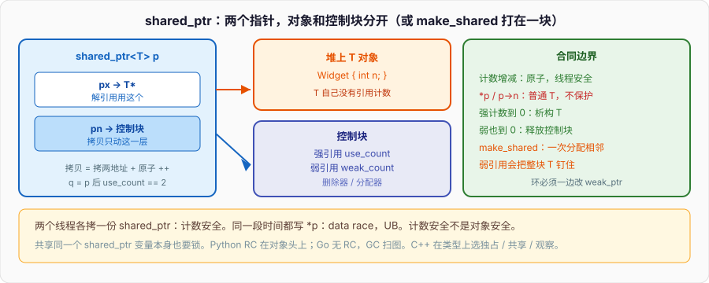

# 智能指针

两个线程各拷一份 `shared_ptr<T>`，引用计数的增减是原子的，最后一个走的时候 `delete` 只发生一次。同一段时间两个线程都写 `*p`，这是 data race，未定义行为。计数安全不是对象安全。内存篇把智能指针点到「RAII 应用」就停了；本篇从这条缝往下挖：独占怎么焊进类型、控制块为什么是另一块堆、`make_shared` 省一次分配却把对象寿命绑死、环怎么破、为什么不能从裸 `this` 再造一个 `shared_ptr`。

Python 的对象自带头上的引用计数，`sys.getrefcount` 看到的就是那份。C++ 的 `T` 自己没有计数，`shared_ptr` 把计数放在旁边的控制块里。Go 没有 RC，GC 扫图。三种语言里只有 C++ 让你在类型上选择「独占 / 共享 / 观察」。



```cpp
#include <memory>
#include <thread>

struct Widget { int n = 0; };

void bump(std::shared_ptr<Widget> p) {   // 拷贝：只动计数，原子
    ++p->n;                              // 写对象：不是原子
}

int main() {
    auto w = std::make_shared<Widget>();
    std::thread a(bump, w);
    std::thread b(bump, w);
    a.join();
    b.join();
    // w->n 可能是 1 或 2；更糟：这是 data race，整个程序的行为未定义
}
```

`bump` 的形参按值收 `shared_ptr`，拷贝构造只碰控制块上的强引用计数，这一下是线程安全的。`++p->n` 是对 `Widget::n` 的普通读写，`shared_ptr` 不保护它。要保护对象，自己加 mutex，或把 `n` 改成 `std::atomic<int>`。不要把「我用了 shared_ptr」读成「对象线程安全」。

---

## 一、拷贝安全 ≠ 解引用安全

### 1、两份指针，两套合同

`shared_ptr<T>` 内部是两个指针：一个指向 `T`，一个指向控制块。拷贝 `shared_ptr` 是拷这两份地址，并原子地 `++` 强引用计数。析构是原子地 `--`，减到 0 再调删除器、再看弱引用是否也到 0 才释放控制块。合同到此为止：**管理所有权的那一层**线程安全。

`operator*` / `operator->` / `get()` 返回的是普通 `T*` / `T&`。之后对 `T` 的读写，跟你手里拿着裸指针没有任何区别。两个线程同时改 `T` 的非原子成员，是 data race。一个线程 `reset()` 把最后一个 `shared_ptr` 扔掉、另一个线程还在 `*p`，是 UAF——计数保护的是「别 double free」，不是「别在释放后还碰」。

```cpp
std::shared_ptr<int> g;

void writer() {
    g = std::make_shared<int>(1);        // 写 g 这个 shared_ptr 对象本身
}

void reader() {
    if (g) std::cout << *g << "\n";      // 读 g
}
```

`g` 是一个非原子的 `shared_ptr` 变量。两个线程一个赋值、一个拷贝 / 解引用，**连控制块那一层都谈不上安全**——你在无同步地读写 `g` 自己的那两个指针。线程安全的是「已经各自持有一份之后，各自拷贝 / 析构自己手里的那份」。共享同一个 `shared_ptr` 变量，要用 mutex 包住，或 C++20 的 `std::atomic<std::shared_ptr<T>>`（C++17 用 `std::atomic_load` / `atomic_store` 那组自由函数，且要求你按文档来，别混普通读写）。

### 2、use_count 不能当锁

`p.use_count() == 1` 然后做点「只有我能做」的事：在多线程下，读完计数、下手之前，另一个线程可能已经拷走一份。`use_count` 是瞬时快照，不是互斥。单线程里用它判断「没有别的共享者、可以原地改」还说得通；跨线程不要。

`unique()` 在 C++17 还在，C++20 弃用，理由一样：它只是 `use_count() == 1`，给多线程一种错觉。新代码别依赖它做同步。

### 3、Python 的 RC 同一条缝

CPython 的 `PyObject` 头上有 `ob_refcnt`。`Py_INCREF` / `Py_DECREF` 在有 GIL 时不是原子指令，GIL 把字节码之间的增减串行化了。对象内容同样不自动线程安全：两个线程改同一个 `list`，没有你自己的锁就会炸。C++ 把「计数原子、对象不管」写进了 `shared_ptr` 的规范；Python 把「计数碰巧被 GIL 罩住、对象仍要你锁」写进了运行时。Go 没有这条缝——没有共享计数可拷，逃逸到堆的对象由 GC 管，你要同步的是自己的数据，不是所有权图。

`shared_ptr` 的原子计数有代价：每次拷贝、每次析构都是原子 RMW，缓存行在核之间来回。热路径上把 `shared_ptr` 当「随手传一下」的默认形参，会比传引用贵一个数量级不止。形参能 `const T&` / `T*` 就别 `shared_ptr<T>`——后者在说「我要入股所有权」。

---

## 二、unique_ptr：独占焊在类型上

### 1、不可拷、可移，sizeof 常常就是一个指针

`std::unique_ptr<T>` 独占一块 `new` 出来的对象（或自定义删除器认领的资源）。拷贝构造 / 拷贝赋值删除掉。移动把指针转手，源置空。析构调删除器。默认删除器是 `std::default_delete<T>`，空类，EBO 吃掉，64 位上 `sizeof(unique_ptr<T>) == 8`，和裸指针一样宽。

```cpp
#include <memory>
#include <utility>

struct Node { int v; };

auto p = std::make_unique<Node>(Node{1});
// auto q = p;                          // 非法：不能拷
auto q = std::move(p);                  // q 有对象，p 空
if (!p) { /* p.get() == nullptr */ }
```

内存篇说过：所有权在签名里读。工厂返回 `unique_ptr<T>`，调用方拿到独占。形参 `unique_ptr<T>` 按值，调用方必须 `std::move` 进来——类型系统强制转手。形参 `unique_ptr<T>&` 能改指针本身（reset、换成别的），仍不是把所有权拷走。观察用 `T*` / `T&`，合同写清楚：不释放、不活过所有者。

`release()` 交出裸指针并置空，**不再**负责 `delete`。只在对接 C API、或立刻交给另一个 RAII 对象时用。`release` 完不接管，就是泄漏。`reset(q)` 先释放当前、再接管 `q`。`reset()` 释放并置空。

```cpp
void take_raw(Node* n);                 // C API，约定调用方仍拥有或对方拥有，必须写清

void hand_off(std::unique_ptr<Node> p) {
    Node* raw = p.release();            // unique_ptr 不再 delete
    take_raw(raw);                      // 若 take_raw 不 delete，泄漏
}
```

### 2、删除器是类型的一部分

默认 `unique_ptr<T>` 是 `unique_ptr<T, std::default_delete<T>>`。换删除器就换类型：

```cpp
struct FileCloser {
    void operator()(std::FILE* f) const {
        if (f) std::fclose(f);
    }
};

using UniqueFile = std::unique_ptr<std::FILE, FileCloser>;

UniqueFile fp(std::fopen("a.txt", "r"));
// UniqueFile 和 unique_ptr<FILE> 不是同一类型，不能默契互转
```

函数指针当删除器：`unique_ptr<FILE, int(*)(FILE*)> fp(fopen(...), &fclose);`，删除器要存一份指针，`sizeof` 变成两个指针宽。有状态的函数对象同理。无状态的空 class / 无捕获 lambda 走 EBO，宽度仍是一个指针。能写成空 class 就别存函数指针。

`unique_ptr<T[]>` 用 `delete[]`。`make_unique<T[]>(n)` 值初始化元素。不要 `unique_ptr<T>` 去管 `new[]`——类型已经把数组删器钉死。C++17 没有 `shared_ptr<T[]>` 的良好支持（C++17 起 `shared_ptr` 对数组有部分，优先仍是 `vector`）。数组缓冲交给 `vector<T>`，不要智能指针数组当容器。

### 3、工厂、数组、从 unique 升 shared

```cpp
std::unique_ptr<Node> make_node(int v) {
    return std::make_unique<Node>(Node{v});
}

void consume(std::unique_ptr<Node> p);

int main() {
    auto p = make_node(1);
    consume(std::move(p));              // 所有权进 consume
    std::shared_ptr<Node> sp = make_node(2);  // unique 转 shared：合法，控制块这时才建
}
```

`shared_ptr<T> sp = unique_ptr<T>{...}` 会分配控制块、接管指针。反过来不行：已经共享的所有权不能无损耗退回独占。能独占就独占；调用方真要共享，自己升。这是 API 设计的默认：工厂返回 `unique_ptr`，不要一上来 `shared_ptr`。

`make_unique` 把 `new` 和接管焊成一次，C++14 起在标准库。C++17 项目直接用它，不要 `unique_ptr<T>(new T(...))`——后者在 `foo(unique_ptr<T>(new T), unique_ptr<U>(new U))` 这种调用里，某个 `new` 成功、另一个抛，可能泄漏（求值顺序在 C++17 对函数实参仍有坑）。`make_*` 没有这个窗口。

裸 `T*` 观察者可以和 `unique_ptr` 并存，寿命合同是观察者不得活过 `unique_ptr`。容器、成员、回调里存裸指针，等于把合同从类型里拿掉，只剩注释。能用引用捕获、能把所有权移进 lambda，就不要把 `get()` 的结果存起来。

---

## 三、控制块：对象旁边那份账本

### 1、两份堆，或一份

`std::shared_ptr<T> p(new T)` 通常两次分配：一次 `T`，一次控制块。控制块里至少有：强引用计数、弱引用计数、删除器、分配器。`p` 这个对象本身在栈上，两个指针：`T*` 和 `control_block*`。

```cpp
struct ControlBlockApprox {
    std::atomic<long> strong;           // 有几个 shared_ptr
    std::atomic<long> weak;             // 有几个 weak_ptr，外加「强引用还在」那一份
    // deleter 的类型擦除存储
    // allocator
};
```

强计数到 0：调删除器，销毁 `T`（或自定义资源）。弱计数到 0：释放控制块自己。所以 `weak_ptr` 能在对象死后仍活着——它指着控制块，`lock()` 看强计数是不是 0。对象死了、控制块可能还在，直到最后一个 `weak_ptr` 析构。

拷贝 `shared_ptr`：拷两个指针，`strong++`。移动 `shared_ptr`：两个指针转手，源置空，**不碰计数**。移动比拷贝便宜，热路径上能移就移。赋值：先处理右边（拷或移出一份），再析构左边旧的——自我赋值有专门路径，标准库会做对，自己写控制块时别忘。

### 2、类型擦除：删除器和指向的动态类型可以脱节

`shared_ptr<Base> p(new Derived)` 合法：控制块记下的删除器是 `delete` 那个 `Derived*`（构造时把完整类型钉进删除器），即使 `Base` 析构不是虚的，通过 `shared_ptr<Base>` 释放仍会调 `~Derived`。这是 `shared_ptr` 相对 `unique_ptr<Base>` 的一个关键差别：`unique_ptr<Base>` 默认 `delete` 的是 `Base*`，基类析构非虚就是 UB；`shared_ptr` 的删除器在构造那一刻按实际指针类型生成。

仍然该写虚析构。`shared_ptr` 救的是「用 shared_ptr 释放」这条路径，救不了别人 `delete static_cast<Base*>(raw)`。别名、自定义删除器、从 `unique_ptr` 转过来，都靠控制块上那份类型擦除。

`shared_ptr<void>` 能管任意对象：删除器记得真正的类型。有时当类型擦除的所有权句柄用。读数据要自己 `static_pointer_cast` 回去。这不是默认写法。

### 3、别名构造：共享寿命，指向内部

```cpp
struct Packet {
    std::vector<int> payload;
};

auto pkt = std::make_shared<Packet>();
std::shared_ptr<std::vector<int>> view(pkt, &pkt->payload);
```

`view` 共享 `pkt` 的控制块（强计数 +1），但 `get()` 指向 `payload`。`view` 活着，`Packet` 就不会被删，`payload` 的地址就有效。`pkt.reset()` 之后只要 `view` 还在，对象还在。用来：共享大对象、只把子对象的指针往下传，同时保住整块寿命。

别名构造也能指向完全无关的地址，甚至空：`shared_ptr<int> p(empty_owner, raw)`。这时 `p` 不拥有 `*raw`，只是把 `empty_owner` 的寿命绑在 `p` 上。用来把「观察者指针」和「另一份所有权」焊在一起。用错就是：以为 `p` 会 `delete raw`，其实不会。

`static_pointer_cast` / `dynamic_pointer_cast` / `const_pointer_cast` 本质是别名：同一控制块，指针按 cast 规则换。`dynamic_pointer_cast` 失败返回空 `shared_ptr`，不会抛。cast 失败不会把原对象释放——你手里原来那份还在。

---

## 四、make_shared：一次分配，和弱引用的钉子

### 1、对象和控制块相邻

`make_shared<T>(args)` 一次分配：控制块和 `T` 打在同一块内存里。少一次堆分配，局部性更好，构造时没有「`new` 成功、控制块分配失败」的窗口。`make_unique` 同理（只是没有控制块）。新代码默认 `make_shared` / `make_unique`。

```cpp
auto p = std::make_shared<Widget>(/* args */);
// 不要：std::shared_ptr<Widget> p(new Widget(...));
```

`new` 加 `shared_ptr` 构造函数仍有合法用途：自定义删除器、定位 new、已经存在的裸指针要接管。默认路径不走它。

### 2、弱引用把整块钉住

一次分配的代价：`T` 的存储和控制块同一块。强计数到 0 时 `T` 被析构，**但字节还不能还给堆**——控制块还在，弱计数没到 0。最后一个 `weak_ptr` 才把整块释放。于是出现：对象逻辑上死了，那一大块 `T` 的内存仍占着，只因为某处还握着 `weak_ptr`。

大对象 + 长期活着的 `weak_ptr`（缓存、观察者列表），`make_shared` 可能比「两次分配」更占内存。两次分配时，`T` 可以立刻还给堆，控制块小小一块跟着 weak 活。选哪条看对象大小和 weak 的寿命，不是教条「永远 make_shared」。

```cpp
std::weak_ptr<Big> w;
{
    auto p = std::make_shared<Big>();   // Big 很大
    w = p;
}                                       // p 死，~Big 跑了；Big 的字节可能还在，直到 w 死
```

### 3、异常窗口和 enable_shared_from_this 的配合

`shared_ptr<T> p(new T)`：`new T` 成功后，若控制块分配抛 `bad_alloc`，`shared_ptr` 的构造必须把 `T` 删掉，规范保证不泄漏。`make_shared` 没有这个窗口。`enable_shared_from_this` 需要 `shared_ptr` 的构造把内部 `weak_this` 焊上——`make_shared` 和 `shared_ptr(new T)` 都会做；裸指针直接用、或自己 `allocate_shared` 漏了，`shared_from_this()` 会抛 `bad_weak_ptr`。

---

## 五、weak_ptr：破环，不延长寿命

### 1、两个 shared_ptr 互指，计数永远到不了 0

```cpp
struct Node {
    std::shared_ptr<Node> next;
    std::shared_ptr<Node> prev;         // 双向链表这样写，两个节点互相钉死
};

auto a = std::make_shared<Node>();
auto b = std::make_shared<Node>();
a->next = b;
b->prev = a;                            // 环：a、b 的强计数都是 2
```

`a`、`b` 局部析构后各减到 1，剩「对方还握着我」。谁也不会到 0，泄漏。Python 的 RC 同样过不了环，靠分代 GC 扫；CPython 的 `gc` 模块就是干这个。C++ 没有对象图扫描，环必须你自己拆：一边改成 `weak_ptr`。

```cpp
struct Node {
    std::shared_ptr<Node> next;
    std::weak_ptr<Node> prev;           // 回边观察，不入股
};
```

树的父指针、观察者、缓存里「还在不在」的查询，都是 weak。所有权图必须是有向无环；需要反向边就 weak。不要「以防万一两边都 shared」——那是把泄漏写进结构。

### 2、lock 是原子的「试着入股」

```cpp
std::weak_ptr<Widget> wp = p;

if (auto sp = wp.lock()) {
    use(*sp);                           // 这一段 sp 保着对象
} else {
    // 对象已经死了
}
```

`lock()` 原子地看强计数：非 0 则 `++` 并返回一个 `shared_ptr`；是 0 则返回空。不要先 `!wp.expired()` 再 `lock()` 当两步——中间对象可以死。`expired()` 只是快照。`shared_ptr<T> sp(wp)` 在 weak 已过期时抛 `bad_weak_ptr`；`lock()` 不抛。默认用 `lock()`。

`weak_ptr` 可以拷贝、移动，只动弱计数。它没有 `operator*` / `operator->`——逼你先 `lock`。这是类型系统在说：观察者不能假装所有者。

### 3、缓存、观察者列表

缓存 `map<Key, weak_ptr<T>>`：对象还被别人握着就还能 `lock` 出来；没人用了自动过期，缓存不钉死对象。要定期扫 `expired()` 的条目，否则 map 里堆积空 weak。观察者列表同理：通知时 `lock`，失败就删掉这一项。不要观察者列表存 `shared_ptr`——那会让「被观察者」永远死不了，除非你手动 unsubscribe，而异常路径上很容易忘。

`weak_ptr` 不能挡 UAF 以外的逻辑错误：你 `lock` 成功之后仍要按对象自己的线程安全来用。`lock` 只保证「这一份所有权还在」，不保证对象内部的 mutex 你抢到了。

---

## 六、enable_shared_from_this：this 不是共享所有权

### 1、从 this 再构造 shared_ptr，是两套控制块

```cpp
struct Session {
    void register_self() {
        std::shared_ptr<Session> p(this);   // 灾难
        queue.push(p);
    }
};

auto s = std::make_shared<Session>();
s->register_self();
```

`make_shared` 已经有一套控制块。`shared_ptr<Session>(this)` **再造一套**，两套都认为自己独占 `this`。一份析构 `delete`，另一份再 `delete`：double free。内存篇的 double free，只是这次穿着 `shared_ptr` 的衣服。

`this` 是裸指针。从裸指针构造 `shared_ptr` 的合同是：你交出所有权，而且此前没有别的 `shared_ptr` 管这块。对象已经在 `shared_ptr` 手里时，这条合同破了。

### 2、weak_this 怎么焊上

```cpp
struct Session : std::enable_shared_from_this<Session> {
    void register_self() {
        queue.push(shared_from_this()); // 同一套控制块，强计数 +1
    }
};

auto s = std::make_shared<Session>();
s->register_self();
```

`enable_shared_from_this<T>` 里有一个 `mutable weak_ptr<T> weak_this`。当对象**第一次**被一个 `shared_ptr` 接管时（`make_shared` 或 `shared_ptr<T>(new T)`），`shared_ptr` 的构造发现基类是 `enable_shared_from_this`，把 `weak_this` 绑到当前控制块上。之后 `shared_from_this()` 就是 `weak_this.lock()`，拿不到就抛 `bad_weak_ptr`。

必须公开继承。必须已经由 `shared_ptr` 管着。栈上的 `Session s; s.shared_from_this();` 抛。`unique_ptr` 管着的对象同样没有控制块，调 `shared_from_this` 抛。C++17 起有 `weak_from_this()`，不抛，返回那份 weak，可能 `expired`。

### 3、构造期间不能 shared_from_this

构造函数跑的时候，`shared_ptr` 的接管还没完成——`make_shared` 要先把 `T` 构完，再焊 `weak_this`（实现细节略有出入，规范保证的是：构造期间 `shared_from_this` 不工作）。构造里把 `this` 丢给异步队列、丢给「立刻共享」的回调，是经典事故。

```cpp
struct Session : std::enable_shared_from_this<Session> {
    Session() {
        // queue.push(shared_from_this());  // 抛，或未定义
    }
    void start() { queue.push(shared_from_this()); }
};

auto s = std::make_shared<Session>();
s->start();                             // 焊好了再 start
```

工厂模式：`make` 里 `make_shared`，再调 `start()`。不要在构造函数里注册 `this`。析构期间同样不要 `shared_from_this`：强计数已经在往 0 走，再入股是在跟析构赛跑。

多继承时 `enable_shared_from_this` 只继承一次，虚继承或小心菱形。通常让最派生类继承它。`shared_from_this()` 返回 `shared_ptr<Session>`，要基类指针用 `static_pointer_cast`。

虚继承那份 `enable_shared_from_this` 子对象只有一个，两套 `shared_ptr` 构造都想焊 `weak_this` 时，规范要求已经焊过的不再覆盖。不要让两个不相关的基类各自继承一份 `enable_shared_from_this`——`shared_from_this` 二义，控制块也焊不干净。混入只放最派生类。

`shared_from_this` 返回的是 `shared_ptr<T>`，`T` 是模板参数那个类。派生类 `D : enable_shared_from_this<D>` 对，`D : enable_shared_from_this<Base>` 错——焊的是 `Base`，`D::shared_from_this` 都没有（除非自己 using）。CRTP 风格：模板参数必须是最终要共享的那一层。

---

## 七、PIMPL、不完整类型、自定义删除器的工程用法

### 1、unique_ptr 可以指向不完整类型，析构处必须完整

```cpp
// widget.h
class Widget {
public:
    Widget();
    ~Widget();                          // 必须在 cpp 里定义，不能 = default 在头里
    Widget(Widget&&) noexcept;
    Widget& operator=(Widget&&) noexcept;
    Widget(const Widget&) = delete;
    Widget& operator=(const Widget&) = delete;
private:
    struct Impl;
    std::unique_ptr<Impl> impl_;
};

// widget.cpp
struct Widget::Impl { int n = 0; };
Widget::Widget() : impl_(std::make_unique<Impl>()) {}
Widget::~Widget() = default;            // 此时 Impl 完整，delete 合法
Widget::Widget(Widget&&) noexcept = default;
Widget& Widget::operator=(Widget&&) noexcept = default;
```

`unique_ptr<Impl>` 在头里只是成员，`sizeof` 仍是一个指针。`Impl` 可以不完整——声明 `unique_ptr` 不需要完整类型。**析构 `unique_ptr` 时需要完整类型**，因为 `default_delete` 要 `delete`，`sizeof` 不完整是 UB（编译器常直接报错）。所以 `~Widget` 不能在头里隐式生成：隐式析构会在每个翻译单元、在 `Impl` 还不完整时实例化 `default_delete`。把析构（和移动）挪到 cpp，那里 `Impl` 已经定义。

这是 PIMPL 的现代写法：独占堆上实现，头里只见一个指针宽，ABI 稳定。`shared_ptr` 对不完整类型更宽：删除器类型擦除，构造时钉完整类型即可，析构 `shared_ptr` 时不必看见 `T` 的定义。所以 `shared_ptr<Impl>` 当 PIMPL 也能过，但共享一份 Impl 通常不是 PIMPL 的本意。PIMPL 用 `unique_ptr`。

### 2、FILE*、fd、D3D 句柄：删除器是资源类型

```cpp
struct FdCloser {
    void operator()(int* p) const {
        if (p) {
            ::close(*p);
            delete p;
        }
    }
};
// 更干净：不把 fd 塞进 new int
struct Fd {
    int fd = -1;
    explicit Fd(int fd) : fd(fd) {}
    Fd(const Fd&) = delete;
    Fd& operator=(const Fd&) = delete;
    Fd(Fd&& o) noexcept : fd(o.fd) { o.fd = -1; }
    Fd& operator=(Fd&& o) noexcept {
        if (this != &o) {
            if (fd >= 0) ::close(fd);
            fd = o.fd;
            o.fd = -1;
        }
        return *this;
    }
    ~Fd() { if (fd >= 0) ::close(fd); }
};
```

智能指针不是万能 RAII。fd、mmap、锁之外的句柄，常常自己写一个 20 行的 class 比 `unique_ptr<int, FdCloser>` 更清楚。`unique_ptr` 适合「一块 `new` 出来的内存或一个 C 指针 + 释放函数」。资源不是指针时，不要硬套。

`shared_ptr` 的自定义删除器不进类型：`shared_ptr<FILE> a(fopen(...), &fclose);` 和 `shared_ptr<FILE> b(fopen(...), fclose_log);` 是同一类型，可以放进同一个容器。删除器存在控制块里，类型擦除。这是和 `unique_ptr` 的根本差别之一：`unique_ptr` 删除器是类型的一部分，零开销；`shared_ptr` 删除器是控制块的一部分，有分配和间接调用。选 `unique_ptr` 当默认，不只是所有权，也是这条税。

### 3、数组、allocator、allocate_shared

`unique_ptr<T[]>`：`p[i]` 有重载，`p.get()` 是 `T*`。`make_unique<T[]>(n)` C++14，元素值初始化。没有 `make_unique<T[n]>` 那种编译期长度——编译期长度用 `unique_ptr<std::array<T, n>>` 或干脆 `std::array` / `vector`。

`allocate_shared<T>(alloc, args...)` 用你的分配器一次分出控制块 + 对象。池、arena、统计分配器走这里，不要 `shared_ptr<T>(new T)` 再指望对象落在池里——控制块仍在全局堆。`make_shared` 等价于 `allocate_shared` 配默认分配器。

`shared_ptr` 可以从裸指针 + 分配器 + 删除器三件套构造。自己拼时记住：删除器负责对象，分配器负责控制块。两者可以不是同一块堆。别名构造不换控制块，所以也不换分配器。

`unique_ptr` 没有 `allocate_unique` 在标准里（C++23 才补了一些）。自定义分配的独占对象：分配器 `allocate` + 定位 new + 自定义删除器里析构再 `deallocate`。写对不容易，这就是为什么默认路径是 `make_unique` 走全局 `new`。要池化独占，先确认池的寿命盖住 `unique_ptr`。

`shared_ptr<T[]>` 在 C++17 能管数组（`default_delete<T[]>`），但没有 `operator[]` 的良好年代更早，C++17 起有。仍优先 `vector<T>`：大小、迭代器、扩容合同都现成。智能指针数组是「我已经有一块 `new[]`，要立刻接管」的逃生口，不是容器。

```cpp
auto raw = new int[4]{1, 2, 3, 4};
std::unique_ptr<int[]> p(raw);          // 接管，析构 delete[]
p[2] = 9;
// 更好：auto v = std::vector<int>{1, 2, 3, 4};
```

从 C API 收回一块 `malloc` 的缓冲：`unique_ptr<T, void(*)(void*)> p(static_cast<T*>(std::malloc(n)), &std::free);`。类型是「带函数指针删除器」，`sizeof` 两个指针。写一个空 class `Mfree { void operator()(void* p) const { std::free(p); } };` 再 `unique_ptr<T, Mfree>`，EBO 吃掉，宽度回到一个指针。删除器能空就空。

---

## 八、线程、atomic、和「默认不要共享」

### 1、shared_ptr 变量本身要同步

本节开头那条：两个线程无同步地读写**同一个** `shared_ptr` 对象（赋值、reset、拷贝到别处），是 data race。各自手里已经有的副本，拷贝 / 析构安全。设计上让每个线程拷一份到自己的栈上再干活，别盯着同一个全局 `shared_ptr` 又读又写。

C++17：`std::atomic_load(&g)` / `atomic_store(&g, p)` / `atomic_exchange` / `atomic_compare_exchange`，参数是 `shared_ptr<T>*`。这些自由函数要求你**始终**用它们访问 `g`，不能混普通 `g = ...`。C++20 才有真正的 `std::atomic<std::shared_ptr<T>>`。C++17 项目里全局 / 成员上的跨线程 `shared_ptr`，优先 mutex 包一层，语义清楚。

### 2、对象内部仍要锁

`shared_ptr` 把对象送到两个线程之后，对象的成员读写自己管。可变共享状态：mutex 或 atomic。只读共享：构造完再发布（release 语义），之后只读可以无锁——这已经是内存序的话题，并发篇展开。这里只钉：所有权层和数据层是两把锁，前者 `shared_ptr` 管了计数，后者它不管。

### 3、什么时候不该 shared_ptr

- 能独占：`unique_ptr`。
- 能嵌进对象当成员：`T` 直接当成员，或 `vector<T>`。
- 观察、不延长寿命：裸指针 / 引用 / `weak_ptr`。
- 图有环：回边 `weak_ptr`，或干脆不要共享所有权，改 ID。
- API 只是「用一下」：`const T&` / `T*`。

`shared_ptr` 的正确场景：寿命真的不知道谁最后用完——异步回调、跨模块缓存、图节点被多处引用且没有单一主人。场景一多，就该问是不是所有权模型没设计好。满天飞的 `shared_ptr` 是把生命周期问题藏进计数，泄漏变成「内存慢慢涨」，比 crash 更难查。

Python 默认就是共享引用，环靠 GC。C++ 默认独占（栈对象、`unique_ptr`），共享是显式的、有税的。别用 Python 的名字绑定直觉写 C++ 的指针。

把对象图改成 ID：节点存在 `unordered_map<Id, Node>` 里，边存 ID 不存指针。寿命由 map 管，没有环计数，没有 `shared_from_this`。游戏场景、ECS、很多服务端会话表走这条。`shared_ptr` 图是「对象即节点」；ID 图是「容器即所有者」。能容器所有就容器所有。

跨 DLL / 跨模块：`shared_ptr` 的删除器在构造时钉死，释放会调到分配那一侧的 `delete`，避免「A 模块 `new`、B 模块 `delete`」的堆不匹配。`unique_ptr` 默认删除器是头文件里的模板，跨模块要自己给删除器，让 `delete` 发生在 new 的那一侧。这是共享指针在插件边界上偶尔赢独占的理由——不是所有权模型赢了，是类型擦除把释放函数指针带过了边界。

---

## 九、对照、易错点和一份能跑的实验

| | 拷贝 | 释放 | 环 | 从 this |
| --- | --- | --- | --- | --- |
| `unique_ptr` | 否 | 析构 `delete` | 无此问题 | 不要 `unique_ptr(this)` 除非你清楚在交出 |
| `shared_ptr` | 是，原子计数 | 强计数 0 时删除器 | 互指泄漏 | 必须 `shared_from_this` |
| `weak_ptr` | 是，弱计数 | 不删对象 | 用来破环 | `weak_from_this` |
| Python 名字 | 绑定，RC++ | RC 0 时 `tp_dealloc`，环靠 GC | GC | `self` 本来就是共享 |
| Go 指针 | 拷地址，GC | GC | GC | 没有 RC API |

易错点：

- 以为 `shared_ptr` 让 `*p` 线程安全。
- 多线程读写同一个 `shared_ptr` 变量，没锁。
- `shared_ptr<T>(this)` 第二套控制块。
- 构造函数里 `shared_from_this`。
- 双向 `shared_ptr` 成环。
- `lock()` 之前只看 `expired()`。
- `make_shared` 大对象被长期 `weak_ptr` 钉住整块内存。
- 工厂返回 `shared_ptr` 只因为「以后也许要共享」。
- `unique_ptr<Base>` 删 `Derived`，基类析构非虚。
- `release()` 之后没人 `delete`。
- 形参默认 `shared_ptr`，热路径原子计数把缓存行打爆。
- `use_count()` 当互斥。
- 自定义删除器的 `unique_ptr` 和默认的混用、类型对不上。
- 别名构造成功后以为会 `delete` 那个别名指针。
- `~Widget` 写在头里，`unique_ptr<Impl>` 对不完整类型 `delete`。
- 两个基类各继承一份 `enable_shared_from_this`。
- `enable_shared_from_this<Base>` 却期望 `shared_ptr<Derived>`。
- 跨模块 `unique_ptr` 默认删除器，`new`/`delete` 不在同一运行时。
- `allocate_shared` 不用，对象在池里、控制块在全局堆，池先拆。
- 把 fd 塞进 `unique_ptr<int>` 还 `new int{fd}`，多一次堆分配。
- 观察者列表存 `shared_ptr`，被观察者退不出去。
- `weak_ptr` 当缓存却从不扫 `expired`，map 无限涨。
- 移动 `shared_ptr` 之后还用源，源已空。

`g++ -std=c++17 -O0 -Wall -Wextra -pthread -o sp sp.cpp && ./sp`：

```cpp
// sp.cpp — unique / shared / weak / enable_shared_from_this。C++17。
#include <iostream>
#include <memory>
#include <vector>

struct Node : std::enable_shared_from_this<Node> {
    int id;
    std::shared_ptr<Node> next;
    std::weak_ptr<Node> prev;
    explicit Node(int id) : id(id) {}
    std::shared_ptr<Node> self() { return shared_from_this(); }
};

struct Big {
    char payload[64];
};

int main() {
    auto u = std::make_unique<int>(7);
    std::shared_ptr<int> s = std::move(u);          // unique 升 shared
    std::cout << "s=" << *s << " unique_empty=" << !u << "\n";

    auto a = std::make_shared<Node>(1);
    auto b = std::make_shared<Node>(2);
    a->next = b;
    b->prev = a;                                    // 回边 weak，不成环
    std::cout << "a.use=" << a.use_count()
              << " b.use=" << b.use_count() << "\n";

    if (auto p = b->prev.lock()) {
        std::cout << "prev=" << p->id << "\n";
    }
    auto self = a->self();                          // 同一控制块
    std::cout << "self.use=" << self.use_count() << "\n";

    std::weak_ptr<Big> wp;
    {
        auto big = std::make_shared<Big>();
        wp = big;
        std::cout << "alive=" << !wp.expired() << "\n";
    }
    std::cout << "after=" << wp.expired() << " lock=" << !wp.lock() << "\n";

    auto pkt = std::make_shared<Node>(9);
    std::shared_ptr<int> alias(pkt, &pkt->id);      // 别名：寿命跟 pkt，指针跟 id
    std::cout << "alias=" << *alias << " use=" << pkt.use_count() << "\n";

    std::weak_ptr<Node> expired;
    expired = a;
    a.reset();
    b.reset();
    self.reset();
    std::cout << "reset_lock=" << !expired.lock() << "\n";
}
```

跑完对照：`unique` 移进 `shared` 后空；`a`/`b` 的 `use_count` 在弱回边下能回到 1，作用域结束能释放；`shared_from_this` 让 `use_count` 升上去而不是另起炉灶；`weak_ptr` 在对象死后 `expired`；别名让 `use_count` 变成 2，`id` 仍可读。把 `prev` 改成 `shared_ptr` 再跑，ASAN 不一定立刻报——那是泄漏不是越界，要看 `use_count` 出了作用域仍不是 0，或用泄漏检测。

开头那个「两个线程 `++p->n`」：把 `n` 改成 `std::atomic<int>`，或在 `bump` 里加一把锁，计数层和数据层就分开了。`shared_ptr` 只承诺前一层。Python 的 RC 同样只承诺前一层（再加一个 GIL 把增减串起来）。Go 没有这一层，你同步的是值，不是所有权图。

检查清单：能 `unique_ptr` 就不要 `shared_ptr`；共享之前先问环；从 `this` 要所有权只能 `shared_from_this`，且不在构造里；跨线程拷贝的是每人一份，不是无锁读写同一个智能指针变量；`*` 出去之后是普通对象，要锁自己加。内存篇把钥匙放进盒子；本篇把盒子分成独占、共享、观察三只，共享那只的账本在控制块上，账本的线程安全和盒子里的东西无关。
