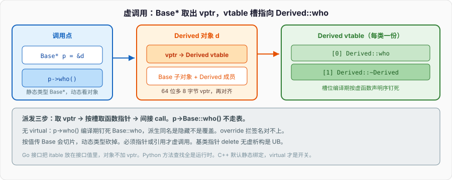

# 虚函数

基类指针指着派生对象，调一个基类里写过的函数：



```cpp
#include <iostream>

struct Base {
    void who() { std::cout << "Base\n"; }
};

struct Derived : Base {
    void who() { std::cout << "Derived\n"; }
};

int main() {
    Derived d;
    Base* p = &d;
    p->who();                           // 打印 Base，不是 Derived
}
```

`p` 的静态类型是 `Base*`。`who` 没有 `virtual`，调用在编译期按静态类型钉死：跳到 `Base::who`。对象模型篇只点过「加虚函数会多一个 vptr、布局变了」；本篇把派发钉完：vptr 谁写、vtable 里是什么、虚析构为什么是 UB 的开关、`override` / `final` 拦什么、菱形怎么把一份基类变成两份、动态绑定相对直接调用贵在哪。Python 的方法查找全是运行时；Go 的接口把 itable 放在接口值里，对象本身不加 vptr。C++ 把「要不要运行时派发」写成声明上的一个关键字，默认静态绑定。

---

## 一、静态绑定是默认，virtual 才是开关

### 1、名字、签名、隐藏

派生类里写一个同名函数，没有 `virtual`，不是重写，是**隐藏**：基类那个名字在派生类作用域里被挡住。即使参数不同，基类重载也会被藏住。

```cpp
struct B {
    void f(int);
    void f(double);
};

struct D : B {
    void f(int);                        // 隐藏 B::f 的两个重载
};

D d;
d.f(1);                                 // D::f
// d.f(1.0);                            // 仍走 D::f(int)，B::f(double) 被藏
d.B::f(1.0);                            // 显式打开
```

`using B::f;` 可以把基类重载拉进派生类作用域。这和虚函数无关，但「我在派生类写了同名，以为覆盖了」常常先撞上隐藏。虚函数的覆盖要求：基类声明 `virtual`，派生类签名匹配（const、引用限定、异常规格有规则），返回类型协变允许。

### 2、加上 virtual，调用点看对象

```cpp
struct Base {
    virtual void who() { std::cout << "Base\n"; }
    virtual ~Base() = default;
};

struct Derived : Base {
    void who() override { std::cout << "Derived\n"; }
};

Derived d;
Base* p = &d;
p->who();                               // Derived：运行时看 *p 的动态类型
p->Base::who();                         // 仍可显式静态调用 Base
```

`p->who()` 的生成代码不再是直接 `call Base::who`，而是：从对象取出 vptr → 在 vtable 里按槽位取函数指针 → 间接调用。槽位在编译期按类的虚函数声明顺序定死，运行时只多一次间接。`Base::who()` 这种限定调用不走虚表，用来在派生类里调基类实现。

成员函数里调自己的虚函数，同样走虚表——`this` 的动态类型是什么就派发到哪，除非构造 / 析构期间（见后）。`f()` 和 `this->f()` 一样。想绑死当前类的实现：`Base::f()`。

### 3、值、引用、指针：切片把动态类型砍掉

```cpp
void by_value(Base b) { b.who(); }      // 切片：参数是 Base，永远 Base::who
void by_ref(Base& b) { b.who(); }       // 虚调用
void by_ptr(Base* b) { b->who(); }      // 虚调用
```

`by_value` 先把实参拷进一个 `Base` 对象，派生部分丢掉。对象模型篇的切片。虚函数在切片后的对象上，动态类型就是 `Base`。要多态，传引用或指针。容器 `vector<Base>` 同理，装派生会切片；`vector<unique_ptr<Base>>` 才是多态集合。

返回 `Base` 也切片。返回 `Base&` / `Base*` 不切片，但要保证对象还活着。工厂返回 `unique_ptr<Base>` 指向 `new Derived`，所有权清楚，动态类型保留。

---

## 二、vptr 和 vtable：一次间接的布局

### 1、对象开头那只指针

常见 Itanium ABI：有虚函数的对象开头一个 vptr，指向该类的 vtable。vtable 在只读数据段，一类一份（模板实例一类一份）。vptr 是对象的一部分，构造时写入，拷贝 / 移动时按**目标动态类型**处理——拷贝构造会把 vptr 设成正在构造的这个类的表，不会从源对象抄一个「错误类型」的 vptr 过来。你不能靠 memcpy 一个多态对象还指望虚调用正确，标准布局那套对有 vptr 的类本来就不适用。

```cpp
struct A { virtual void f(); int n; };
// 64 位常见：sizeof(A) == 16 = 8(vptr) + 4(n) + 4(pad)
```

对象模型篇的数字。多继承时可能多个 vptr：每个有虚函数的基类子对象一份，指向调整过 this 的 thunk 或该子对象对应的表。`this` 调整：派生对象地址不等于某个基类子对象地址，虚调用要通过 thunk 把 `this` 加一个偏移再进派生函数。

```cpp
struct A { virtual void fa(); int a; };
struct B { virtual void fb(); int b; };
struct C : A, B { void fa() override; void fb() override; };

C c;
A* pa = &c;                             // 通常 pa == &c
B* pb = &c;                             // 通常 pb == &c + sizeof(A 子对象)
pb->fb();                               // 先把 pb 调回 C*，再进 C::fb
```

`static_cast<C*>(pb)` 会减偏移。`reinterpret_cast` 不会，多继承下 `reinterpret_cast` 基类指针是错的。指针篇写过四种 cast；多态 + 多继承是 `static_cast` / `dynamic_cast` 的主场。

### 2、vtable 槽：函数指针、RTTI、偏移

一张表里常见内容（实现细节，用来建立直觉，不是可移植布局）：

- 偏移到 top / 到 RTTI 结点（`typeid` / `dynamic_cast` 用）
- 虚函数指针，按声明顺序，基类的槽在前，派生类覆写就地改槽，新虚函数追加
- 虚析构可能占两个槽（完整对象析构 / deleting 析构，后者带 `operator delete`）

纯虚函数槽里常常是 `__cxa_pure_virtual`：构造期间误调纯虚会进这里，通常 terminate。不要在构造 / 析构里调纯虚。

`typeid(*p)` 对多态类型走 RTTI 结点，给出动态类型。对非多态（没有虚函数）只给静态类型。`dynamic_cast` 同样要 RTTI，要多态基类。编译可关 RTTI（`-fno-rtti`），关了这两样不能用，虚调用本身还在——虚调用不依赖 `typeinfo` 名字，只依赖槽。

### 3、谁在什么时候写 vptr

构造顺序：基类构造期间，vptr 指向**基类**的表。基类构造函数里调虚函数，落到基类实现，不是最终派生类——派生部分还没构造，不能落到那里。成员构造完、进入派生构造函数体时，vptr 改成派生类的表。析构反过来：先把 vptr 改回当前正在析构的类，再跑函数体，再析构成员、基类。

```cpp
struct Base {
    Base() { who(); }                   // 永远 Base::who，即使对象最终是 Derived
    virtual void who() { std::cout << "Base\n"; }
    virtual ~Base() { who(); }          // 析构里同样是 Base::who
};

struct Derived : Base {
    void who() override { std::cout << "Derived\n"; }
};
```

对象模型篇点过「构造里当当前类」。这是 vptr 写入时机的直接后果。Java 在构造里可以落到派生（派生字段还是默认值），C++ 不允许。Go 没有构造期虚派发这套。Python `__init__` 里调 `self.method()` 一定是派生——对象已经完全是那个 class。

拷贝赋值**不**重新绑 vptr 到源的类型：赋值不是换类型。`Base& a = d1; a = d2;` 若 `operator=` 不是虚的，只赋 `Base` 那一段，vptr 仍是 `d1` 的动态类型。不要指望赋值换成另一个派生类型。要换类型，换指针 / `unique_ptr`，别赋多态值。

---

## 三、虚析构：delete 基类指针的开关

### 1、非虚析构 + delete 基类指针 = UB

```cpp
struct Base {
    ~Base() = default;                  // 非虚
};

struct Derived : Base {
    std::string s;
};

Base* p = new Derived;
delete p;                               // UB：~Derived 可能不跑，string 泄漏
```

`delete p` 要先调析构再 `operator delete`。`p` 的静态类型是 `Base*`，析构不是虚，调的是 `~Base`。`~Derived` 不跑，成员不释放。更糟：`operator delete` 的大小、地址按 `Base` 算，派生对象更大，释放路径也可能错。规范直接说 UB，不是「可能泄漏」。

只要会通过基类指针 `delete`，基类析构必须虚。工厂返回 `unique_ptr<Base>`，默认删除器是 `delete Base*`，同样要求虚析构。`shared_ptr<Base>` 在构造时把删除器按 `Derived*` 类型擦除，**可以**在基类析构非虚时仍调 `~Derived`——智能指针篇写过。不要靠这条逃虚析构：别人仍可能 `unique_ptr<Base>` 或裸 `delete`。

### 2、虚析构的代价

加一个虚析构，类变成多态：有 vptr，不再标准布局，不能当 C struct，拷贝仍默认生成但切片。不需要多态、不会基类指针删派生，**不要**无故给析构加 `virtual`。接口类（有别的虚函数）几乎一定要虚析构，或 `protected` 非虚析构 + 禁止基类指针删除（派生里自己删）。第二种用于「不允许通过基类释放」的混入。

```cpp
struct Mixin {
protected:
    ~Mixin() = default;                 // 不能 Base* p = new D; delete p;
};

struct D : Mixin {
    // 可以栈上 D，或 delete 静态类型就是 D 的指针
};
```

`protected` 析构让 `delete` 基类指针在派生类外部编译失败（析构不可及）。栈上派生对象仍可析构，因为 `~D` 能调 `~Mixin`。这是「非侵入、不给 vptr」的混入手法。

### 3、纯虚析构也要定义

```cpp
struct Interface {
    virtual ~Interface() = 0;
    virtual void run() = 0;
};

inline Interface::~Interface() = default;  // 必须有定义
```

析构会链到基类析构，纯虚析构仍会被调用，必须有函数体。纯虚让 `Interface` 不能实例化。其它纯虚可以没有定义（除非有人静态调用 `Interface::run()`）。

---

## 四、override、final、协变、using

### 1、override 把隐藏变成编译错误

```cpp
struct Base {
    virtual void f(int) const;
};

struct Derived : Base {
    void f(int);                        // 少了 const：隐藏，不是覆盖
    void f(int) const override;         // 对：覆盖
    // void f(double) override;         // 编译失败：基类没有匹配的虚函数
};
```

`override` 不是「变成虚」，是「我声称在覆盖」。基类没虚、签名不对、const 不对，编译失败。新代码覆盖必写 `override`。对象模型不讲关键字，这里是工程开关：重构基类签名时，派生类编译失败比运行时静默走基类好。

C++11 起 `virtual void f() override` 里 `virtual` 可省略——有 `override` 已说明是虚。写不写 `virtual` 是风格，`override` 不是。

### 2、final 钉类或钉函数

`void f() final`：派生类不能再覆盖。`struct D final : B`：不能再继承。用来封实现、让编译器做去虚化（有时能把虚调用优化成直接调用，若它看见动态类型）。接口的某个钩子不想被再改，`final`。滥用 `final` 让测试里的假派生插不进去。

```cpp
struct Sealed final : Base {
    void who() override final;
};
// struct More : Sealed {};             // 非法
```

### 3、协变返回、默认实参、覆盖与重载

覆盖的返回类型可以是协变：基类返回 `Base*`，派生返回 `Derived*`（指针或引用，cv 更严的规则）。用来工厂方法。返回 `unique_ptr<Base>` 不是协变，派生不能改成 `unique_ptr<Derived>` 当覆盖——智能指针不是指针。

**默认实参按静态类型走**，不是动态。虚函数覆盖时不要改默认实参；要改，调用方看见的仍是基类声明的默认值。

```cpp
struct B {
    virtual void f(int n = 1) { std::cout << n; }
};
struct D : B {
    void f(int n = 2) override { std::cout << n; }
};

D d;
B& r = d;
r.f();                                  // 打印 2？不：默认实参是 1，函数体是 D::f
```

调用 `r.f()` 按 `B::f` 的声明填默认 1，再虚派发进 `D::f(1)`。默认实参是编译期、静态的。覆盖函数别写默认实参。

同名虚函数和一个非虚重载混在一起，隐藏规则照旧。先 `using` 再覆盖，或换名字。签名必须匹配：引用限定 `&&` / `&`、`const`、`noexcept`（C++17 起 `noexcept` 是类型的一部分，覆盖时要一致）。

```cpp
struct B {
    virtual void f() &;
    virtual void f() &&;
};

struct D : B {
    void f() & override;
    void f() && override;               // 两个槽，左值 / 右值对象各一条
};
```

引用限定让 `std::move(d).f()` 走 `&&` 版本，用来：左值留下资源，右值把资源移出。覆盖必须两个都写，否则只覆盖一个，另一个仍是基类。漏写 `override` 时，限定不一致就是隐藏，基类那条虚函数还在，通过基类引用调用会落到基类——又是静默错误。`override` 在引用限定上同样值钱。

`virtual void f() final override` 合法，顺序习惯 `override final`。`final` 不能写在第一次声明虚函数上当「这是虚的但别覆盖」之外的意思——第一次声明写 `virtual void f() final` 表示「我是虚的，派生类不能覆盖」，自己就是最终实现。接口里少这样做，等于既要 vptr 又不许变化。

协变返回只适用于指针 / 引用，而且必须是类层次上的一致 cv：基类 `virtual Base* clone() const;`，派生 `Derived* clone() const override;`。返回 `Base` 值不是协变，派生返回 `Derived` 值是另一个函数（隐藏）。工厂要保留动态类型，返回 `unique_ptr<Base>` 在基类，派生里覆盖不了成 `unique_ptr<Derived>`；实现里 `return std::make_unique<Derived>(...);` 隐式转 `unique_ptr<Base>` 即可，不必协变。

---

## 五、多继承、菱形、虚继承

### 1、普通多继承：两份子对象

```cpp
struct A { int n; virtual void f(); };
struct B : A { void f() override; };
struct C : A { void f() override; };
struct D : B, C {};                     // D 里两份 A
```

`D` 的布局常见：B 子对象（内含一份 A）+ C 子对象（内含另一份 A）。`D d; A* p = &d;` 二义——哪一份 A？必须 `static_cast<B*>(&d)` 再转 `A*`，或 `d.B::n`。`d.f()` 也二义，即使 B、C 都覆盖了。这就是菱形：`A` 在顶上被两条路继承。

两份 `A` 有两个 vptr、两份 `n`。不是 bug，是你要的「两个 A 身份」时才用普通继承。多数时候不是。

### 2、虚继承：一份共享基类

```cpp
struct A { int n; virtual void f(); virtual ~A() = default; };
struct B : virtual A { void f() override; };
struct C : virtual A { void f() override; };
struct D : B, C {
    void f() override;                  // 必须，否则 D 仍抽象或二义
};
```

虚基类子对象一份，由**最派生类**初始化。对象模型篇构造顺序第一条：先虚基类，再按声明序直接基类。`D` 的构造要负责 `A(...)`，`B`、`C` 初始化列表里对 `A` 的调用在「作为中间类」时被忽略。

布局更绕：虚基类常常放在对象尾部，前面的子对象里存 vbptr（虚基类指针）或偏移，运行时才能找到那份 `A`。访问虚基类成员多一次间接。`static_cast` 到虚基类可能要读偏移，不能当常量。`reinterpret_cast` 在虚继承下更不能用。

`D` 必须覆盖 `f`：否则 `D` 里来自 B 和 C 的 `f` 二义。最终覆盖者唯一，菱形才合上。

### 3、虚继承的代价和何时用

多一次间接、构造更慢、对象更大、布局编译器相关。真正需要「一份共享接口 / 一份共享状态」时才虚继承。COM 式接口、`enable_shared_from_this` 在多继承下有时要小心只一份。日常业务继承优先单继承 + 组合。Python 的 MRO 把菱形线性化；C++ 要么两份要么虚继承你选，没有自动 MRO。Go 没有继承，嵌入是组合，没有菱形。

不要「预防性虚继承」。两条链汇合再改，代价是 ABI 和布局全变。设计接口时：多态用单根虚接口，实现用组合。

---

## 六、动态绑定的代价，和编译器怎么把税拿回来

### 1、直接调用 vs 虚调用

直接调用：编译期地址，`call rel32`，还能内联。虚调用：load vptr、load 槽、间接 `call`，内联门槛高——编译器必须看见动态类型，或做推测 + 类型检查（devirtualization）。一次虚调用本身几个周期，真正的税是：**挡内联**之后，后面一串小函数都露在外面，寄存器、常量传播、死代码消除全弱了。

热循环里对每个元素 `p->foo()`，`foo` 若只有几行，虚调用的开销可能比工作本身大。对象模型篇说「不需要运行时多态就不要 virtual」，数字在这里：不是那 8 字节 vptr，是内联墙。

```cpp
struct Base { virtual int f() const { return 1; } };
struct D : Base { int f() const override { return 2; } };

int sum(const std::vector<std::unique_ptr<Base>>& xs) {
    int s = 0;
    for (auto& p : xs) s += p->f();     // 间接，难内联
    return s;
}
```

同一动态类型占大多数时，编译器可能推测。类型到处跳，预测失败还加一笔。CRTP / 模板把派发放到编译期：`template<class D> struct Base { int f() { return static_cast<D*>(this)->f_impl(); } };` 没有 vptr，全内联。代价是没有统一的 `Base*` 容器（除非再擦类型）。运行时异构集合才需要虚函数；编译期异构用模板 / `variant`。

CRTP 把派生类当模板参数，`this` 静态转到 `D*`，调用 `D::f_impl` 是直接调用。没有槽，没有 RTTI，对象不加 vptr（除非你另外写了虚函数）。容器要装「任意 D」时，CRTP 帮不上——每个 `Base<D>` 是不同类型。于是出现两层：内部 CRTP 吃掉热路径，对外一层虚接口做类型擦除。不要一上来两层都写，测热再拆。

`std::function<void()>` 擦的是可调用，不是类层次。一个 lambda、一个函数指针、一个绑定了对象的成员调用，都能进同一份 `function`。税是可能的堆分配 + 一次间接。虚函数擦的是「这一族对象的这一组方法」，`function` 擦的是「这一次调用」。选错的症状：每个方法一个 `function` 成员，对象又胖又碎，还不如一张 vtable。

---

## 七、纯虚、接口类、NVI

### 1、抽象类不能造对象，指针和引用可以

```cpp
struct Writer {
    virtual ~Writer() = default;
    virtual void write(std::string_view) = 0;
};

// Writer w;                            // 非法
void pump(Writer& w);                   // 合法
std::unique_ptr<Writer> make_file_writer();
```

有纯虚就是抽象类。派生类必须覆盖所有纯虚才能实例化。接口类：虚析构 + 纯虚方法 + 没有（或很少）数据。数据放实现类。接口上放数据，多继承立刻菱形或布局变胖。Java / Go 的 interface 没有数据；C++ 没有语言级 `interface` 关键字，靠约定。约定破了就是对象里多几个字段、多几个 vptr。

纯虚可以有默认实现：`virtual void f() = 0;` 仍提供 `void Base::f() { ... }`，派生类必须覆盖，但覆盖里可以 `Base::f()`。用来「必须想过这个点，但有一份默认」。少用。读者看见 `= 0` 以为没有函数体。

### 2、NVI：虚函数放 private，public 包一层

```cpp
struct Writer {
    virtual ~Writer() = default;
    void write(std::string_view s) {    // 非虚
        lock();
        do_write(s);
        unlock();
    }
private:
    virtual void do_write(std::string_view) = 0;
};
```

公共入口非虚，真正覆盖的钩子私有虚。入口可以锁、打日志、检查前置条件，派生类改不掉这层。模板方法模式。虚函数不必 public——覆盖不受访问控制限制（private 虚函数派生类仍能 override，只是不能直接调）。访问控制的是名字，不是槽。

NVI 让你把「合同」和「变化点」拆开。到处 `public virtual` 的类，派生类能绕过基类入口，不变式难保。新接口优先 NVI；已经铺开的 public 虚函数不必为了仪式去改 ABI。

### 3、虚函数表和类型信息可以关

`-fno-rtti`：没有 `typeid` / `dynamic_cast`，vtable 还在。`-fno-exceptions` 是另一回事。嵌入式常关 RTTI 省 typeinfo 字符串。关了就不能用 `dynamic_cast` 做向下转，只能自己在基类里放类型标签或只靠虚函数。设计接口时不要让正确性依赖 RTTI——虚函数才是正路，`dynamic_cast` 是逃逸舱。

虚表本身在只读段，多份翻译单元的弱符号合并成一份。模板类的虚函数会为每个实例出一张表。模板 + 虚函数：代码膨胀，每个 `T` 一张表、一套虚函数体。能非模板基类 + 模板派生就别让基类自己是模板还带虚。

内联虚函数：定义可以写在类内，调用点若看不见动态类型，仍走虚表，内联体用来「去虚化成功时展开」。不要指望「我写在头文件里它就会内联进每个调用」。纯虚函数也可以定义在类外，只给静态调用和析构链用。

对象切片再强调一次：`Base b = derived;` 之后 `b` 是完整的 `Base` 对象，有自己的 vptr，指向 `Base` 的表。不是「一个缺了派生部分的 Derived」。赋值 `b = derived;` 同样只赋基类子对象，vptr 保持 `Base`。要保留动态类型，永远握指针或引用，或握 `unique_ptr<Base>`。

---

## 八、对照 Go interface、Python 动态

### 1、Go：itable 在接口值里

Go 的 `var x I = p`，接口值是 `(tab, data)`。`tab` 指向 itable：左边是接口方法表，右边是具体类型的方法指针。对象**不加**字段。两个接口值指向同一块数据，itable 可能不同（不同接口）。派发间接一次，和 C++ 虚调用同量级，但布局税在接口值上，不在对象上。同一个 `T` 可以满足很多接口，不必继承，不必改 `T` 的大小。

C++ 虚函数是侵入的：改基类、改对象大小、改构造。要非侵入：模板、`std::function`、type erasure（`any` + 自己的表）。`virtual` 适合「一族类型、稳定接口、要基类指针容器」。Go 适合「事后发现要抽象」。从 Go 过来不要给每个 struct 先加一个虚接口基类。

Go 没有析构链，没有「基类指针 delete」。接口值不拥有，GC 管。C++ 的虚析构是所有权问题，不是派发问题。两件事不要混成「有虚函数就安全」。

### 2、Python：全是查找

`obj.method()` 从类型（及 MRO）找 `method`，绑定 `self`，调用。可以运行时给实例塞属性、给类换方法。没有静态绑定默认。代价是每次查找（有缓存），对象头上永远有类型指针。C++ 默认连类型指针都不给，直到你写 `virtual`。Python 的「重写」就是子类字典里同名；没有 `override` 关键字检查签名。从 Python 过来最容易漏写 `virtual`，然后看到基类实现在跑，以为对象造错了——对象是对的，绑定是静态的。

### 3、三门语言的「接口」

| | 默认派发 | 对象上多什么 | 事后抽象 | 释放 |
| --- | --- | --- | --- | --- |
| C++ 虚函数 | 静态，opt-in 动态 | vptr | 要改类、改布局 | 虚析构或智能指针删除器 |
| Go interface | 接口值上动态 | 无 | 不改类型 | GC |
| Python | 始终动态 | 类型指针 | 随便 | RC + GC |

C++ 还有模板：编译期接口（概念在 C++20，C++17 用 SFINAE / 文档）。模板不是虚函数的替代，是另一根轴——异构在编译期消掉。虚函数是运行时轴。`variant` + `visit` 是闭集运行时分发，无 vptr，加类型要改 variant。开集用虚函数，闭集用 variant / 枚举。

Go 的小接口（`io.Writer` 一个方法）鼓励组合。C++ 同样：接口拆细，实现类多继承几个无数据接口，或组合几个实现。胖基类「什么虚函数都有」会逼所有派生实现一堆空函数，或把不相关的变化绑在一起。一个虚函数一个变化点。Python 的 ABC / `Protocol` 偏鸭子；C++ 没有鸭子的运行时，编译期鸭子是模板，运行时鸭子必须先写成虚接口。

`typeid(x).name()` 实现定义，libstdc++ 返回 mangled，MSVC 较可读。不要拿它当稳定协议字段。序列化、日志里的类型名自己维护，或用虚 `name()` 由派生类返回。RTTI 名字不是 API。

Python 的 `isinstance` / `super()` 是运行时 MRO 上的查找。C++ 的 `dynamic_cast` 是 RTTI 图上的边，`Base::f()` 是静态指名，不是 `super`。多继承下没有单一「super」——要写 `B::f()` / `C::f()`。菱形里两个中间层都调虚基类的 `f`，得自己约定谁调，否则调两次。Go 没有 super，嵌入的方法提升，冲突要外层自己写方法转发。三门语言里 C++ 把「往上一层」写得最显式，也最容易漏。

虚函数可以纯虚且派生类覆盖后，仍通过 `p->Base::f()` 调到基类实现（若基类提供了定义）。这不是 Python 的 `super()` 自动链，是一次指名调用。NVI 的 public 非虚入口里常这样调，用来跑默认前后步骤。

---

## 九、对照、易错点和一份能跑的实验

易错点：

- 没 `virtual`，基类指针调到基类实现。
- 没 `override`，const / 参数差一个，变成隐藏。
- 基类析构非虚，`delete` 基类指针。
- 按值传基类，切片。
- `vector<Base>` 装派生。
- 构造 / 析构里调虚，指望派生。
- 虚函数改默认实参，调用方仍用基类默认值。
- 菱形不虚继承，两份基类，二义。
- 虚继承却在中间类初始化虚基类，最派生类才算。
- `dynamic_cast` 当热路径分发。
- `reinterpret_cast` 多继承基类指针。
- 无故给每个类加虚析构「以防万一」，布局和标准布局全丢。
- 纯虚析构没有定义。
- 赋值指望换动态类型。
- 成员函数指针当 `void*` 塞给 C。
- 接口类放数据，多继承菱形。
- 正确性依赖 `dynamic_cast` / `typeid`。
- 模板基类带虚函数，每个 `T` 一张表。
- public 虚函数让派生类绕过基类入口（该 NVI 时没 NVI）。
- `typeid().name()` 当稳定协议。
- 覆盖时改 `noexcept`，C++17 下不是同一函数。
- 用 `using Base::f` 却忘了，隐藏把虚覆盖藏住。
- 栈上 `Writer w;` 抽象类，或 `vector<Writer>`。

`g++ -std=c++17 -O0 -Wall -Wextra -o virt virt.cpp && ./virt`：

```cpp
// virt.cpp — 静态 vs 虚、切片、override、菱形。C++17。
#include <iostream>
#include <memory>
#include <vector>

struct Base {
    virtual void who() const { std::cout << "Base\n"; }
    virtual ~Base() = default;
};

struct Derived : Base {
    void who() const override { std::cout << "Derived\n"; }
};

struct A {
    A() { std::cout << " A"; }
    virtual void f() { std::cout << " A::f"; }
    virtual ~A() = default;
};

struct B : virtual A {
    B() { std::cout << " B"; }
    void f() override { std::cout << " B::f"; }
};

struct C : virtual A {
    C() { std::cout << " C"; }
    void f() override { std::cout << " C::f"; }
};

struct D : B, C {
    D() { std::cout << " D"; }
    void f() override { std::cout << " D::f"; }
};

void call_val(Base b) { b.who(); }
void call_ref(const Base& b) { b.who(); }

int main() {
    Derived d;
    Base* p = &d;
    std::cout << "ptr: ";
    p->who();
    std::cout << "val: ";
    call_val(d);
    std::cout << "ref: ";
    call_ref(d);

    std::vector<std::unique_ptr<Base>> xs;
    xs.push_back(std::make_unique<Derived>());
    xs.push_back(std::make_unique<Base>());
    std::cout << "vec:\n";
    for (auto& e : xs) e->who();

    std::cout << "ctor:";
    D obj;
    std::cout << "\ncall:";
    A* pa = &obj;
    pa->f();
    std::cout << "\n";

    struct Left {
        virtual void ident() const { std::cout << "L"; }
        virtual ~Left() = default;
        int x = 1;
    };
    struct Right {
        virtual void ident() const { std::cout << "R"; }
        virtual ~Right() = default;
        int y = 2;
    };
    struct Both : Left, Right {
        void ident() const override { std::cout << "B"; }
    };
    Both both;
    Left* pl = &both;
    Right* pr = &both;
    std::cout << "same_addr=" << (static_cast<void*>(pl) == static_cast<void*>(pr))
              << "\n";
    std::cout << "via_l=";
    pl->ident();
    std::cout << " via_r=";
    pr->ident();
    std::cout << "\n";
}
```

跑完对照：`ptr` / `ref` 打 `Derived`，`val` 打 `Base`（切片）；`vector<unique_ptr<Base>>` 里两个动态类型各自派发；`D` 的构造先 `A` 再 `B`、`C`、`D`（虚基类一份），`pa->f()` 打 `D::f`。`Both` 里 `Left*` 和 `Right*` 地址通常不同，虚调用经 thunk 仍进 `Both::ident`。把 `Base::who` 的 `virtual` 去掉再编译运行，`ptr` 也会打 `Base`——开头那个事故。把 `~Base` 去掉 `virtual`，用 `Base* p = new Derived; delete p;` 加 ASAN，看泄漏或不完整析构。

检查清单：要运行时多态才 `virtual`；覆盖写 `override`；基类指针会 `delete` 则虚析构；多态走引用 / 指针 / `unique_ptr`，不走值、不走 `vector<Base>`；构造析构当当前类；菱形先问要不要继承，要共享状态才虚继承；热路径虚调用测过再谈 CRTP / variant。对象模型把 vptr 当作 8 字节税；本篇把这 8 字节背后的表、时机、UB 开关和对照语言钉死。默认静态绑定——这是 C++，不是 Python。Go 把表放在接口值里，对象干净；Python 把查找放在类型对象上，永远动态。C++ 让你为每一次「要不要间接」付钱或省钱，关键字是 `virtual`，账单是布局、内联墙和析构合同。

`Both` 实验里若 `ident` 只在 `Left` 覆盖、`Right` 仍是基类实现，通过 `pr->ident()` 会进 `Right::ident` 还是 `Both`？只覆盖一个基类的同名虚函数，另一个基类的槽不一定改掉——两个基类各一张表，`Both::ident` 若只 override 了其中一个声明，另一个槽仍指向 `Right::ident`。要两张表都指向同一份最终覆盖，两个基类的 `ident` 必须是同一个虚函数被最终类覆盖，或 `Both` 对两条链都写 override。菱形用虚继承合一份；普通多继承是两份槽，最终类要自己填齐。这和开头「没 virtual 就静态绑定」是同一条规则在多表上的展开。实验里 `Both::ident` 同时覆盖两条链（同名同签名），两张表的对应槽都改写，所以 `pl->ident()` 和 `pr->ident()` 都打印 `B`，只是 `this` 调整不同。若改成两个不同名字的虚函数，就是两套独立的槽，没有「最终覆盖者」要唯一这件事——那是菱形同一虚函数从两条路下来才有的约束。

开头那 20 行：`p->who()` 没有 `virtual` 就钉死 `Base::who`。加上 `virtual` 之后，同一行源码变成「读 vptr、取槽、间接跳」。中间所有章节——覆盖、虚析构、菱形、NVI、对照 Go / Python——都是在给这一跳补合同。合同写不清，跳得再正确也是在错的对象上跳。基类指针、虚析构、`override`，三件套先写上，再谈菱形和去虚化。对象模型篇只点到 vptr 占 8 字节；那 8 字节值不值，看你有没有运行时异构。没有，就别加。有，就把析构和覆盖写全，再让这一跳去干活。

静态绑定是默认。要动态，自己打开，并付布局和析构的税。
